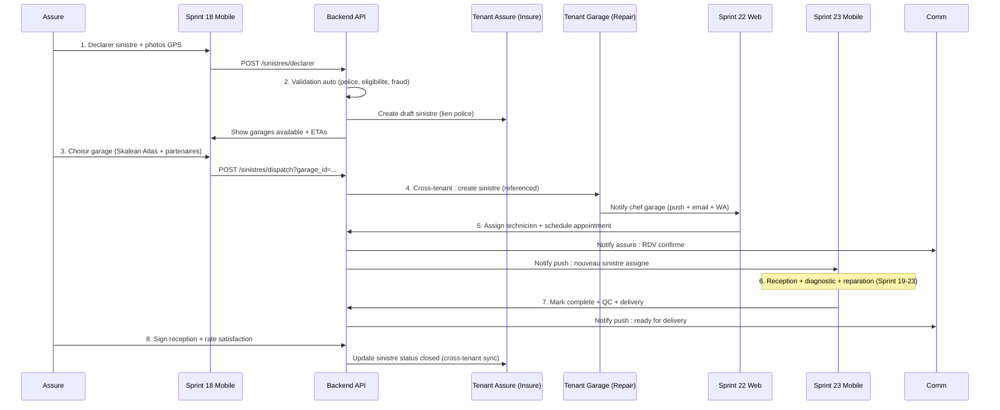

# META-PROMPT B-24 -- SPRINT 24 FLUX SINISTRE CLIENT END-TO-END

**Version** : v2.2 (Option B)
**Phase** : 5 -- Vertical Repair (Skalean Garage ERP)
**Sprint** : 24 / 35 (cumul) -- Phase 5 Sprint 6
**Position** : Apres Web Garage Mobile, avant Cross-Tenant Framework
**Numerotation taches** : 5.6.1 a 5.6.13
**Effort total** : ~75 heures developpement / 2 semaines
**Priorite** : P0 (sprint le plus differenciant -- premier flux M8 client end-to-end MA)

---

## Objectif Global du Sprint

Implementer **flux sinistre client end-to-end M8** : workflow complet declaration assure -> choix garage -> validation -> dispatch -> reparation -> livraison, **SANS intervention courtier** dans la chaine de traitement. Sprint 24 = sprint le plus **differenciant** du programme : premier flux MA ou client mobile (Sprint 18) declenche tout le processus reparation directement avec garage choisi (Skalean Atlas + partenaires Sprint 25).

A la sortie de ce sprint :
- Workflow M8 documente : declaration assure (mobile) -> validation auto + manual broker -> dispatch garage choisi -> reception garage -> diagnostic + reparation -> livraison + reglement
- Cross-tenant routing : sinistre cree dans tenant assure -> propagate au tenant garage choisi (preserved data isolation)
- Validation auto : verifications IA pre-screening (couverture police, vehicle eligible, fraud rules basiques)
- Dispatch garage : auto-assignment chef garage (Sprint 22) qui assigne technicien
- Notifications coordonnees multi-parties : assure (push mobile + email + WA) + broker (read-only updates) + garage (technicien push)
- Dashboard cycle complet : visualisation 360 sinistre per role
- Tests E2E end-to-end : 1 sinistre traverse 5 sprints/apps complet

---

## Frontiere du Sprint

**INCLUS** :
- Workflow M8 documente complet
- Cross-tenant routing sinistres
- Validation auto pre-screening
- Dispatch garage workflow
- Notifications coordonnees multi-parties
- Dashboard cycle complet
- Tests E2E end-to-end

**EXCLU** (sera ajoute aux sprints suivants) :
- Cross-Tenant Framework runtime activation 3 types -- Sprint 25
- Connecteurs assureurs reels -- Sprint 32 (defere)
- IA-powered fraud detection avance -- Sprint 30+ defere
- Marketplace garages public selection -- Phase 7+

---

## Lectures Prealables Obligatoires

1. Sortie Sprint 18 : web-assure-mobile + declaration sinistre + choix garage M8
2. Sortie Sprint 19-21 : backend Repair complet
3. Sortie Sprint 22-23 : web-garage desktop + mobile
4. Sortie Sprint 14-15 : Insure (police + sinistre lien)
5. Sortie Sprint 6 : multi-tenant + RLS

---

## Stack Imposee (Sprint 24)

| Composant | Version | Notes |
|-----------|---------|-------|
| zod | 3.24.1 | validation cross-tenant flows |
| date-fns | 4.1.0 | duration tracking |
| decimal.js | 10.4.3 | precision computations |

Pas de nouvelle dep externe.

---

## Vue d'Ensemble des 13 Taches

| # | Tache | Effort | Priorite | Depend de |
|---|-------|--------|----------|-----------|
| 5.6.1 | Workflow M8 documente : flow diagram + states transitions cross-systems | 5h | P0 | Phase 5 |
| 5.6.2 | Cross-tenant sinistre routing : create assure tenant -> propagate garage tenant | 7h | P0 | 5.6.1 |
| 5.6.3 | Validation auto pre-screening : couverture + eligibilite + fraud basics | 6h | P0 | 5.6.2 |
| 5.6.4 | Dispatch garage workflow : chef garage assign technicien + capacity check | 6h | P0 | 5.6.3 |
| 5.6.5 | Sinistre Cycle Tracker : entity centralise vue 360 cross-tenant | 5h | P0 | 5.6.4 |
| 5.6.6 | Notifications coordonnees : assure + broker + garage triggers | 6h | P0 | 5.6.5 |
| 5.6.7 | Dashboard "Mon Sinistre" pour assure (Sprint 18 enrichi) | 5h | P0 | 5.6.6 |
| 5.6.8 | Dashboard broker monitoring read-only sinistres lies polices | 5h | P0 | 5.6.7 |
| 5.6.9 | Dashboard chef garage : pipeline + dispatch + KPIs | 5h | P0 | 5.6.8 |
| 5.6.10 | Endpoints REST cross-tenant + permissions enrichies | 5h | P0 | 5.6.9 |
| 5.6.11 | Audit trail cross-tenant + Kafka events coordination | 4h | P0 | 5.6.10 |
| 5.6.12 | Documentation flux M8 + diagrammes sequences + scenarios | 4h | P0 | 5.6.11 |
| 5.6.13 | Tests E2E end-to-end (40+) : 1 sinistre traverse 5 apps complet | 12h | P0 | 5.6.12 |

**Total** : 75 heures.

---

# DETAIL DES 13 TACHES

---

## Tache 5.6.1 -- Workflow M8 Documente

**Metadonnees** : Phase 5 / Sprint 24 / P0 / 5h / Depend de Phase 5

**But** : Documenter workflow M8 complet : flow diagram + states transitions + responsabilites + SLA + edge cases.

**Contexte** : Modele M8 = "Modele 8" interne Skalean (apres iterations conception). Differentiator marche : assure decide flow, courtier passif (suivi only), garage execute. Vs marche actuel MA : courtier actif (intermediaire toutes etapes).

**Livrables checkables** :
- [ ] Document `repo/docs/workflow-m8-flux-sinistre-client.md`
- [ ] Sections :
  - **Vue d'ensemble M8** : 8 etapes principales
  - **Diagrammes sequences** : chaque etape (UML sequence)
  - **Roles + responsabilites** : assure / broker / chef garage / technicien
  - **States transitions cross-systems** : sinistre move tenant assure -> tenant garage
  - **SLA per etape** : declaration confirme < 1h / chef garage assign < 4h / diagnostic complete < 48h / etc.
  - **Edge cases** : assure annule + garage refuse + parts indisponibles + assureur reject
  - **Comparaison M0 (modele traditionnel) vs M8** : avantages / pour Skalean
- [ ] Diagrammes : Mermaid syntax (versionne avec code)
- [ ] Distribution : equipe technique + business + legal review
- [ ] Tests : workflow validation par scenarios humains (review)

**Pattern critique : workflow M8 sequence**



**Fichiers crees / modifies** :
```
repo/docs/workflow-m8-flux-sinistre-client.md                                          # ~500 lignes (markdown + Mermaid)
repo/docs/workflow-m8-comparison-m0.md                                                   # ~150 lignes
repo/docs/workflow-m8-sla-table.md                                                      # ~80 lignes
```

**Notes implementation** :
- Workflow M8 valide business + technique avant code
- Diagrammes Mermaid : versionnage + auto-render GitHub
- Distribution : equipe + legal + ACAPS (validation regulator)

**Criteres validation** :
- V1 (P0) : Document complet 8 etapes
- V2 (P0) : 5+ diagrammes sequences
- V3 (P0) : SLA per etape definis
- V4 (P0) : Edge cases couverts
- V5 (P0) : Comparaison M0 vs M8

---

## Tache 5.6.2 -- Cross-Tenant Sinistre Routing

**Metadonnees** : Phase 5 / Sprint 24 / P0 / 7h / Depend de 5.6.1

**But** : Mecanisme cross-tenant sinistre creation : assure declare dans tenant assure (insure) -> sinistre propage au tenant garage choisi (repair) avec data sharing controle.

**Livrables checkables** :
- [ ] Migration : table `sinistre_cross_tenant_links` (table cross-tenant centralisee, pas RLS) :
  - id, source_tenant_id (assure tenant Insure), target_tenant_id (garage tenant Repair), source_sinistre_id (UUID Insure context), target_sinistre_id (UUID Repair context), status (enum 'pending_dispatch' | 'dispatched' | 'completed' | 'failed'), created_at, dispatched_at, completed_at, metadata (jsonb)
- [ ] Service `cross-tenant-sinistre-routing.service.ts` (super-tenant context) :
  - `dispatchToGarage(sourceSinistreId, targetGarageId): Promise<{ targetSinistreId }>` :
    1. Read source sinistre (tenant assure)
    2. Validate : police active + couverture + garage active + capacity OK
    3. Switch tenant context to target garage tenant
    4. Create sinistre row in target tenant + reference source via metadata.source_sinistre_id
    5. Insert link row sinistre_cross_tenant_links
    6. Switch back tenant context (cleanup)
    7. Notify garage (Tache 5.6.6)
  - `syncStatus(sourceSinistreId)` : sync status target -> source (cron 1min OR Kafka)
- [ ] Privileged context : utilise super-tenant role pour cross-tenant operations
- [ ] Audit complete : qui a access cross-tenant + when
- [ ] Endpoint `POST /api/v1/repair/sinistres/:id/dispatch` (super admin OR assure self-action)
- [ ] Tests : routing + isolation + audit

**Pattern critique : cross-tenant routing service**

```typescript
// repo/packages/repair/src/services/cross-tenant-sinistre-routing.service.ts
@Injectable()
export class CrossTenantSinistreRoutingService {
  constructor(
    private dataSource: DataSource,
    private tenantContext: TenantContextService,
    private kafkaPublisher: KafkaPublisher,
  ) {}

  async dispatchToGarage(
    sourceSinistreId: string,
    targetGarageTenantId: string,
  ): Promise<{ targetSinistreId: string }> {
    // 1. Read source sinistre (tenant assure context)
    const sourceTenantId = getCurrentTenantId();
    const sourceSinistre = await this.dataSource.getRepository(InsureSinistre).findOneOrFail(sourceSinistreId);
    const policy = await this.dataSource.getRepository(InsurePolicy).findOneOrFail(sourceSinistre.policy_id);

    // 2. Validate
    if (sourceSinistre.status !== 'declared') {
      throw new BadRequestException({ code: 'SINISTRE_NOT_DECLARED' });
    }
    if (policy.status !== 'active') {
      throw new BadRequestException({ code: 'POLICY_NOT_ACTIVE' });
    }

    // Verify target garage capacity available (cross-tenant context switch)
    let targetGarageOk = false;
    let targetSinistreId: string | null = null;

    await this.tenantContext.runWithContext(
      { tenantId: targetGarageTenantId, isSuperAdmin: true /* privilege escalation */ },
      async () => {
        const garage = await this.dataSource.getRepository(RepairGarage).findOneOrFail({
          where: { tenant_id: targetGarageTenantId, status: 'active' },
        });

        const currentLoad = await this.dataSource.getRepository(RepairSinistre).count({
          where: { tenant_id: targetGarageTenantId, status: In(['received', 'under_diagnostic', 'under_repair']) },
        });

        if (currentLoad >= garage.capacity_simultaneous_repairs) {
          throw new BadRequestException({ code: 'GARAGE_AT_CAPACITY', current: currentLoad, max: garage.capacity_simultaneous_repairs });
        }

        // Create sinistre in target tenant
        const targetSinistre = await this.dataSource.getRepository(RepairSinistre).save({
          tenant_id: targetGarageTenantId,
          sinistre_number: await this.generateNumber(targetGarageTenantId),
          insure_policy_id: policy.id,
          customer_id: sourceSinistre.customer_id,
          vehicle_data: sourceSinistre.vehicle_data,
          incident_data: sourceSinistre.incident_data,
          status: 'declared',
          metadata: { source_tenant_id: sourceTenantId, source_sinistre_id: sourceSinistreId },
        });

        targetSinistreId = targetSinistre.id;
        targetGarageOk = true;
      },
    );

    if (!targetGarageOk || !targetSinistreId) {
      throw new InternalServerError({ code: 'DISPATCH_FAILED' });
    }

    // 3. Insert link row (super-tenant context : cross-tenant table no RLS)
    await this.dataSource.getRepository(SinistreCrossTenantLink).save({
      source_tenant_id: sourceTenantId,
      target_tenant_id: targetGarageTenantId,
      source_sinistre_id: sourceSinistreId,
      target_sinistre_id: targetSinistreId,
      status: 'dispatched',
      dispatched_at: new Date(),
      metadata: { dispatcher_user_id: getCurrentUserId() },
    });

    // 4. Audit + Kafka
    await this.kafkaPublisher.publish(Topics.SINISTRE_DISPATCHED, {
      source_tenant_id: sourceTenantId, source_sinistre_id: sourceSinistreId,
      target_tenant_id: targetGarageTenantId, target_sinistre_id: targetSinistreId,
    });

    return { targetSinistreId };
  }
}
```

**Fichiers crees / modifies** :
```
repo/packages/database/src/migrations/{date}-SinistreCrossTenantLinks.ts                # ~50 lignes (cross-tenant table)
repo/packages/repair/src/entities/sinistre-cross-tenant-link.entity.ts                    # ~50 lignes
repo/packages/repair/src/services/cross-tenant-sinistre-routing.service.ts                 # ~350 lignes
repo/apps/api/src/modules/repair/controllers/sinistres-dispatch.controller.ts              # ~120 lignes
```

**Notes implementation** :
- Cross-tenant table `sinistre_cross_tenant_links` : NO RLS (super-tenant access)
- TenantContext switch : critical pour preserve isolation
- Privilege escalation : audit complete + alerts si abuse
- Status sync bi-directionnel : Kafka OR poll cron 1min

**Criteres validation** :
- V1 (P0) : Dispatch source -> target tenant
- V2 (P0) : Validation police + capacity
- V3 (P0) : Tenant context switch correct
- V4 (P0) : Link row insert
- V5 (P0) : Audit + Kafka events
- V6 (P0) : Tests cross-tenant isolation 8+ scenarios

---

## Tache 5.6.3 -- Validation Auto Pre-Screening

**Metadonnees** : Phase 5 / Sprint 24 / P0 / 6h / Depend de 5.6.2

**But** : Validations auto avant dispatch garage : couverture police OK + vehicle eligible + fraud rules basiques.

**Livrables checkables** :
- [ ] Service `sinistre-pre-screening.service.ts` :
  - `validate(sourceSinistreId): Promise<{ valid: boolean; errors[]; warnings[] }>`
  - Validations :
    1. Police active a la date sinistre (incident_date)
    2. Branche police match incident type (auto police -> auto sinistre)
    3. Garanties police couvrent type incident (e.g. vol -> garantie vol active)
    4. Vehicle declare correspond police vehicle
    5. Customer connu (pas suspect liste fraud)
    6. Fraud basics : patterns rapides (sinistre 30j post souscription = flag)
    7. Documents customer required uploaded (CIN + permis + attestation)
- [ ] Si validations OK : status -> 'acknowledged' auto OR manual broker review (selon settings tenant)
- [ ] Si fail : status -> 'pending_review_broker' + notification broker
- [ ] Endpoint `GET /api/v1/insure/sinistres/:id/pre-screening` (preview validation)
- [ ] Tests : validations + edge cases

**Fichiers crees / modifies** :
```
repo/packages/insure/src/services/sinistre-pre-screening.service.ts                       # ~250 lignes
repo/packages/insure/src/services/fraud-rules-basics.service.ts                            # ~150 lignes
```

**Criteres validation** :
- V1 (P0) : 7 validations executees
- V2 (P0) : Errors classified
- V3 (P0) : Auto-acknowledge si tout OK
- V4 (P0) : Pending review broker si fail
- V5 (P0) : Tests 12+ scenarios

---

## Tache 5.6.4 -- Dispatch Garage Workflow

**Metadonnees** : Phase 5 / Sprint 24 / P0 / 6h / Depend de 5.6.3

**But** : Workflow dispatch chef garage : recoit notification -> review sinistre -> assign technicien + schedule appointment.

**Livrables checkables** :
- [ ] Notification chef garage : push + email + WhatsApp (Sprint 9 Comm)
- [ ] Page Sprint 22 web-garage : "Sinistres pending dispatch" (queue)
- [ ] Workflow chef garage :
  1. Review sinistre details (photos + IA estimation Sprint 20 si auto-trigger)
  2. Check technicien disponibilite (capacity + skills match)
  3. Assign technicien
  4. Schedule appointment customer (Sprint 8 booking)
  5. Confirm dispatch
- [ ] Auto-suggestion technicien : algorithm round-robin + skill match (specialty Sprint 19)
- [ ] Si chef garage rejette : sinistre cancelled + assure notification + suggested re-dispatch other garage
- [ ] Endpoints :
  - `GET /api/v1/repair/sinistres/pending-dispatch` (chef garage)
  - `POST /api/v1/repair/sinistres/:id/accept-dispatch` (assign technicien + appointment)
  - `POST /api/v1/repair/sinistres/:id/reject-dispatch` (reason)
- [ ] Tests

**Fichiers crees / modifies** :
```
repo/packages/repair/src/services/dispatch-workflow.service.ts                              # ~250 lignes
repo/packages/repair/src/services/technician-suggestion.service.ts                            # ~150 lignes
repo/apps/api/src/modules/repair/controllers/dispatch.controller.ts                          # ~120 lignes
```

**Criteres validation** :
- V1 (P0) : Notification chef garage
- V2 (P0) : Auto-suggestion technicien
- V3 (P0) : Accept dispatch + appointment
- V4 (P0) : Reject re-dispatch
- V5 (P0) : Tests 8+ scenarios

---

## Tache 5.6.5 -- Sinistre Cycle Tracker (Vue 360)

**Metadonnees** : Phase 5 / Sprint 24 / P0 / 5h / Depend de 5.6.4

**But** : Entity centralisee `sinistre_cycle_trackers` : vue 360 cross-tenant pour visualization assure / broker / garage du cycle complet.

**Livrables checkables** :
- [ ] Migration : table `sinistre_cycle_trackers` (super-tenant) :
  - id, source_tenant_id, source_sinistre_id, target_tenant_id, target_sinistre_id, current_phase (enum 8 phases M8), milestones (jsonb : array { phase, started_at, completed_at, responsible_role, notes }), expected_completion_date, actual_completion_date, sla_status (enum 'on_track' | 'delayed' | 'critical')
- [ ] Service `cycle-tracker.service.ts` :
  - `createTracker(sourceSinistreId, targetSinistreId)` -- INSERT pending
  - `updatePhase(trackerId, phase, milestone)` -- update milestones
  - `getCycleView(sinistreId, perspective: 'assure' | 'broker' | 'garage')` -- vue 360 filtree par role
- [ ] 8 phases M8 :
  1. `declaration` (assure)
  2. `validation` (auto + broker review optional)
  3. `dispatch` (chef garage)
  4. `reception` (garage)
  5. `diagnostic` (technicien + IA)
  6. `repair` (technicien + parts)
  7. `delivery` (assure + signature)
  8. `closed` (apres garantie)
- [ ] SLA tracking : compute expected_completion vs actual + status
- [ ] Endpoint `GET /api/v1/sinistres/:id/cycle-view?perspective=assure`
- [ ] Tests

**Fichiers crees / modifies** :
```
repo/packages/database/src/migrations/{date}-SinistreCycleTrackers.ts                       # ~50 lignes (cross-tenant)
repo/packages/repair/src/entities/sinistre-cycle-tracker.entity.ts                            # ~50 lignes
repo/packages/repair/src/services/cycle-tracker.service.ts                                     # ~250 lignes
repo/apps/api/src/modules/sinistres/controllers/cycle-view.controller.ts                       # ~120 lignes
```

**Criteres validation** :
- V1 (P0) : Tracker created auto
- V2 (P0) : 8 phases tracked
- V3 (P0) : SLA computed
- V4 (P0) : 3 perspectives view
- V5 (P0) : Tests 8+ scenarios

---

## Tache 5.6.6 -- Notifications Coordonnees Multi-Parties

**Metadonnees** : Phase 5 / Sprint 24 / P0 / 6h / Depend de 5.6.5

**But** : Orchestrer notifications chaque transition phase pour 3 parties : assure (Sprint 18 mobile) + broker (web-broker Sprint 16) + garage (Sprint 22/23).

**Livrables checkables** :
- [ ] Templates Comm Sprint 9 (cross-tenant aware) :
  - **Assure** : declaration_received / dispatch_to_garage / appointment_scheduled / vehicle_received / diagnostic_complete / parts_arrived / repair_complete / ready_for_delivery / delivered
  - **Broker** : new_sinistre_on_policy / status_update / completed (read-only, suivi)
  - **Garage chef** : new_sinistre_dispatched / appointment_scheduled / parts_delay
  - **Technicien** : assigned / parts_arrived / completion_required
- [ ] Channels per party :
  - Assure : push PWA Sprint 18 + email + WhatsApp (criticum updates)
  - Broker : email + in-app notifications Sprint 16
  - Garage chef : push Sprint 23 mobile + email + WhatsApp
  - Technicien : push Sprint 23 mobile only
- [ ] Auto-trigger via Kafka events `sinistre.cycle.phase_*`
- [ ] Locale customer respect (preferred_language)
- [ ] Tests integration coordination

**Fichiers crees / modifies** :
```
repo/packages/comm/src/templates/{fr,ar-MA,ar}/m8/{30+ templates}.hbs                       # all parties + phases
repo/packages/repair/src/consumers/cycle-events-to-notifications.consumer.ts                  # ~250 lignes
```

**Criteres validation** :
- V1 (P0) : 30+ templates 3 locales
- V2 (P0) : 4 parties notified per role
- V3 (P0) : Channels per role correct
- V4 (P0) : Auto-trigger Kafka
- V5 (P0) : Tests 10+ scenarios

---

## Tache 5.6.7 -- Dashboard "Mon Sinistre" Assure

**Metadonnees** : Phase 5 / Sprint 24 / P0 / 5h / Depend de 5.6.6

**But** : Enrichir Sprint 18 web-assure-mobile : page "Mon Sinistre" avec vue 360 cycle complet + ETA + photos progress.

**Livrables checkables** :
- [ ] Update Sprint 18 page `/sinistres/:id` :
  - Header : sinistre + status + ETA livraison
  - Timeline 8 phases visuelle (Tache 5.6.5)
  - Section current phase : details + photos progress + responsible
  - Section coming up : next phase + expected_date
  - Section parties : garage info + technicien + chef garage + contacts
  - Section documents : auto-generes (Sprint 21 documents)
  - Bouton "Contacter garage" : whatsapp + phone + email
  - Bouton "Annuler sinistre" (si avant dispatch)
- [ ] Real-time updates : poll 30s OR push notifications
- [ ] Tests

**Fichiers crees / modifies** :
```
repo/apps/web-assure-mobile/app/[locale]/sinistres/[id]/page.tsx                              # update enrichi
repo/packages/assure-shared/src/components/sinistre-cycle-timeline.tsx                          # ~200 lignes
repo/packages/assure-shared/src/components/sinistre-parties.tsx                                  # ~150 lignes
```

**Criteres validation** :
- V1 (P0) : Cycle timeline 8 phases
- V2 (P0) : ETA visible
- V3 (P0) : Parties contact
- V4 (P0) : Real-time updates
- V5 (P0) : Tests 6+ scenarios

---

## Tache 5.6.8 -- Dashboard Broker Read-Only Sinistres

**Metadonnees** : Phase 5 / Sprint 24 / P0 / 5h / Depend de 5.6.7

**But** : Enrichir Sprint 16 web-broker : page sinistres read-only enrichie avec cycle 360 visible.

**Livrables checkables** :
- [ ] Update Sprint 16 page `/sinistres/:id` :
  - Vue 360 cycle complet (Tache 5.6.5 perspective='broker')
  - Status visualization
  - Customer + garage contact info
  - Documents generes accessibles
  - Pas d'actions write (read-only)
  - Bouton "Contact customer" (Sprint 9 Comm)
- [ ] Permission `repair.sinistres.read` (deja Sprint 21)
- [ ] Tests

**Fichiers crees / modifies** :
```
repo/apps/web-broker/app/[locale]/(protected)/sinistres/[id]/page.tsx                          # update enrichi
```

**Criteres validation** :
- V1 (P0) : Vue 360 broker
- V2 (P0) : Read-only respect
- V3 (P0) : Tests 4+ scenarios

---

## Tache 5.6.9 -- Dashboard Chef Garage : Pipeline + KPIs

**Metadonnees** : Phase 5 / Sprint 24 / P0 / 5h / Depend de 5.6.8

**But** : Enrichir Sprint 22 web-garage : dashboard chef garage avec pipeline dispatch + KPIs operations.

**Livrables checkables** :
- [ ] Page `/dispatch-pipeline` (chef garage) :
  - Section "A dispatcher" : nouveaux sinistres pending (avec SLA timer)
  - Section "Dispatchees" : sinistres assignes en cours
  - Section "Capacity status" : workload per technicien + alerts surcharge
  - KPIs : avg_dispatch_time / avg_repair_duration / customer_satisfaction
- [ ] Endpoints stats consume Sprint 13 analytics
- [ ] Tests

**Fichiers crees / modifies** :
```
repo/apps/web-garage/app/[locale]/(protected)/dispatch-pipeline/page.tsx                       # ~200 lignes
repo/apps/web-garage/components/dispatch/{several components}.tsx                                # ~400 lignes
```

**Criteres validation** :
- V1 (P0) : Pipeline visible
- V2 (P0) : KPIs accurate
- V3 (P0) : Tests 5+ scenarios

---

## Tache 5.6.10 -- Endpoints REST Cross-Tenant + Permissions

**Metadonnees** : Phase 5 / Sprint 24 / P0 / 5h / Depend de 5.6.9

**But** : Consolidation endpoints cross-tenant + permissions specifiques M8.

**Livrables checkables** :
- [ ] Endpoints livres dans taches precedentes (consolidation)
- [ ] Permissions ajoutees catalog Sprint 7 :
  - `sinistre.cross_tenant.dispatch`
  - `sinistre.cross_tenant.read_view`
  - `sinistre.dispatch.accept/reject`
  - `sinistre.cycle.read`
- [ ] Privilege escalation rules : cross-tenant operations require super-tenant role OR specific authorization
- [ ] Tests RBAC cross-tenant

**Fichiers crees / modifies** :
```
repo/packages/auth/src/rbac/permissions.enum.ts                                              # update
repo/packages/auth/src/rbac/cross-tenant-policies.ts                                          # ~150 lignes
```

**Criteres validation** :
- V1 (P0) : Permissions cross-tenant
- V2 (P0) : Privilege escalation rules
- V3 (P0) : Tests 8+ scenarios

---

## Tache 5.6.11 -- Audit Trail Cross-Tenant + Kafka Coordination

**Metadonnees** : Phase 5 / Sprint 24 / P0 / 4h / Depend de 5.6.10

**But** : Audit trail enrichi cross-tenant + Kafka events coordination phases.

**Livrables checkables** :
- [ ] Kafka events :
  - `sinistre.cycle.phase_declaration`
  - `sinistre.cycle.phase_validation`
  - `sinistre.cycle.phase_dispatch`
  - `sinistre.cycle.phase_reception`
  - `sinistre.cycle.phase_diagnostic`
  - `sinistre.cycle.phase_repair`
  - `sinistre.cycle.phase_delivery`
  - `sinistre.cycle.phase_closed`
- [ ] Audit log enrichi : `cross_tenant_action` flag pour operations sensibles
- [ ] Sprint 13 ETL etend : sync `sinistre_cycle_trackers` -> ClickHouse
- [ ] Dashboard "M8 Performance" Sprint 27 admin
- [ ] Tests

**Fichiers crees / modifies** :
```
repo/packages/analytics/src/etl/postgres-to-clickhouse.etl.ts                                  # update sync
repo/infrastructure/clickhouse/schemas/fct_sinistre_cycles.sql                                  # nouvelle table
```

**Criteres validation** :
- V1 (P0) : 8 Kafka events specifiques
- V2 (P0) : Audit cross-tenant flag
- V3 (P0) : ETL ClickHouse
- V4 (P0) : Tests 6+ scenarios

---

## Tache 5.6.12 -- Documentation Flux M8

**Metadonnees** : Phase 5 / Sprint 24 / P0 / 4h / Depend de 5.6.11

**But** : Documentation finale flux M8 pour stakeholders : technique + business + legal review.

**Livrables checkables** :
- [ ] Document `repo/docs/m8-implementation-guide.md`
- [ ] Document `repo/docs/m8-comparison-vs-traditional.md` (pour business + investisseurs)
- [ ] Document `repo/docs/m8-acaps-compliance.md` (legal review pour ACAPS)
- [ ] Architecture diagram complet
- [ ] FAQ : edge cases + troubleshooting

**Fichiers crees / modifies** :
```
repo/docs/m8-implementation-guide.md                                                            # ~300 lignes
repo/docs/m8-comparison-vs-traditional.md                                                       # ~200 lignes
repo/docs/m8-acaps-compliance.md                                                                # ~200 lignes
repo/docs/m8-architecture-diagram.mermaid                                                        # diagram
```

**Criteres validation** :
- V1 (P0) : 4 documents complets
- V2 (P0) : Diagrams Mermaid
- V3 (P0) : Review ready

---

## Tache 5.6.13 -- Tests E2E End-to-End (40+) : 1 Sinistre 5 Apps

**Metadonnees** : Phase 5 / Sprint 24 / P0 / 12h / Depend de 5.6.12

**But** : Suite tests E2E exhaustive : 1 sinistre traverse cycle complet 5 apps + edge cases.

**Livrables checkables** :

**Tests E2E end-to-end (40+)** :
- [ ] **Test signature : Happy path complete (1 test long ~10min)** :
  1. Assure declare via web-assure-mobile (Sprint 18)
  2. Validation auto pre-screening pass
  3. Assure choisit Skalean Atlas
  4. Cross-tenant dispatch -> tenant Atlas
  5. Chef garage assign technicien (web-garage Sprint 22)
  6. Technicien reception via mobile (Sprint 23)
  7. IA estimation Sprint 20 + technicien validate
  8. Generate devis + send (mock assureur Sprint 21)
  9. Mock assureur approve apres delay
  10. Order start + parts consume + hours timer
  11. QC pass + delivery + signature customer
  12. Invoices split insurer + customer
  13. Sinistre closed status
- [ ] Edge cases (10+) : assure cancel + garage refuse + parts delay + QC fail + mock assureur reject + cross-tenant capacity full
- [ ] Cross-tenant isolation : assure tenant pas visible garage tenant + reverse
- [ ] Notifications coordonnees : 8 phases x 3 parties = 24 notifications check
- [ ] Cycle view perspectives : 3 roles different views

**Fichiers crees / modifies** :
```
repo/apps/api/test/integration/m8-end-to-end-happy-path.e2e-spec.ts                            # 1 test long (full flow)
repo/apps/api/test/integration/m8-edge-cases/{15+ specs}.e2e-spec.ts                            # edge cases
repo/apps/api/test/integration/m8-cross-tenant-isolation.e2e-spec.ts                            # isolation tests
```

**Criteres validation** :
- V1 (P0) : Happy path complete passe
- V2 (P0) : Edge cases couverts
- V3 (P0) : Cross-tenant isolation
- V4 (P0) : 40+ tests passent
- V5 (P0) : CI green
- V6 (P0) : Reproducibility 5x

---

## Sortie du Sprint 24

A la fin de l'execution des 13 taches :

```
Flux Sinistre Client End-to-End operational :
  - Workflow M8 documente complet (8 phases)
  - Cross-tenant routing sinistres (assure -> garage)
  - Validation auto pre-screening (couverture + eligibilite + fraud basics)
  - Dispatch chef garage workflow + auto-suggestion technicien
  - SinistreCycleTracker vue 360 cross-tenant
  - 30+ templates Comm coordonnes 4 parties (assure/broker/garage chef/technicien)
  - 3 dashboards perspectives (assure / broker / chef garage)
  - Audit trail cross-tenant + 8 Kafka events
  - Permissions cross-tenant + privilege escalation rules
  - 40+ tests E2E end-to-end (happy path + edge cases + isolation)

PREMIER FLUX SINISTRE CLIENT END-TO-END AU MAROC SANS COURTIER ACTIF
```

**Sprint 25 (Cross-Tenant Framework) demarre avec** :
- Flux M8 fonctionne avec Skalean Atlas (1 garage tenant)
- Sprint 25 : framework runtime activation 3 types tenants (Atlas / partenaires geres / partenaires API)
- Onboarding garages partenaires preparation Phase 7

---

## Specifications Format Tache (pour Generation par Cowork)

Cowork genere `task-5.6.X-*.md` dans `00-pilotage/prompts-taches/sprint-24-flux-sinistre-client/`.

**Patterns code inline conserves** : workflow M8 sequence diagram Mermaid, cross-tenant routing service avec privilege escalation TenantContext switch.

**Reference** : Sprints 18 + 19-21 + 22-23 (5 apps integrated).

---

**Fin du meta-prompt B-24 v2.2 format Option B.**
