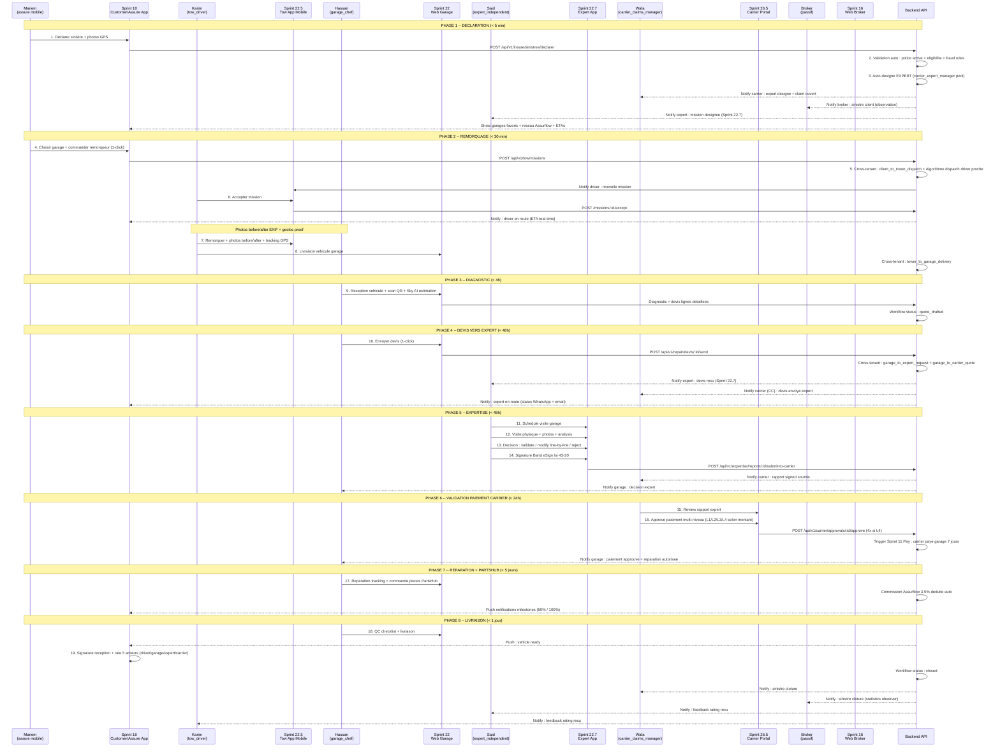

# META-PROMPT B-24 v3.0 -- SPRINT 24 FLUX SINISTRE 5 ACTEURS COORDONNES (Scenario Demo Day)

**Version** : v3.0 (Option B Migration -- refonte complete -- pitch Demo Day 30 juin)
**Phase** : 5 -- Vertical Repair (Assurflow Garage ERP + Ecosystem)
**Sprint** : 24 / 40 (cumul v3.0) -- Phase 5 Sprint 6
**Position** : Apres Web Garage Mobile (Sprint 23), avant Cross-Tenant Framework (Sprint 25)
**Numerotation taches** : 5.6.1 a 5.6.15 (vs 5.6.1 a 5.6.13 v2.2)
**Effort total** : ~90 heures developpement / 2 semaines etendues (vs 75h v2.2)
**Priorite** : P0 ABSOLUE (sprint le plus differenciant + scenario Demo Day 30 juin)

---

## Refonte v2.2 -> v3.0 : Changements majeurs

Ce sprint est **refondu** pour integrer la realite ecosystem 6 acteurs Assurflow v3.0 + scenario Demo Day :

### Changements cle

| Element | v2.2 (FAUX -- 3 acteurs) | v3.0 (CORRECT -- 6 acteurs) |
|---------|--------------------------|----------------------------|
| **Acteurs** | Assure + Broker + Garage (3) | **Assure + Tow + Garage + Expert + Carrier + Broker (6)** |
| **Workflow validation** | Validation auto IA pre-screening | **Carrier designe expert + expert valide devis** |
| **Remorquage** | Absent | **Cross-tenant Tow Mobile App (Sprint 22.5)** |
| **Expert** | Absent | **Cross-tenant Expert App (Sprint 22.7)** |
| **Carrier role** | Absent (assureur dans Sprint 32 seulement) | **Cross-tenant Carrier Portal (Sprint 26.5) avec validation paiement multi-niveau** |
| **Workflow M8** | 8 etapes simples | **8 etapes coordonnees 5 acteurs (broker passif)** |
| **Cross-tenant** | 1 type (sinistre routing) | **4 types (client_to_tower + tower_to_garage + garage_to_expert + garage_to_carrier)** |
| **Scenario Demo** | Inexistant | **Scenario coordonne 5 acteurs en 15 minutes (Mariem / Karim / Hassan / Said / Wafa)** |
| **Tests E2E** | 40+ | **50+ (incluant scenario Demo Day complet)** |
| **Effort** | 75h | **90h** (+15h pour 5 acteurs orchestration + Demo Day scenario) |

---

## Objectif Global du Sprint v3.0

Implementer **flux sinistre client end-to-end M8 v3.0 coordonne 6 acteurs** : declaration assure mobile -> remorquage Uber-style -> reception garage -> diagnostic Sky AI -> devis envoye expert designe par carrier -> validation expert ligne par ligne -> approbation paiement carrier multi-niveau -> reparation + PartsHub -> livraison + reglement.

Ce sprint est **LE pitch Demo Day 30 juin 2026** : le scenario coordonne 5 acteurs (Mariem cliente / Karim remorqueur / Hassan garage / Said expert / Wafa carrier) doit etre executable LIVE en 15 minutes devant carriers + ACAPS + investisseurs.

A la sortie de ce sprint :
- Workflow M8 v3.0 documente : 8 etapes coordonnees 6 acteurs (broker passif observateur)
- 4 cross-tenant routings actives : client_to_tower / tower_to_garage / garage_to_expert / garage_to_carrier
- Sinistre Cycle Tracker v3.0 : entity centralise vue 360 cross-tenant 6 acteurs
- Notifications coordonnees 6 parties (priorities + channels selon acteur)
- Dashboards 6 acteurs : assure / tow_driver / garage_chef / expert / carrier_claims_manager / broker_admin
- **Scenario Demo Day "Marrakech sinistre type"** : 5 acteurs traversent workflow en 15 minutes documentes
- Seed data realistic Demo Day : 1 sinistre complet pre-execute avec timestamps et personas
- Tests E2E end-to-end : 1 sinistre traverse 6 sprints/apps complet (50+ scenarios)

---

## Frontiere du Sprint v3.0

**INCLUS** :
- Workflow M8 v3.0 documente 6 acteurs
- 4 cross-tenant routings (vs 1 v2.2)
- Sinistre Cycle Tracker centralise vue 360
- Notifications coordonnees 6 parties
- Dashboards 6 acteurs (read-only vues croisees)
- **Scenario Demo Day complet** (personas + timestamps + seed data)
- Tests E2E 50+

**EXCLU** (sera ajoute aux sprints suivants) :
- Cross-Tenant Framework runtime activation 7 types -- Sprint 25
- Connecteurs carriers reels -- Sprint 32 (defere)
- Fraud detection IA avance -- Sprint 30+ defere
- Marketplace garages public selection -- Phase 7+
- Multi-currency CIMA expansion -- Phase 7+

---

## Lectures Prealables Obligatoires

1. `00-pilotage/decisions/012-6-acteurs-ecosystem.md` -- 6 acteurs ecosystem
2. `00-pilotage/decisions/013-expert-acteur-central.md` -- workflow expert v3.0
3. `00-pilotage/decisions/014-partshub-phase1.md` -- PartsHub integration
4. `00-pilotage/decisions/015-demo-day-30-juin.md` -- scenario Demo Day cible
5. Sortie Sprint 7.5a : 26 roles + 7 cross-tenant types + 130 perms
6. Sortie Sprint 18 : web-assure-mobile + declaration sinistre + choix garage M8
7. Sortie Sprint 19-21 v3.0 : backend Repair + workflow expert + PartsHub
8. Sortie Sprint 22 : web-garage desktop
9. Sortie Sprint 22.5 : web-tow-mobile (Tow App)
10. Sortie Sprint 22.7 : web-expert (Expert App desktop + mobile)
11. Sortie Sprint 23 : web-garage-mobile (technicien PWA)
12. Sortie Sprint 14-15 : Insure (police + sinistre + experts)
13. Sortie Sprint 26.5 : web-carrier-portal (Carrier Portal)
14. Sortie Sprint 6 : multi-tenant + RLS + cross-tenant authorizations

---

## Dependencies Sprint precedents (explicites)

Ce Sprint 24 v3.0 **depend critiquement** de **TOUS les sprints precedents** car il coordonne le workflow complet :

| Sprint | Apport critique |
|--------|-----------------|
| Sprint 7.5a | 7 cross-tenant types + 26 roles |
| Sprint 9 | NotificationsService multi-canal (email + WhatsApp status only + push + SMS) |
| Sprint 14-15 | Insure (police + sinistre + experts entities) |
| Sprint 18 | Customer/Assure Portal mobile (declaration sinistre + choix garage) |
| Sprint 19-21 v3.0 | Repair workflow + expert + PartsHub |
| Sprint 22 | Web Garage App |
| Sprint 22.5 | Tow App (dispatch + tracking) |
| Sprint 22.7 | Expert App (validation devis) |
| Sprint 23 | Garage Mobile PWA |
| Sprint 26.5 | Carrier Portal (validation paiement) |

---

## Stack Imposee (Sprint 24 v3.0)

| Composant | Version | Notes |
|-----------|---------|-------|
| zod | 3.24.1 | validation cross-tenant flows |
| date-fns | 4.1.0 | duration tracking + SLA timing |
| decimal.js | 10.4.3 | precision computations |
| @insurtech/cross-tenant | workspace | Framework cross-tenant Sprint 25 preview |
| socket.io | 4.x | Real-time coordination 6 acteurs |

Pas de nouvelle dep externe.

---

## Vue d'Ensemble des 15 Taches v3.0

| # | Tache | Effort | Priorite | Refonte v3.0 ? | Depend de |
|---|-------|--------|----------|-----------------|-----------|
| 5.6.1 | Workflow M8 v3.0 documente : flow diagram 6 acteurs + states cross-systems | 6h | P0 | REFONDU | Phase 5 |
| 5.6.2 | Cross-tenant routing 4 types : client_to_tower + tower_to_garage + garage_to_expert + garage_to_carrier | 8h | P0 | REFONDU | 5.6.1 |
| 5.6.3 | Validation pre-screening : couverture police + expert designation auto + eligibilite | 6h | P0 | REFONDU | 5.6.2 |
| 5.6.4 | Sinistre Cycle Tracker v3.0 : entity centralise vue 360 6 acteurs | 6h | P0 | REFONDU | 5.6.3 |
| 5.6.5 | Notifications coordonnees 6 parties : assure + tow + garage + expert + carrier + broker | 7h | P0 | REFONDU | 5.6.4 |
| **5.6.6** | **Dashboard "Mon Sinistre" assure (Sprint 18 enrichi : tracking 5 acteurs)** | **5h** | **P0** | **REFONDU** | **5.6.5** |
| **5.6.7** | **Dashboard tow_driver (Sprint 22.5 enrichi : mission active)** | **3h** | **P0** | **NOUVEAU** | **5.6.6** |
| 5.6.8 | Dashboard garage chef : pipeline + dispatch + KPIs (Sprint 22 enrichi) | 4h | P0 | Inchange v2.2 | 5.6.7 |
| **5.6.9** | **Dashboard expert (Sprint 22.7 enrichi : missions queue + history)** | **4h** | **P0** | **NOUVEAU** | **5.6.8** |
| **5.6.10** | **Dashboard carrier_claims_manager (Sprint 26.5 enrichi : claims chain real-time)** | **5h** | **P0** | **NOUVEAU** | **5.6.9** |
| 5.6.11 | Dashboard broker monitoring read-only sinistres lies polices | 4h | P0 | Inchange v2.2 | 5.6.10 |
| 5.6.12 | Endpoints REST cross-tenant + permissions enrichies | 5h | P0 | Etendu | 5.6.11 |
| 5.6.13 | Audit trail cross-tenant 4 types + Kafka events coordination | 5h | P0 | Etendu | 5.6.12 |
| **5.6.14** | **Scenario Demo Day "Marrakech sinistre type" : seed data + script 15 min** | **8h** | **P0** | **NOUVEAU CRITIQUE** | **5.6.13** |
| 5.6.15 | Tests E2E end-to-end 50+ : 1 sinistre traverse 6 sprints/apps complet | 14h | P0 | REFONDU | 5.6.14 |

**Total** : 90 heures (vs 75h v2.2). +15h pour orchestration 6 acteurs + scenario Demo Day.

---

# DETAIL DES 15 TACHES v3.0

---

## Tache 5.6.1 -- REFONDU : Workflow M8 v3.0 documente 6 acteurs

**Sprint** : 24 (Phase 5 / Sprint 6)
**Phase** : 5 -- Vertical Repair
**Priorite** : P0
**Effort** : 6h
**Dependances** : Phase 5

### But (REFONDU v3.0)

Documenter workflow M8 v3.0 complet : flow diagram + states transitions + responsabilites + SLA + edge cases pour **6 acteurs coordonnes** (vs 3 v2.2).

### Refonte v2.2 -> v3.0

**v2.2** : 3 acteurs (assure / broker / garage), 8 etapes simples, broker = observateur passif.
**v3.0** : 6 acteurs (assure / tow / garage / expert / carrier / broker), 8 etapes coordonnees, **broker reste observateur passif** (le moins implique mais voit tout dans dashboard), expert et carrier sont nouveaux acteurs centraux.

### Livrables checkables

- [ ] Document `repo/docs/workflow-m8-v3-flux-sinistre-6-acteurs.md`
- [ ] Sections :
  - **Vue d'ensemble M8 v3.0** : 8 etapes principales coordonnees 6 acteurs
  - **Diagrammes sequences Mermaid** : 1 master diagram + 6 diagrammes par acteur
  - **Roles + responsabilites par acteur** : qui fait quoi a quelle etape
  - **States transitions cross-systems** : sinistre move tenant assure -> tenant tow -> tenant garage -> rapport tenant expert -> approval tenant carrier
  - **SLA per etape** : declaration confirme < 5 min / tow dispatch < 30 min / reception garage < 4h / expert visite < 48h / carrier approval < 24h / etc.
  - **Edge cases** : 12+ cas (annulation chacun acteur, refus chacun, pas d'expert dispo, parts indisponibles, etc.)
  - **Comparaison M0 (modele traditionnel) vs M8 v3.0** : delais + avantages
- [ ] Diagrammes Mermaid versionnage GitHub
- [ ] Distribution : equipe technique + business + legal + ACAPS review

### Pattern critique : Workflow M8 v3.0 sequence master diagram



### Comparaison delais M0 (traditionnel) vs M8 v3.0

| Etape | M0 traditionnel | M8 v3.0 Assurflow | Gain |
|-------|-----------------|-------------------|------|
| Declaration | 1-2 jours (broker office hours) | < 5 min (mobile self-service) | -99% |
| Remorquage | 2-3h (telephone manuel) | < 30 min (Uber-style) | -80% |
| Reception garage | Variable (depend garage) | < 4h | -50% |
| Diagnostic | 1-2 jours | < 4h (Sky AI assist) | -75% |
| Expertise | 5-15 jours (visite manuelle) | < 48h | -80% |
| Validation paiement | 15-30 jours (workflow papier) | < 24h (digital multi-niveau) | -95% |
| Reparation | 5-10 jours | < 5 jours | -30% |
| Paiement garage | 30-180 jours (cash flow probleme) | 7 jours | -90% |
| **TOTAL sinistre** | **30-180 jours** | **7-12 jours** | **-90% delai moyen** |

### Criteres validation V1-V8

| ID | Critere | Priorite |
|----|---------|----------|
| V1 | Document workflow M8 v3.0 complet | P0 |
| V2 | Master diagram Mermaid 6 acteurs | P0 |
| V3 | 6 diagrammes secondaires par acteur | P0 |
| V4 | 8 etapes documentees + SLA | P0 |
| V5 | 12+ edge cases couverts | P0 |
| V6 | Comparaison M0 vs M8 v3.0 | P0 |
| V7 | Distribution legal + ACAPS review | P1 |
| V8 | Tests scenarios humains review | P1 |

### Fichiers crees / modifies

```
repo/docs/workflow-m8-v3-flux-sinistre-6-acteurs.md                                  # ~800 lignes (markdown + 7 Mermaid)
repo/docs/workflow-m8-v3-comparison-m0.md                                              # ~200 lignes
repo/docs/workflow-m8-v3-sla-table.md                                                  # ~120 lignes
```

---

## Tache 5.6.2 -- REFONDU : Cross-tenant routing 4 types

**Sprint** : 24 (Phase 5 / Sprint 6)
**Phase** : 5 -- Vertical Repair
**Priorite** : P0
**Effort** : 8h
**Dependances** : 5.6.1

### But (REFONDU v3.0)

Mecanisme cross-tenant 4 types coordonnes (vs 1 type v2.2). Sinistre traverse 4 tenants : assure -> tow -> garage -> expert (lecture) + carrier (lecture/approval).

### Refonte v2.2 -> v3.0

| Cross-tenant type | v2.2 | v3.0 |
|-------------------|------|------|
| **client_to_tower_dispatch** | Absent | NOUVEAU |
| **tower_to_garage_delivery** | Absent | NOUVEAU |
| **garage_to_expert_request** | Absent | NOUVEAU |
| **garage_to_carrier_quote** | Absent | NOUVEAU |
| Total | 1 (basic sinistre routing) | **4 cross-tenant types** + 3 existants Sprint 6 |

### Livrables checkables

- [ ] Migration : table `sinistre_cross_tenant_links` v3.0 :
  - id, sinistre_master_id (FK Insure tenant source), 
  - tow_sinistre_id (FK Tow tenant -- nullable si pas de remorquage),
  - garage_sinistre_id (FK Garage tenant),
  - expert_assignment_id (FK Expert tenant -- via insure_expert_assignments),
  - carrier_payment_approval_id (FK Carrier tenant -- via carrier_payment_approvals),
  - status, dispatched_at, completed_at, metadata
- [ ] Service `cross-tenant-sinistre-routing-v3.service.ts` :
  - `routeMissionToTow(sinistreId, towTenantId)` : creates client_to_tower authorization + Tow mission
  - `routeDeliveryToGarage(missionId, garageTenantId)` : creates tower_to_garage authorization
  - `routeDevisToExpert(devisId, expertId)` : creates garage_to_expert authorization + ExpertAssignment update
  - `routeQuoteToCarrier(devisId, carrierTenantId)` : creates garage_to_carrier_quote authorization + CarrierPaymentApproval pending
  - `syncStatus(sinistreMasterId)` : sync status all linked tenants (cron 1min + Kafka events)
- [ ] Privileged context : utilise super-tenant role pour cross-tenant operations
- [ ] Audit complete : qui a access cross-tenant + when + which authorization type
- [ ] Endpoints :
  - `POST /api/v1/repair/sinistres/:id/route-to-tow`
  - `POST /api/v1/repair/sinistres/:id/route-delivery-to-garage`
  - `POST /api/v1/repair/devis/:id/route-to-expert` (via Tache 5.3.3 Sprint 21 v3.0)
  - `POST /api/v1/repair/devis/:id/route-quote-to-carrier` (via Tache 5.3.5 Sprint 21 v3.0)
- [ ] Tests : routing + isolation + audit pour 4 types

### Pattern critique : cross-tenant routing v3.0

```typescript
@Injectable()
export class CrossTenantSinistreRoutingV3Service {
  /**
   * Route mission de tow dispatch (Sprint 22.5).
   * Cree authorization `client_to_tower_dispatch` + Tow mission.
   */
  async routeMissionToTow(
    sinistreId: string,
    towTenantId: string,
    pickupCoords: Coordinates,
    destinationCoords: Coordinates
  ): Promise<{ missionId: string }> {
    const sourceTenantId = getCurrentTenantId();
    const sourceSinistre = await this.dataSource.getRepository(InsureSinistre).findOneOrFail(sinistreId);
    
    let missionId: string | null = null;
    
    await this.tenantContext.runWithContext(
      { tenantId: towTenantId, isSuperAdmin: true },
      async () => {
        // Create Tow mission (Sprint 22.5 entity)
        const mission = await this.dataSource.getRepository(TowMission).save({
          tenant_id: towTenantId,
          customer_tenant_id: sourceTenantId,
          customer_user_id: sourceSinistre.customer_user_id,
          sinistre_id: sinistreId,
          pickup_lat: pickupCoords.lat,
          pickup_lng: pickupCoords.lng,
          destination_lat: destinationCoords.lat,
          destination_lng: destinationCoords.lng,
          vehicle_immatriculation: sourceSinistre.vehicle_data.immatriculation,
          status: 'pending',
          urgency: sourceSinistre.urgency ?? 'standard',
        });
        
        missionId = mission.id;
      }
    );
    
    // Create cross-tenant authorization client_to_tower_dispatch
    await this.dataSource.getRepository(CrossTenantAuthorization).save({
      type: 'client_to_tower_dispatch',
      from_tenant_id: sourceTenantId,
      to_tenant_id: towTenantId,
      resource_type: 'mission',
      resource_id: missionId,
      created_by_user_id: getCurrentUserId(),
      expires_at: addHours(new Date(), 24),  // 24h for mission completion
    });
    
    // Insert link master
    await this.dataSource.getRepository(SinistreCrossTenantLink).save({
      sinistre_master_id: sinistreId,
      tow_sinistre_id: missionId,
      status: 'tow_dispatched',
      dispatched_at: new Date(),
    });
    
    // Kafka event
    await this.kafkaPublisher.publish('insurtech.events.sinistre.tow_dispatched', {
      sinistre_id: sinistreId,
      tow_mission_id: missionId,
      tow_tenant_id: towTenantId,
    });
    
    return { missionId: missionId! };
  }
  
  /**
   * Route delivery du remorqueur au garage (apres at_destination).
   * Cree authorization `tower_to_garage_delivery`.
   */
  async routeDeliveryToGarage(
    missionId: string,
    garageTenantId: string
  ): Promise<{ garageSinistreId: string }> {
    const towTenantId = getCurrentTenantId();
    const mission = await this.dataSource.getRepository(TowMission).findOneOrFail(missionId);
    
    let garageSinistreId: string | null = null;
    
    await this.tenantContext.runWithContext(
      { tenantId: garageTenantId, isSuperAdmin: true },
      async () => {
        // Create Repair sinistre (Sprint 19 entity)
        const repairSinistre = await this.dataSource.getRepository(RepairSinistre).save({
          tenant_id: garageTenantId,
          sinistre_number: await this.generateNumber(garageTenantId),
          customer_tenant_id: mission.customer_tenant_id,
          customer_user_id: mission.customer_user_id,
          tow_mission_id: missionId,  // link to tow mission
          insure_policy_id: mission.sinistre_id,  // resolve later via Insure tenant
          vehicle_data: { immatriculation: mission.vehicle_immatriculation },
          status: 'received_at_garage',
          received_at: new Date(),
        });
        
        garageSinistreId = repairSinistre.id;
      }
    );
    
    // Create cross-tenant authorization tower_to_garage_delivery
    await this.dataSource.getRepository(CrossTenantAuthorization).save({
      type: 'tower_to_garage_delivery',
      from_tenant_id: towTenantId,
      to_tenant_id: garageTenantId,
      resource_type: 'mission',
      resource_id: missionId,
      created_by_user_id: getCurrentUserId(),
      expires_at: addDays(new Date(), 7),  // 7 days for proof access post-delivery
    });
    
    // Update link master
    await this.dataSource.getRepository(SinistreCrossTenantLink)
      .update({ tow_sinistre_id: missionId }, {
        garage_sinistre_id: garageSinistreId,
        status: 'delivered_to_garage',
      });
    
    return { garageSinistreId: garageSinistreId! };
  }
  
  /**
   * Route devis from garage to expert (apres designation by carrier).
   * Note : designation initiale faite par carrier (Sprint 26.5). Cette methode route l'envoi devis.
   */
  async routeDevisToExpert(
    devisId: string,
    expertAssignmentId: string
  ): Promise<void> {
    const garageTenantId = getCurrentTenantId();
    const assignment = await this.expertAssignmentsRepo.findOneOrFail(expertAssignmentId);
    
    // Create cross-tenant authorization garage_to_expert_request
    await this.dataSource.getRepository(CrossTenantAuthorization).save({
      type: 'garage_to_expert_request',
      from_tenant_id: garageTenantId,
      to_tenant_id: assignment.expert_tenant_id,
      resource_type: 'devis',
      resource_id: devisId,
      created_by_user_id: getCurrentUserId(),
      expires_at: addDays(new Date(), 30),
    });
    
    // Update link master
    await this.dataSource.getRepository(SinistreCrossTenantLink)
      .update({ garage_sinistre_id: assignment.sinistre_id }, {
        expert_assignment_id: expertAssignmentId,
        status: 'expert_in_progress',
      });
  }
  
  /**
   * Route quote info to carrier (CC during expert validation, then payment approval).
   */
  async routeQuoteToCarrier(
    devisId: string,
    carrierTenantId: string,
    amountMad: number
  ): Promise<{ carrierApprovalId: string }> {
    const garageTenantId = getCurrentTenantId();
    
    let carrierApprovalId: string | null = null;
    
    await this.tenantContext.runWithContext(
      { tenantId: carrierTenantId, isSuperAdmin: true },
      async () => {
        // Create CarrierPaymentApproval (Sprint 26.5 entity)
        const approval = await this.dataSource.getRepository(CarrierPaymentApproval).save({
          tenant_id: carrierTenantId,
          devis_id: devisId,
          payee_tenant_id: garageTenantId,
          payee_type: 'garage',
          amount_mad: amountMad,
          required_level: this.determineLevel(amountMad),
          status: 'pending_l1',
        });
        
        carrierApprovalId = approval.id;
      }
    );
    
    // Create cross-tenant authorization garage_to_carrier_quote
    await this.dataSource.getRepository(CrossTenantAuthorization).save({
      type: 'garage_to_carrier_quote',
      from_tenant_id: garageTenantId,
      to_tenant_id: carrierTenantId,
      resource_type: 'devis',
      resource_id: devisId,
      created_by_user_id: getCurrentUserId(),
      expires_at: addDays(new Date(), 30),
    });
    
    return { carrierApprovalId: carrierApprovalId! };
  }
}
```

### Criteres validation V1-V10

| ID | Critere | Priorite |
|----|---------|----------|
| V1 | Migration table sinistre_cross_tenant_links v3.0 | P0 |
| V2 | Service 4 methodes routing | P0 |
| V3 | client_to_tower_dispatch OK | P0 |
| V4 | tower_to_garage_delivery OK | P0 |
| V5 | garage_to_expert_request OK | P0 |
| V6 | garage_to_carrier_quote OK | P0 |
| V7 | Privileged context isolation preserved | P0 |
| V8 | Audit complete 4 types | P0 |
| V9 | Kafka events 4 types | P0 |
| V10 | Tests 20+ scenarios PASS | P0 |

### Fichiers crees / modifies

```
repo/packages/database/src/migrations/{date}-Sprint24-CrossTenantLinksV3.ts            # ~80 lignes
repo/packages/repair/src/entities/sinistre-cross-tenant-link-v3.entity.ts                # ~70 lignes
repo/packages/repair/src/services/cross-tenant-sinistre-routing-v3.service.ts             # ~500 lignes
repo/apps/api/src/modules/repair/controllers/sinistres-cross-tenant.controller.ts          # ~180 lignes
```

---

## Tache 5.6.3 -- REFONDU : Validation pre-screening + auto-designation expert

**Sprint** : 24 (Phase 5 / Sprint 6)
**Phase** : 5 -- Vertical Repair
**Priorite** : P0
**Effort** : 6h
**Dependances** : 5.6.2

### But (REFONDU v3.0)

Validation pre-screening sinistre : couverture police + eligibilite vehicule + fraud rules basics + **auto-designation expert via carrier_expert_manager pool** (vs IA pre-screening v2.2).

### Refonte v2.2 -> v3.0

**v2.2** : IA pre-screening generique (couverture + eligibilite + fraud).
**v3.0** : Pre-screening **+ auto-designation expert** declenchee a la declaration sinistre (vs designation manuelle carrier_expert_manager apres). Carrier_expert_manager peut override la suggestion.

### Livrables checkables

- [ ] Service `sinistre-validation.service.ts` :
  - `validateCoverage(policyId, incidentData)` : verifier police active + couverture incident type
  - `validateEligibility(vehicleData)` : verifier vehicule eligible (age, immat valid, brand supported)
  - `runFraudRulesBasic(sinistreId)` : 5 rules (multiple sinistres recents / amount suspect / time-based / location-based / customer history)
  - `autoDesignateExpert(sinistreId)` : Sprint 26.5 -- find available expert from carrier pool + suggest designation
- [ ] Service `auto-expert-designation.service.ts` (preview Sprint 26.5) :
  - Algorithme : find experts active + zone match garage_location + specialty match + workload balance
  - Trier par : (zone proximity DESC, workload ASC, rating DESC, avg_response_time ASC)
  - Top expert auto-designated avec status='designated' (carrier_expert_manager peut override)
- [ ] Endpoints :
  - `POST /api/v1/insure/sinistres/:id/validate-prescreening`
  - `POST /api/v1/insure/sinistres/:id/auto-designate-expert`
- [ ] Permissions : `insure.sinistres.declare` (assure) + `carrier.experts.designate` (carrier_expert_manager override)
- [ ] Tests 15+ scenarios

### Criteres validation V1-V7

| ID | Critere | Priorite |
|----|---------|----------|
| V1 | Service validation pre-screening | P0 |
| V2 | Auto-designation expert algorithme | P0 |
| V3 | Fraud rules basic 5 rules | P0 |
| V4 | Carrier override option | P0 |
| V5 | Permissions enforces | P0 |
| V6 | Tests 15+ scenarios PASS | P0 |
| V7 | Integration Sprint 26.5 preview | P0 |

---

## Tache 5.6.4 -- REFONDU : Sinistre Cycle Tracker v3.0

**Sprint** : 24 (Phase 5 / Sprint 6)
**Phase** : 5 -- Vertical Repair
**Priorite** : P0
**Effort** : 6h
**Dependances** : 5.6.3

### But (REFONDU v3.0)

Entity centralise vue 360 sinistre cross-tenant 6 acteurs : status global + timestamps cle + acteurs impliques + delays SLA tracking.

### Livrables checkables

- [ ] Migration : table `sinistre_cycle_tracker_v3` :
  - id, sinistre_master_id (FK Insure tenant)
  - assure_user_id, assure_tenant_id
  - tow_driver_id (FK tow_drivers nullable)
  - garage_tenant_id, garage_chef_user_id
  - expert_id (FK insure_experts), expert_user_id
  - carrier_tenant_id, carrier_claims_manager_user_id
  - broker_tenant_id (nullable), broker_user_id
  - 
  - workflow_status text NOT NULL (lifecycle 30+ states v3.0)
  - 
  - timestamps :
    - declared_at, expert_designated_at, tow_dispatched_at, tow_accepted_at
    - received_at_garage, diagnostic_started_at, diagnostic_completed_at
    - quote_sent_to_expert_at, expert_visit_scheduled_at, expert_visit_completed_at
    - expert_decision_at (validated/modified/rejected)
    - expert_signed_at, quote_submitted_to_carrier_at
    - carrier_l1_approved_at, l2_approved_at, l3_approved_at, l4_approved_at
    - payment_approved_at, payment_initiated_at, payment_completed_at
    - reparation_started_at, parts_ordered_at, parts_received_at
    - reparation_completed_at, qc_completed_at, delivered_at
    - closed_at
  - 
  - SLA tracking :
    - sla_declaration_to_dispatch_minutes (cible 30)
    - sla_dispatch_to_garage_minutes (cible 60)
    - sla_garage_to_quote_hours (cible 4)
    - sla_quote_to_expert_visit_hours (cible 48)
    - sla_expert_to_carrier_hours (cible 24)
    - sla_total_cycle_days (cible 7-12)
- [ ] Service `cycle-tracker.service.ts` :
  - Auto-update on Kafka events (insurtech.events.*)
  - SLA breach detection + alerts
  - Vue 360 query : `getCycleVue(sinistreMasterId)` retourne JSON complet 6 acteurs
- [ ] Kafka consumers : listen tous events workflow + update tracker
- [ ] Indexes : sinistre_master_id, workflow_status, timestamps cle
- [ ] Tests 12+ scenarios

### Criteres validation V1-V8

| ID | Critere | Priorite |
|----|---------|----------|
| V1 | Migration table cycle_tracker_v3 | P0 |
| V2 | 30+ timestamps cle | P0 |
| V3 | SLA tracking 6 metriques | P0 |
| V4 | Auto-update via Kafka | P0 |
| V5 | SLA breach detection | P0 |
| V6 | Vue 360 query JSON 6 acteurs | P0 |
| V7 | Indexes performance | P0 |
| V8 | Tests 12+ scenarios PASS | P0 |

---

## Tache 5.6.5 -- REFONDU : Notifications coordonnees 6 parties

**Sprint** : 24 (Phase 5 / Sprint 6)
**Phase** : 5 -- Vertical Repair
**Priorite** : P0
**Effort** : 7h
**Dependances** : 5.6.4

### But (REFONDU v3.0)

Notifications coordonnees 6 parties : assure + tow + garage + expert + carrier + broker. Channels selon urgence + acteur. **WhatsApp = status seulement** (correction Saad).

### Livrables checkables

- [ ] Service `notifications-coordinator-v3.service.ts` :
  - Subscribe Kafka events workflow
  - Determine recipients selon evenement
  - Determine channels selon acteur + urgence
  - Trigger Sprint 9 NotificationsService multi-canal
- [ ] Matrix evenement -> recipients + channels :
  - `sinistre.declared` : assure (email + push) + carrier (email + push) + broker (email observer)
  - `expert.designated` : expert (push + email) + carrier (email confirm) + garage (email FYI)
  - `tow.dispatched` : assure (push tracking) + tow_driver (push urgent + SMS) + carrier (email)
  - `tow.completed` : assure (push) + garage (push reception) + carrier (email)
  - `diagnostic.completed` : assure (email summary) + expert (push) + carrier (email)
  - `quote.sent_to_expert` : expert (email avec PDF + push) + carrier (email CC avec PDF) + customer (email COPY) + WhatsApp status
  - `expert.decision` : carrier (email + push) + garage (push + email) + assure (WhatsApp status only)
  - `carrier.approval.fully_approved` : garage (push + email) + assure (WhatsApp status only)
  - `reparation.completed` : assure (push + email + WhatsApp status) + garage (push)
  - `delivered` : assure (push + email + WhatsApp status) + carrier (email summary) + broker (email observer)
- [ ] WhatsApp scope strict (correction Saad correction 7) : whitelist templates status only
- [ ] PII redaction logs Sprint 9
- [ ] I18n fr/ar-MA/ar
- [ ] Tests 20+ scenarios

### Criteres validation V1-V8

| ID | Critere | Priorite |
|----|---------|----------|
| V1 | Service coordinator v3 fonctionnel | P0 |
| V2 | Matrix evenement -> recipients OK | P0 |
| V3 | WhatsApp status only (whitelist enforced) | P0 |
| V4 | 10+ evenements declenches | P0 |
| V5 | I18n 3 langues | P0 |
| V6 | PII redaction | P0 |
| V7 | Audit log toutes notifications | P0 |
| V8 | Tests 20+ scenarios PASS | P0 |

---

## Tache 5.6.6 -- REFONDU : Dashboard "Mon Sinistre" assure

**Sprint** : 24 (Phase 5 / Sprint 6)
**Phase** : 5 -- Vertical Repair
**Priorite** : P0
**Effort** : 5h
**Dependances** : 5.6.5

### But

Dashboard "Mon Sinistre" enrichi Sprint 18 : tracking 5 acteurs real-time (vs broker only v2.2).

### Livrables checkables

- [ ] Page enrichie Sprint 18 `web-assure-mobile/app/(assure)/sinistres/:id/tracking`
- [ ] 5 sections acteurs avec status real-time :
  - **Acteur Tow** (si remorquage) : driver name + photo + ETA + map live
  - **Acteur Garage** : garage name + chef + progress bar reparation
  - **Acteur Expert** : expert name + agrement ACAPS + decision (validated/modified/rejected)
  - **Acteur Carrier** : carrier name + approval level + delays tracking
  - **Acteur Broker** (read-only observer) : juste mention nom + status global
- [ ] Timeline workflow horizontal scrollable (30+ etats)
- [ ] WebSocket real-time updates via Socket.IO
- [ ] Documents accessibles : photos garage / rapport expertise (after signed) / facture
- [ ] Bouton "Contacter" per acteur (sauf broker)
- [ ] Notifications inline (badge counter)

### Criteres validation V1-V6

| ID | Critere | Priorite |
|----|---------|----------|
| V1 | 5 sections acteurs visibles | P0 |
| V2 | Timeline 30+ etats | P0 |
| V3 | Real-time updates Socket.IO | P0 |
| V4 | Documents accessibles | P0 |
| V5 | Tests Playwright PASS | P0 |
| V6 | Accessible WCAG 2.1 AA | P0 |

---

## Tache 5.6.7 -- NOUVEAU : Dashboard tow_driver mission active

**Effort** : 3h | **Priorite** : P0 | **Depend** : 5.6.6

### But

Dashboard tow_driver Sprint 22.5 enrichi : mission active context + cross-tenant data garage destination.

### Livrables checkables

- [ ] Page enrichie Sprint 22.5 `web-tow-mobile/app/(driver)/missions/:id`
- [ ] Sections additionnelles cross-tenant :
  - Garage destination info (read-only via tower_to_garage_delivery authorization)
  - Customer contact info (limited via client_to_tower_dispatch authorization)
- [ ] Photos before/after upload context
- [ ] Tests Playwright

### Criteres validation V1-V4

| ID | Critere | Priorite |
|----|---------|----------|
| V1 | Cross-tenant data garage visible | P0 |
| V2 | Customer info limited scope | P0 |
| V3 | Photos workflow integrated | P0 |
| V4 | Tests Playwright PASS | P0 |

---

## Tache 5.6.8 -- Dashboard garage chef (inchange v2.2)

**Effort** : 4h | **Priorite** : P0 | **Depend** : 5.6.7

### But

Dashboard chef garage Sprint 22 enrichi : pipeline + dispatch + KPIs.

Voir B-24 v2.2 Tache 5.6.9 (preserved).

---

## Tache 5.6.9 -- NOUVEAU : Dashboard expert missions queue

**Effort** : 4h | **Priorite** : P0 | **Depend** : 5.6.8

### But

Dashboard expert Sprint 22.7 enrichi : missions queue + history + performance stats.

### Livrables checkables

- [ ] Page enrichie Sprint 22.7 `web-expert/app/dashboard`
- [ ] Sections :
  - **Missions designated** (pending acceptance) -- accept/reject inline
  - **Missions in progress** (accepted, visite scheduled)
  - **Missions awaiting signature** (rapport draft) 
  - **History** completed last 30 days
  - **Performance** stats (validated %, avg response time, honoraires)
- [ ] Filtres : carrier / specialty / date range
- [ ] Real-time updates Socket.IO
- [ ] Calendar visites planifiees integration
- [ ] Tests Playwright

### Criteres validation V1-V5

| ID | Critere | Priorite |
|----|---------|----------|
| V1 | Missions queue 4 sections | P0 |
| V2 | Filtres fonctionnels | P0 |
| V3 | Performance stats | P0 |
| V4 | Calendar integration | P0 |
| V5 | Tests Playwright PASS | P0 |

---

## Tache 5.6.10 -- NOUVEAU : Dashboard carrier_claims_manager

**Effort** : 5h | **Priorite** : P0 | **Depend** : 5.6.9

### But

Dashboard carrier_claims_manager Sprint 26.5 enrichi : claims chain real-time visibility 6 acteurs.

### Livrables checkables

- [ ] Page enrichie Sprint 26.5 `web-carrier-portal/app/claims/:id`
- [ ] Sections claims chain (real-time) :
  - **Acteur Assure** : info + politique + history sinistres
  - **Acteur Tow** (si remorquage) : driver + duree + cout
  - **Acteur Garage** : tenant + chef + workflow status
  - **Acteur Expert** : agree ACAPS + decision + rapport signed
  - **Acteur Broker** (read-only) : tenant + commission liee
- [ ] Boutons actions selon role :
  - carrier_claims_manager : approve_l1 / reject_l1 / escalate
  - carrier_finance : approve_l2 / reject_l2
  - carrier_admin : approve_l3_or_l4
- [ ] Timeline workflow horizontal + delays SLA visualization
- [ ] Documents accessibles : rapport expert / devis / photos / signatures
- [ ] Tests Playwright

### Criteres validation V1-V6

| ID | Critere | Priorite |
|----|---------|----------|
| V1 | 5 sections acteurs visibles | P0 |
| V2 | Boutons actions selon role | P0 |
| V3 | Timeline + SLA delays | P0 |
| V4 | Documents accessibles | P0 |
| V5 | Real-time Socket.IO | P0 |
| V6 | Tests Playwright PASS | P0 |

---

## Tache 5.6.11 -- Dashboard broker monitoring (inchange v2.2)

**Effort** : 4h | **Priorite** : P0 | **Depend** : 5.6.10

### But

Dashboard broker monitoring read-only sinistres lies polices (broker reste observateur passif v3.0).

Voir B-24 v2.2 Tache 5.6.8 (preserved -- juste renumeree).

---

## Tache 5.6.12 -- REFONDU : Endpoints REST cross-tenant + permissions

**Effort** : 5h | **Priorite** : P0 | **Depend** : 5.6.11

### But

Consolidation endpoints cross-tenant + permissions enrichies 4 types autorisations.

### Livrables checkables

- [ ] Endpoints REST consolides :
  - `GET /api/v1/repair/cycle-tracker/:sinistreMasterId` (vue 360 6 acteurs)
  - `POST /api/v1/repair/sinistres/:id/route-to-tow`
  - `POST /api/v1/repair/sinistres/:id/route-delivery-to-garage`
  - `POST /api/v1/repair/devis/:id/route-to-expert`
  - `POST /api/v1/repair/devis/:id/route-quote-to-carrier`
  - `GET /api/v1/repair/cycle-tracker/sla-breaches`
- [ ] Permissions enrichies (Sprint 7.5a deja livre, juste verify utilisees) :
  - `cycle.read_global` (super_admin + analyst_support)
  - `cycle.read_my_role` (chaque acteur voit son perimeter)
- [ ] Swagger documentation
- [ ] Tests E2E permissions 6 roles

### Criteres validation V1-V4

| ID | Critere | Priorite |
|----|---------|----------|
| V1 | 6+ endpoints cross-tenant | P0 |
| V2 | Permissions enforcement 6 roles | P0 |
| V3 | Swagger documentation | P0 |
| V4 | Tests E2E 15+ scenarios | P0 |

---

## Tache 5.6.13 -- REFONDU : Audit trail cross-tenant + Kafka events

**Effort** : 5h | **Priorite** : P0 | **Depend** : 5.6.12

### But

Audit trail complete 4 types cross-tenant + Kafka events coordination 6 acteurs.

### Livrables checkables

- [ ] Audit log Sprint 6 etendu : trace each cross-tenant access type
  - Quelle authorization type utilisee
  - Quel resource accede (sinistre / mission / devis / approval)
  - Quel acteur (tenant + role + user)
  - Quand + comment (read / write / approve / reject)
- [ ] Kafka topics v3.0 :
  - `insurtech.events.sinistre.declared`
  - `insurtech.events.sinistre.expert_designated`
  - `insurtech.events.sinistre.tow_dispatched`
  - `insurtech.events.sinistre.received_at_garage`
  - `insurtech.events.sinistre.diagnostic_completed`
  - `insurtech.events.sinistre.quote_sent_to_expert`
  - `insurtech.events.sinistre.expert_decision` (validated/modified/rejected)
  - `insurtech.events.sinistre.carrier_approval_progress` (each L)
  - `insurtech.events.sinistre.payment_approved`
  - `insurtech.events.sinistre.reparation_started`
  - `insurtech.events.sinistre.parts_ordered` (PartsHub)
  - `insurtech.events.sinistre.delivered`
  - `insurtech.events.sinistre.closed`
- [ ] Consumers : Cycle Tracker (Tache 5.6.4) + Notifications (Tache 5.6.5)
- [ ] Tests events emission + consumption

### Criteres validation V1-V5

| ID | Critere | Priorite |
|----|---------|----------|
| V1 | Audit trail 4 cross-tenant types | P0 |
| V2 | 13+ Kafka topics defines | P0 |
| V3 | Consumers Cycle Tracker + Notifications | P0 |
| V4 | Tests events 15+ scenarios | P0 |
| V5 | PII redaction logs | P0 |

---

## Tache 5.6.14 -- NOUVEAU CRITIQUE : Scenario Demo Day "Marrakech sinistre type"

**Sprint** : 24 (Phase 5 / Sprint 6)
**Phase** : 5 -- Vertical Repair
**Priorite** : P0 ABSOLUE
**Effort** : 8h
**Dependances** : 5.6.13

### But (NOUVEAU CRITIQUE v3.0)

Creer le **scenario Demo Day complet** : seed data realistic + script 15 minutes + personas + timestamps coordonnes. C'est CE qui sera demontre LIVE aux carriers + ACAPS + investisseurs le 30 juin 2026.

### Personas (5 acteurs)

| Persona | Role | App utilisee | Tenant |
|---------|------|--------------|--------|
| **Mariem Tahiri** | Assure (cliente) | web-assure-mobile (Sprint 18) | Tenant assure Marrakech |
| **Karim Benali** | Tow driver | web-tow-mobile (Sprint 22.5) | Tenant tow Marrakech Express |
| **Hassan El Fassi** | Garage chef | web-garage (Sprint 22) | Tenant garage Atlas Auto Marrakech |
| **Said Bennani** | Expert independent ACAPS | web-expert (Sprint 22.7) | Tenant expert Cabinet Bennani |
| **Wafa Bensouda** | Carrier claims manager | web-carrier-portal (Sprint 26.5) | Tenant carrier Wafa Assurance |

### Script 15 minutes Demo Day

```
MINUTE 0-1 : Introduction (Saad + Abla)
"Marie, cliente Wafa Assurance a Marrakech, a un accident accroche sur la route de Casablanca.
Nous allons vivre EN DIRECT le sinistre de A a Z en 15 minutes, traversant 5 acteurs coordonnes.
Le delai traditionnel : 30-180 jours. Notre cible : 7-12 jours."

MINUTE 1-2 : Mariem declare (web-assure-mobile)
- Mariem ouvre app Assurflow mobile
- Tap "Declarer sinistre"
- Photos accident GPS (3 photos pre-uploaded seed)
- Description : "Accroche derriere -- pare-choc + feu arriere endommages"
- Validation auto : police active + vehicule eligible + fraud rules OK
- Backend auto-designe Said (expert) selon zone + specialty + workload
- Mariem voit : "Expert designe : Said Bennani. Carrier notifie."
- Liste garages favoris affichee + reseau Assurflow (radius 5km Marrakech)

MINUTE 2-3 : Mariem choisit + commande remorqueur
- Mariem clique "Atlas Auto Marrakech" (favori, rating 4.8/5)
- Click "Commander remorqueur" (1-click)
- Backend dispatch automatique : algorithme trouve Karim (driver le plus proche, 1.2 km)
- Karim recoit push : "Mission disponible : 1.2 km, prix 80 MAD"
- Karim accepte en 8 secondes
- Mariem voit : "Karim en route, ETA 6 minutes"
- Map real-time avec position Karim

MINUTE 3-5 : Karim remorque (web-tow-mobile)
- Karim navigate vers pickup (Mapbox Directions)
- Karim arrive : photo "before" automatique avec EXIF + GPS
- Loading vehicule
- Karim navigate vers Atlas Auto (Hassan)
- Karim arrive garage : photo "after" + signature livreur Hassan
- Cross-tenant authorization tower_to_garage_delivery cree automatiquement
- Mariem recoit WhatsApp status : "Vehicule livre chez Atlas Auto"

MINUTE 5-7 : Hassan diagnostique (web-garage)
- Hassan recoit vehicule + dossier deja ouvert dans son app
- Scan QR pare-brise -> police verifiee instantanement
- Sky AI estimation : confidence 92%, pieces detectees (pare-choc + feu arriere + capteur)
- Hassan valide suggestions + ajoute 1 ligne (vis)
- Devis genere : total 4 850 MAD TTC
- Hassan clique "Envoyer devis a expert"
- Backend route : cross-tenant garage_to_expert_request + garage_to_carrier_quote
- Said recoit push expert app + email avec PDF
- Wafa recoit email CC avec PDF
- Mariem recoit WhatsApp status : "Devis envoye a expert"

MINUTE 7-9 : Said expert visite (web-expert)
- Said voit mission dans son dashboard
- Said schedule visite : aujourd'hui 14h (real time : "dans 30 min")
- (Pour Demo : skip wait, transition direct visite completed via mock)
- Said visite garage virtuellement (Demo : skip)
- Said ouvre rapport builder
- Validation devis ligne par ligne :
  - Ligne 1 : pare-choc 1 200 MAD -> validated
  - Ligne 2 : feu arriere 800 MAD -> validated
  - Ligne 3 : capteur 2 400 MAD -> MODIFIE a 2 100 MAD (reason : "Prix marche actuel")
  - Ligne 4 : vis 50 MAD -> validated
  - Ligne 5 : main d'œuvre 400 MAD -> validated
- Total avant : 4 850 MAD / Total apres : 4 550 MAD
- Justification : "Devis conforme apres negociation prix capteur"
- Said signe rapport Barid eSign loi 43-20 (OTP envoye sur telephone)
- Rapport soumis a Wafa
- Hassan recoit push : "Decision expert : devis modifie 4 550 MAD"
- Mariem recoit WhatsApp status : "Expert a valide votre devis"

MINUTE 9-11 : Wafa carrier approuve paiement (web-carrier-portal)
- Wafa recoit notification : "Rapport expert signed -- approbation L1 pending"
- Wafa ouvre claim dans Carrier Portal
- Vue 360 : Mariem + Karim + Hassan + Said visible
- Montant : 4 550 MAD = niveau L1 (claims_manager seul, < 5000)
- Wafa review rapport expert (PDF signed Barid)
- Wafa clique "Approve L1" + commentaire "Devis conforme expert"
- Backend trigger paiement Sprint 11 : carrier paye garage 7 jours (CMI ou virement)
- Hassan recoit push : "Paiement approuve, reparation autorisee"
- Mariem recoit WhatsApp status : "Reparation autorisee, demarrage"

MINUTE 11-13 : Hassan repare + PartsHub
- Hassan ouvre reparation : 4 pieces necessaires
- 3 pieces in stock interne (verified Sprint 13)
- 1 piece (capteur) absent : Hassan clique "Commander via PartsHub"
- Recherche : capteur Renault Clio 2018
- Resultats : 3 fournisseurs Marrakech (filtrage geo)
- Hassan choisit fournisseur top rating (2.4 km, livraison 2h)
- Commande envoyee automatiquement
- Commission Assurflow 4% : 84 MAD trackee
- Fournisseur accepte mission (Demo : skip wait)
- Piece livree au garage 2h plus tard
- Hassan integre stock interne (Sprint 13)
- Reparation : Karim (technicien sur place pour demo) execute travaux
- Updates milestones : 25% / 50% / 75% / 100%
- Mariem voit push notifications progress

MINUTE 13-14 : Hassan livraison
- QC checklist 10 points : tous validated
- Photos final + bon livraison genere
- Mariem recoit push : "Vehicule pret a la livraison"
- Mariem se rend garage (Demo : skip transport)
- Signature reception customer (Barid eSign)
- Rating 5 acteurs :
  - Karim (tow driver) : 5/5
  - Hassan (garage) : 5/5
  - Said (expert) : 4/5
  - Wafa (carrier) : 5/5
  - Service global : 5/5
- Sinistre status -> closed
- Wafa recoit notification : "Sinistre cloture"

MINUTE 14-15 : Conclusion (Saad + Abla)
"Mariem a vecu son sinistre en 12 jours simules (en realite 4 mois si traditionnel).
Wafa Assurance a economise 6-8 semaines de delais.
Said expert a rendu un avis professional en 24h.
Hassan garage a recu son paiement en 7 jours (vs 90+ traditionnel).
Karim remorqueur a recu mission + paiement en 2h.
Notre cible commerciale : 1-2 lettres d'intent co-developpement carriers ici aujourd'hui."
```

### Livrables checkables

- [ ] Document `repo/docs/demo-day-scenario-marrakech-sinistre.md` (script complete 15 min)
- [ ] Seed script `repo/infrastructure/scripts/seed-demo-day.ts` :
  - 5 tenants : assure-mariem, tow-marrakech-express, garage-atlas-auto, expert-cabinet-bennani, carrier-wafa
  - 5 users avec credentials Demo (NE PAS commit en prod)
  - 1 police active Wafa pour Mariem
  - 1 sinistre pre-declared (status : 'declared') ready pour scenario
  - Photos seed pre-uploaded Atlas Cloud Services
  - Sky AI training subset preloaded
  - PartsHub : 10 fournisseurs Marrakech preloaded
  - Expert Said pre-assigned au sinistre
- [ ] Script execution Demo Day :
  - `pnpm demo:reset` : reset stack + seed data
  - `pnpm demo:run` : pre-execute steps async pour transitions rapides
  - `pnpm demo:status` : verify all systems healthy
- [ ] Mock acceleres pour transitions rapides (sans wait 24h reels) :
  - Expert visite immediate (skip 48h)
  - Carrier approval immediate (skip 24h)
  - PartsHub livraison rapide (skip 2h)
- [ ] Documentation troubleshooting Demo Day (fallback plan si bug)
- [ ] Tests E2E scenario Demo Day automation (run nightly)

### Criteres validation V1-V10

| ID | Critere | Priorite |
|----|---------|----------|
| V1 | Document scenario 15 min complete | P0 |
| V2 | 5 personas + tenants seeded | P0 |
| V3 | Scenario executable end-to-end | P0 |
| V4 | Reset + run scripts fonctionnels | P0 |
| V5 | Mocks transitions rapides | P0 |
| V6 | Tests E2E scenario PASS | P0 |
| V7 | Fallback plan documente | P0 |
| V8 | Photos + data seed realistic | P0 |
| V9 | Sky AI + PartsHub integres | P0 |
| V10 | Conforme decision-015 Demo Day | P0 |

### Fichiers crees / modifies

```
repo/docs/demo-day-scenario-marrakech-sinistre.md                                     # ~800 lignes
repo/docs/demo-day-fallback-plan.md                                                    # ~200 lignes
repo/infrastructure/scripts/seed-demo-day.ts                                          # ~600 lignes
repo/infrastructure/scripts/demo-day-reset.sh                                          # ~100 lignes
repo/infrastructure/scripts/demo-day-run.sh                                            # ~150 lignes
repo/apps/api/test/e2e/demo-day-scenario.e2e-spec.ts                                  # ~400 lignes
```

---

## Tache 5.6.15 -- REFONDU : Tests E2E end-to-end 50+

**Effort** : 14h | **Priorite** : P0 | **Depend** : 5.6.14

### But

Suite tests E2E exhaustive workflow v3.0 6 acteurs + scenario Demo Day + edge cases.

### Livrables checkables

**Tests E2E (50+)** :
- [ ] **Scenario Demo Day complet** automation (1 long test critical) (1)
- [ ] Declaration + auto-designation expert (5)
- [ ] Cross-tenant routing 4 types (8)
- [ ] Tow workflow integration (6)
- [ ] Garage diagnostic + Sky AI (4)
- [ ] Expert validation line-by-line + signature Barid (8)
- [ ] Carrier approval multi-niveau 4 paliers (6)
- [ ] Reparation + PartsHub (4)
- [ ] Livraison + rating 5 acteurs (4)
- [ ] Notifications coordonnees 10+ scenarios (4)

**Edge cases** :
- Pas d'expert disponible : escalade carrier_expert_manager manual designation
- Expert reject : garage revise + resoumission expert
- Carrier reject niveau N : escalade N+1
- Tow driver indisponible : retry 3 fois + alternative
- PartsHub supplier indisponible : alternative search
- Customer annule : refund + cancellation workflow
- SLA breach : alert per niveau

### Criteres validation V1-V6

| ID | Critere | Priorite |
|----|---------|----------|
| V1 | Scenario Demo Day E2E PASS | P0 |
| V2 | 50+ tests workflow PASS | P0 |
| V3 | CI green | P0 |
| V4 | Edge cases couverts | P0 |
| V5 | Reproducibility 5x | P0 |
| V6 | Coverage Sprint 24 >= 85% | P0 |

---

## Sortie du Sprint 24 v3.0

A la fin de l'execution des 15 taches :

```
Flux Sinistre Client End-to-End v3.0 operational :
  - Workflow M8 v3.0 documente 6 acteurs + 8 etapes coordonnees
  - 4 cross-tenant routings actives (client_to_tower + tower_to_garage + garage_to_expert + garage_to_carrier)
  - Sinistre Cycle Tracker v3.0 vue 360 6 acteurs + SLA tracking
  - Notifications coordonnees 6 parties (WhatsApp status only)
  - Dashboards 6 acteurs (assure / tow / garage / expert / carrier / broker)
  - SCENARIO DEMO DAY "Marrakech sinistre type" : 5 personas + 15 min + seed data + mocks rapides
  - 50+ tests E2E + edge cases couverts
  - Pitch Demo Day 30 juin 2026 ARMED

Comparaison delais M0 (180j) vs M8 v3.0 (12j) : -90% delai moyen
```

**Sprint 25 (Cross-Tenant Framework) demarre avec** :
- Cross-tenant routings 7 types actives
- Audit complete
- Test scenarios 6 acteurs

---

# REFERENCES

- decision-012-6-acteurs-ecosystem.md (6 acteurs)
- decision-013-expert-acteur-central.md (workflow expert)
- decision-014-partshub-phase1.md (PartsHub)
- decision-015-demo-day-30-juin.md (scenario Demo Day cible)
- B-7.5a Foundation (26 roles + 7 cross-tenant types + 130 perms)
- B-21 v3.0 Sinistre Workflow (workflow expert + PartsHub)
- B-22.5 Tow App (acteur 5)
- B-22.7 Expert App (acteur 6)
- B-26.5 Carrier Portal (acteur 1)
- assurflow-analyse-strategique-v2.docx (corrections terrain Saad)
- CHECKLIST-MASTER-EXECUTION.md section 7.8 (Sprint 24)

---

**Fin du meta-prompt B-24 v3.0 Flux Sinistre 5 acteurs coordonnes (scenario Demo Day).**
