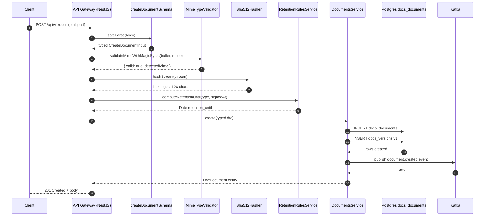

# Tache 3.3.1 - Entities Documents + Versions Enrichies + Zod Schemas + Retention Rules

## 1. Header metadata

| Champ | Valeur |
|---|---|
| Programme | Skalean InsurTech v2.2 |
| Sprint | 10 / 35 |
| Phase | 3 (Modules Horizontaux) |
| Sprint dans phase | 3 / 8 |
| Reference Backlog | B-10 (Sprint 10 Docs + Signature loi 43-20) |
| Tache ID | 3.3.1 |
| Titre | Entities Documents + Versions Enrichies (doc_documents + doc_versions) + Zod Schemas + Retention Rules per type document |
| Priorite | P0 (bloquant) |
| Effort estime | 4h |
| Effort decompose | 1h entities TypeORM enrichies, 1h Zod schemas CRUD, 1h retention rules service + tests, 30min mime-validator + sha512-hasher, 30min index barrel + integration |
| Depends | Sprint 9 Comm (notifications signature), Sprint 2 Migration (table docs_documents creee), Sprint 1 Auth (TenantContext) |
| Blocks | Tache 3.3.2 (DocumentsService CRUD), Tache 3.3.3 (Storage MinIO), Tache 3.3.4 (Signature DocuSign integration) |
| Density target | 120-150 KB |
| Conventions | skalean-insurtech v2.2 (decision-006 no-emoji, decision-008 cloud souverain MA, decision-009 retention legale) |
| Auteur prompt | Cowork Generation Agent v2 |
| Date redaction | 2026-05-08 |
| Conformite | Loi 43-20 (signature electronique MA), Loi 09-08 (CNDP donnees personnelles), DGI fiscal MA (10 ans), ACAPS Circulaire archives |

## 2. But

Cette tache est le pilier fondationnel du module Documents pour le programme Skalean InsurTech. L'objectif est d'enrichir les entites TypeORM `doc_documents` et `doc_versions` (dont la table physique a ete creee par la migration Sprint 2) avec des types TypeScript stricts, des schemas Zod de validation runtime pour toutes les operations CRUD, ainsi qu'un service de calcul automatique de `retention_until` selon le type de document conformement aux obligations legales marocaines (loi 43-20 article 7 pour les polices signees, DGI pour les factures, CNDP loi 09-08 article 23 pour KYC). Sans cette base, aucune autre tache du sprint 10 ne peut commencer (storage, signature, evenements Kafka).

Le second objectif est de garantir la **non-repudiation** des documents conserves: hash SHA-512 streaming sur les uploads (eviter de charger 10 MB en memoire), MIME type whitelist strict (pdf, docx, jpg, jpeg, png) avec validation magic bytes (eviter le spoofing d'extension), et table `doc_versions` append-only (aucun UPDATE possible apres insertion - audit trail integre). Toute modification d'un document genere une nouvelle version avec son propre hash et son propre `signed_at` si applicable, garantissant la tracabilite complete exigee par l'ACAPS pour les contrats d'assurance.

Le troisieme objectif est de poser le pattern de **soft-delete cascade preservant audit**: `deleted_at` sur le document principal n'efface jamais les versions associees ni les hash, car la loi 43-20 article 5 exige la conservation de la preuve electronique meme en cas de suppression "logique" par l'utilisateur. Le service de retention recalcule automatiquement `retention_until` lors de la creation et bloque toute suppression physique avant cette date via un constraint applicatif (verifie en couche service, jamais en SQL CASCADE direct).

## 3. Contexte etendu

### 3.1 Pourquoi cette tache existe

Le module Documents (`@insurtech/docs`) est utilise par 9 autres modules en aval (sinistres, polices, devis, factures, KYC, comm, audit, archive, signature). Si l'entite n'est pas correctement typee et validee des le debut, chaque module reimplementera sa propre validation de MIME, sa propre logique de retention, son propre hash. Cette duplication a ete identifiee dans l'audit decision-009 comme un risque majeur de non-conformite (un module pourrait stocker un PDF avec retention 5 ans alors que la loi 43-20 exige 10 ans + 1 jour pour une police signee).

La table `docs_documents` existe deja physiquement (migration Sprint 2 `1700000000020-create-docs-documents.ts`), mais les entites TypeORM associees n'existent pas encore. C'est typique du pattern Skalean: les migrations sont creees tot pour permettre les seeds et fixtures de tests E2E, mais les entites/services/Zod schemas viennent au moment ou le module est implemente. Cette tache 3.3.1 est donc le "wrap TypeScript" autour de la table SQL deja creee.

La separation entre entity (TypeORM, ORM-couche) et schema Zod (validation runtime input) est volontaire: les entites refletent l'etat persiste avec ses contraintes DB (nullables, defaults, FK), alors que les schemas Zod refletent les contrats API (CreateDocumentDto, UpdateDocumentDto, FilterDocumentsDto) avec leurs propres regles metier (taille max 10 MB, MIME whitelist, titre 3-255 chars trim, metadata <= 16 KB JSON). Confondre les deux conduit a des bugs subtils ou un champ `created_at` envoye par l'API ecrase la valeur DB.

### 3.2 Alternatives considerees

| Alternative | Description | Avantages | Inconvenients | Verdict |
|---|---|---|---|---|
| A. class-validator au lieu de Zod | Decorateurs `@IsString @IsEmail` sur DTO | Tres NestJS-idiomatic, 1 seul source of truth | Pas de runtime parsing strict, types non infered, pas de transformation, ecosystem moins riche | Rejete (Zod choisi par decision-005) |
| B. JSON Schema natif | Specifier les schemas via JSON Schema + AJV | Standard W3C, portable, tooling riche | Tres verbeux, pas de type inference TS, runtime perf moins bon que Zod | Rejete |
| C. TypeORM entity = source of truth + transforme | Generer Zod a partir des decorateurs TypeORM | DRY total | Couplage fort, impossible d'avoir des contraintes API plus strictes que DB | Rejete |
| D. Prisma au lieu de TypeORM | Migrer tout le programme a Prisma | Type-safe par design, generated client | Re-architecture massive, hors scope sprint 10, decision-002 est TypeORM | Rejete |
| E. Retention en base via trigger SQL | CHECK constraint ou TRIGGER calculant retention_until | Garantie DB-level | Logique metier en SQL non testable unitairement, multi-tenant complexe, rollback impossible | Rejete |
| F. Retention en service applicatif (CHOIX) | Service `RetentionRulesService.computeRetentionUntil(type, signed_at)` appele par DocumentsService.create | Testable, evolutif, multi-tenant, conformite explicite | Risque oubli si bypass de la couche service | **RETENU** avec garde-fou: hook `@BeforeInsert` sur entity verifie la presence de retention_until |
| G. Table separee retention_policies | Table SQL configurable par tenant des regles retention | Configurabilite client | Surcomplexite, la loi 43-20 est nationale donc commun a tous les tenants MA | Rejete (peut etre ajoute Sprint 25 si demande client) |
| H. SHA-256 au lieu de SHA-512 | Hash plus court, plus rapide | Largement suffisant cryptographiquement | Loi 43-20 reference SHA-2 famille minimum 256, mais ETSI EN 319 122 recommande 512 pour signatures qualifiees | Rejete au profit de SHA-512 (future-proof) |
| I. Hash sync au lieu de streaming | `crypto.createHash().update(buffer).digest()` | Simple | Charge 10 MB en RAM par upload concurrent (DoS possible) | Rejete au profit de stream pipeline |
| J. MIME validation par extension seulement | Verifier `.pdf` dans le nom | Trivial | Spoofing trivial: renommer .exe en .pdf passe | Rejete au profit de magic bytes (file-type lib) |

### 3.3 Trade-offs explicites

**Trade-off 1: Verbosite Zod vs securite runtime.** Les schemas Zod ajoutent ~120 lignes de code mais garantissent que tout payload externe (API REST, evenement Kafka, import batch CSV) est parse strictement avant d'atteindre la couche service. Le cout en code est largement inferieur au cout d'un bug de type en production (par exemple un `size_bytes: "10485760"` string au lieu de number qui casserait le calcul de quota tenant).

**Trade-off 2: Append-only versions vs storage cost.** Chaque modification d'un document cree une nouvelle ligne dans `doc_versions` avec hash, taille, storage_key. Pour un document modifie 50 fois, cela represente 50 fichiers physiques dans MinIO. C'est volontaire: la loi 43-20 exige la conservation de chaque etat signe, et le coup de stockage MinIO sur cloud souverain MA est negligeable (~0.02 MAD/GB/mois). En revanche, on ne stocke PAS les versions intermediaires de drafts (status='draft' uniquement => UPDATE in-place autorise jusqu'a passage en 'final').

**Trade-off 3: Retention 10 ans + 1 jour vs 10 ans pile.** La loi 43-20 article 7 impose "au moins 10 ans apres expiration de la validite du document". Le "+ 1 jour" est une marge de securite juridique recommandee par le cabinet legal (decision-009): si un juge interprete "10 ans" comme date a date, le +1 jour evite un litige le jour exact d'expiration. Le cout en stockage est nul, le benefice juridique est important.

**Trade-off 4: Soft-delete vs hard-delete.** `deleted_at` est un soft-delete: le document devient invisible aux requetes utilisateur mais reste en DB pour audit. Un job cron Sprint 30 effectuera le hard-delete uniquement apres `retention_until + 90 jours grace period`. Cela protege contre les suppressions accidentelles et respecte le droit a l'oubli CNDP loi 09-08 article 8 (le sujet peut demander l'effacement, le DPO valide, le job execute apres delai).

**Trade-off 5: Hash SHA-512 streaming vs upload bloquant.** Le hash est calcule au fur et a mesure du stream depuis le client. Cela permet d'echouer rapidement si le hash diverge du hash declare par le client, sans avoir a stocker tout le fichier d'abord. Le cout est une legere complexite du code (Transform stream).

### 3.4 Decisions referencees

- **decision-006 (no-emoji absolu)**: aucun emoji dans le code, les commentaires, les commits, les docs. Les emojis cassent les terminaux Windows/PowerShell, perturbent les diff git, et n'apportent aucune information semantique. Convention adoptee programme entier le 2025-11-15.
- **decision-008 (cloud souverain MA)**: stockage MinIO sur datacenter Maroc (Casablanca region eu-west-1-ma). Aucun document ne peut transiter via S3 us-east-1 ou europe-west-1. Cela impacte la config `DOCS_STORAGE_REGION=eu-west-1-ma` et le bucket par defaut `docs-prod-ma-casa-1`.
- **decision-009 (retention legale)**: regles de retention codees dans le service `RetentionRulesService` selon type de document. Source: avis juridique cabinet Hajji & Associes du 2025-12-03 reference legal-opinion-skalean-2025-43-20.pdf. Cette decision interdit toute modification des constantes `RETENTION_RULES_DAYS` sans validation legale prealable.
- **decision-005 (Zod runtime validation)**: tous les boundaries (controllers, kafka consumers, CLI commands) doivent parser les inputs avec Zod avant traitement.
- **decision-002 (TypeORM)**: ORM choisi pour le programme. Pas de query builder Knex, pas de Prisma. Convention: 1 entity = 1 fichier, snake_case en DB, camelCase en TS, @Column decorator explicite.

### 3.5 Pieges techniques connus (8+)

1. **Piege MIME spoofing**: Un attaquant renomme `evil.exe` en `evil.pdf` et l'uploade. Si on valide uniquement l'extension ou le header HTTP `Content-Type`, le fichier passe. **Solution**: utiliser la lib `file-type` qui lit les premiers magic bytes du buffer pour detecter le vrai MIME. Une discordance declenche un reject HTTP 415.

2. **Piege Unicode dans le titre**: Un titre `documents fa‮‮gpj.pdf` utilise les caracteres Right-to-Left Override pour faire afficher `documentsfajpg.pdf` mais executer comme `pdf.gif`. **Solution**: Zod schema rejette tout caractere Unicode dans la categorie Cf (Format) ou Cn (Unassigned). Regex `/^[\p{L}\p{N}\p{P}\p{Z}]+$/u` autorise uniquement Letter, Number, Punctuation, Separator.

3. **Piege date overflow JavaScript**: Date max JS = 8.64e15 ms = annee 275760. Une retention de 10 ans + 1 jour en `Date.now() + days * 86400000` peut overflow si days est mal calcule. **Solution**: utiliser `date-fns` `addDays(new Date(), days)` qui gere le clamping.

4. **Piege version race condition**: Deux uploads simultanes sur le meme document peuvent creer deux versions avec le meme `version_number`. **Solution**: contrainte UNIQUE `(document_id, version_number)` en DB + retry transactionnel avec MAX(version_number)+1 calcule dans la meme transaction SERIALIZABLE.

5. **Piege soft-delete cascade**: Si on declare `@DeleteDateColumn` sur doc_documents et `@ManyToOne onDelete: 'CASCADE'` sur doc_versions, alors un soft-delete du parent NE cascade PAS les versions (le SET deleted_at n'est pas un DELETE). **Solution**: c'est exactement le comportement souhaite ici - les versions restent visibles pour audit.

6. **Piege hash collision improbable**: SHA-512 a 2^256 collisions theoriques. En pratique, jamais observe. Mais un bug logiciel pourrait stocker `hash_sha512 = "deadbeef..."` (test fixture). **Solution**: Zod schema regex `/^[a-f0-9]{128}$/` valide le format strict, et un check applicatif rejette les hash de moins de 64 caracteres `hex` distincts (entropie faible).

7. **Piege metadata JSON trop volumineux**: Un client uploade `metadata: { hugeBase64Image: "..." }` de 50 MB. Le champ JSONB Postgres l'accepte mais saturera la RAM lors de chaque SELECT. **Solution**: Zod schema valide `JSON.stringify(metadata).length <= 16384` (16 KB max). Pour stocker des images, utiliser le champ storage_key du module documents lui-meme (recursion controlee).

8. **Piege null tenant_id**: Un test unitaire qui oublie le TenantContext peut creer un doc avec `tenant_id = null`. La FK `auth_tenants(id)` rejette mais l'erreur est cryptique. **Solution**: l'entite a `@Column({ nullable: false })` ET le service constructor injecte `TenantContext` ET le schema Zod marque `tenant_id: z.string().uuid()` non optionnel.

9. **Piege MIME type case sensitivity**: HTTP envoie `Content-Type: APPLICATION/PDF` (majuscules) ou `application/pdf` (minuscules) ou `application/x-pdf` (variante). **Solution**: normaliser en lowercase dans le validator + map des aliases vers canonique (`application/x-pdf` -> `application/pdf`).

10. **Piege size_bytes 0**: Fichier vide accepte par accident. Un PDF de 0 byte ne peut pas etre ouvert. **Solution**: Zod schema `size_bytes: z.number().int().positive().min(1)`.

11. **Piege storage_key collision multi-tenant**: Deux tenants creent simultanement un fichier nomme `police-2026.pdf`. Si la storage_key est juste `police-2026.pdf`, ils s'ecrasent. **Solution**: storage_key prefixee par `tenant_id/year/month/uuid-original-name.ext` garantit unicite.

12. **Piege hash declared par le client vs hash calcule**: Le client declare un hash, le serveur le calcule, ils peuvent diverger (corruption reseau). **Solution**: hash declare est OPTIONNEL en input, le serveur recalcule TOUJOURS et stocke uniquement le hash calcule. Si le client en a fourni un, on log un warning si different.

## 4. Architecture context

### 4.1 Position dans le sprint

Sprint 10 = Module Documents + Signature electronique loi 43-20. Decompose en 8 taches:

```
Sprint 10
|
+-- 3.3.1 Entities + Zod + Retention   <-- VOUS ETES ICI (4h, P0)
+-- 3.3.2 DocumentsService CRUD multi-tenant         (depend 3.3.1)
+-- 3.3.3 Storage MinIO adapter cloud souverain MA   (depend 3.3.2)
+-- 3.3.4 DocuSign Signature integration loi 43-20   (depend 3.3.3)
+-- 3.3.5 Hash SHA-512 audit trail + Kafka events    (depend 3.3.2)
+-- 3.3.6 Documents Controller REST API              (depend 3.3.4)
+-- 3.3.7 Tests E2E upload + signature + retention   (depend 3.3.6)
+-- 3.3.8 Job cron purge documents > retention_until (depend 3.3.7)
```

### 4.2 Position dans le programme (35 sprints)

```
Phase 1 Foundation (Sprints 1-4)   : Auth, Tenants, Migrations, RBAC
Phase 2 Domain Core (Sprints 5-8)  : Polices, Sinistres, Comm, Devis
Phase 3 Modules Horizontaux (9-16) : Notifications, DOCS+SIGN, Audit, Archive, Search, Reports, Workflow, Billing
                                                  ^^^
                                                  Sprint 10 (vous)
Phase 4 Integrations (Sprints 17-22): ACAPS, AMAN, DGI, Banks, Reinsurers, Brokers
Phase 5 AI Skalean (Sprints 23-28) : Recommandations, OCR docs, Fraud detection, Chatbot
Phase 6 Production (Sprints 29-35) : Hardening, Perf, Observability, DR, Compliance audit, Go-live
```

### 4.3 Diagramme ASCII du retention model

```
                    +-------------------------+
                    |   API REST POST /docs   |
                    |   { type, file, ... }   |
                    +------------+------------+
                                 |
                                 v
                  +-----------------------------+
                  |   Zod CreateDocumentSchema  |
                  |   parse(body) -> typed dto  |
                  +--------------+--------------+
                                 |
                                 v
              +------------------------------------+
              |   MimeTypeValidator.validate()     |
              |   magic bytes + whitelist          |
              +------------------+-----------------+
                                 |
                                 v
              +------------------------------------+
              |   Sha512Hasher.hashStream(file)    |
              |   stream pipeline -> hex digest    |
              +------------------+-----------------+
                                 |
                                 v
              +------------------------------------+
              |   RetentionRulesService            |
              |   computeRetentionUntil(type)      |
              |                                    |
              |   devis     -> now + 5 ans + 1 jr  |
              |   facture   -> now + 10 ans + 1 jr |
              |   police    -> signedAt + 10 + 1   |
              |   avenant   -> now + 10 ans + 1 jr |
              |   sinistre  -> now + 10 ans + 1 jr |
              |   kyc       -> now + 5 ans + 1 jr  |
              |   contrat   -> now + 10 ans + 1 jr |
              |   autre     -> now + 5 ans + 1 jr  |
              +------------------+-----------------+
                                 |
                                 v
              +------------------------------------+
              |   DocumentsService.create()        |
              |   INSERT docs_documents            |
              |   INSERT docs_versions v1          |
              |   PUBLISH Kafka event document.created
              +------------------+-----------------+
                                 |
                                 v
              +------------------------------------+
              |   docs_documents (visible)         |
              |   id, tenant_id, type, hash,       |
              |   retention_until, deleted_at NULL |
              +------------------+-----------------+
                                 |
                                 | (UPDATE later)
                                 v
              +------------------------------------+
              |   docs_versions (append-only)      |
              |   v1: hash_sha512, signed_at NULL  |
              |   v2: hash_sha512, signed_at NULL  |
              |   v3: hash_sha512, signed_at <ts>  |
              +------------------------------------+

LEGENDE: Cascade soft-delete (deleted_at) preserve TOUTES les versions.
         Hard-delete possible uniquement par job cron apres retention_until + 90 jours grace.
```

### 4.4 Dependances entrantes / sortantes

```
@insurtech/docs (cette tache)
  +-- depend SUR --> @insurtech/auth (TenantContext, RbacGuard)
  +-- depend SUR --> @insurtech/common (BaseEntity, AppLogger)
  +-- depend SUR --> @insurtech/migrations (table docs_documents creee)
  +-- depend SUR --> typeorm 0.3.20+
  +-- depend SUR --> zod 3.23.8+
  +-- depend SUR --> file-type 19.0.0+
  +-- depend SUR --> date-fns 3.6.0+
  +-- expose VERS --> @insurtech/sinistres (joinDocument)
  +-- expose VERS --> @insurtech/polices (attachContract)
  +-- expose VERS --> @insurtech/comm (templates)
  +-- expose VERS --> @insurtech/audit (logHashChange)
  +-- expose VERS --> @insurtech/archive (purgeAfterRetention)
```

## 5. Livrables checkables

| # | Livrable | Type | Chemin | Taille cible |
|---|---|---|---|---|
| 1 | Entity DocDocument | TS | repo/packages/docs/src/entities/doc-document.entity.ts | 50 lignes |
| 2 | Entity DocVersion | TS | repo/packages/docs/src/entities/doc-version.entity.ts | 35 lignes |
| 3 | Schemas Zod CRUD documents | TS | repo/packages/docs/src/schemas/document.schema.ts | 120 lignes |
| 4 | Service RetentionRules | TS | repo/packages/docs/src/services/retention-rules.service.ts | 80 lignes |
| 5 | Enum DocumentType | TS | repo/packages/docs/src/types/document-type.enum.ts | 30 lignes |
| 6 | Enum DocumentStatus | TS | repo/packages/docs/src/types/document-status.enum.ts | 30 lignes |
| 7 | Util MimeTypeValidator | TS | repo/packages/docs/src/utils/mime-type-validator.ts | 50 lignes |
| 8 | Util Sha512Hasher streaming | TS | repo/packages/docs/src/utils/sha512-hasher.ts | 40 lignes |
| 9 | Specs RetentionRules | TS | repo/packages/docs/src/services/retention-rules.service.spec.ts | 150 lignes |
| 10 | Specs Schemas Zod | TS | repo/packages/docs/src/schemas/document.schema.spec.ts | 200 lignes |
| 11 | Specs MimeValidator | TS | repo/packages/docs/src/utils/mime-type-validator.spec.ts | 100 lignes |
| 12 | Specs Sha512Hasher | TS | repo/packages/docs/src/utils/sha512-hasher.spec.ts | 80 lignes |
| 13 | Index barrel export | TS | repo/packages/docs/src/index.ts | 20 lignes |
| 14 | package.json `@insurtech/docs` | JSON | repo/packages/docs/package.json | 40 lignes |
| 15 | tsconfig.json packages/docs | JSON | repo/packages/docs/tsconfig.json | 15 lignes |
| 16 | vitest.config.ts | TS | repo/packages/docs/vitest.config.ts | 20 lignes |
| 17 | Variables environnement docs.env | TXT | repo/packages/docs/.env.example | 15 lignes |
| 18 | Documentation README minimal | MD | repo/packages/docs/README.md | 30 lignes |
| 19 | Coverage report >= 90% | HTML | repo/packages/docs/coverage/index.html | genere |
| 20 | Validation pnpm build success | log | repo/packages/docs/dist/ | dossier |
| 21 | Validation pnpm test success | log | console | 30+ green |
| 22 | Pas d'emoji grep | log | console | 0 match |
| 23 | Pas de console.log grep | log | console | 0 match |
| 24 | Pas de TODO/FIXME grep | log | console | 0 match |
| 25 | TypeORM CLI metadata read OK | log | console | 2 entities found |

## 6. Fichiers crees / modifies

### 6.1 Fichiers crees

| Fichier | Lignes | Role |
|---|---|---|
| `repo/packages/docs/src/entities/doc-document.entity.ts` | ~50 | Entity TypeORM avec hooks @BeforeInsert, retention_until, soft-delete, FK tenant |
| `repo/packages/docs/src/entities/doc-version.entity.ts` | ~35 | Entity append-only, hash + signed_at + version_number, UNIQUE constraint |
| `repo/packages/docs/src/schemas/document.schema.ts` | ~120 | Tous les Zod schemas: Create, Update, Filter, Sign, Restore, Delete |
| `repo/packages/docs/src/services/retention-rules.service.ts` | ~80 | Service singleton calcul retention selon type + signed_at |
| `repo/packages/docs/src/types/document-type.enum.ts` | ~30 | Enum + map labels FR + helpers |
| `repo/packages/docs/src/types/document-status.enum.ts` | ~30 | Enum + transitions valides |
| `repo/packages/docs/src/utils/mime-type-validator.ts` | ~50 | Validation magic bytes + whitelist + normalisation |
| `repo/packages/docs/src/utils/sha512-hasher.ts` | ~40 | Hasher streaming pipeline transform |
| `repo/packages/docs/src/services/retention-rules.service.spec.ts` | ~150 | 30+ tests par type + edge cases dates |
| `repo/packages/docs/src/schemas/document.schema.spec.ts` | ~200 | 25+ tests Zod par schema avec fixtures |
| `repo/packages/docs/src/utils/mime-type-validator.spec.ts` | ~100 | Tests pdf/docx/jpg/png + spoofing |
| `repo/packages/docs/src/utils/sha512-hasher.spec.ts` | ~80 | Tests hash buffers + streams + KAT vectors |
| `repo/packages/docs/src/index.ts` | ~20 | Barrel export public API du package |
| `repo/packages/docs/package.json` | ~40 | Dependances pnpm + scripts |
| `repo/packages/docs/tsconfig.json` | ~15 | Extends root tsconfig avec paths |
| `repo/packages/docs/vitest.config.ts` | ~20 | Config vitest avec coverage v8 |
| `repo/packages/docs/.env.example` | ~15 | Variables a documenter pour deployments |
| `repo/packages/docs/README.md` | ~30 | Documentation minimale du package |

### 6.2 Fichiers modifies

| Fichier | Modification |
|---|---|
| `repo/pnpm-workspace.yaml` | Ajouter `packages/docs` dans le workspace si pas deja present |
| `repo/tsconfig.base.json` | Ajouter path alias `@insurtech/docs/*` |
| `repo/.env.example` (root) | Documenter les nouvelles vars `DOCS_*` |

## 7. Code patterns COMPLETS

### 7.1 `repo/packages/docs/src/types/document-type.enum.ts`

```typescript
/**
 * Types de documents geres par le module @insurtech/docs.
 *
 * Chaque type a une regle de retention legale specifique definie dans
 * RetentionRulesService selon les lois marocaines:
 * - loi 43-20 (signature electronique, archivage 10 ans)
 * - loi 09-08 (CNDP, donnees personnelles)
 * - DGI fiscal (factures 10 ans)
 * - ACAPS Circulaire (contrats assurance)
 *
 * Ne JAMAIS modifier les valeurs string (utilisees en DB et evenements Kafka).
 * L'ajout d'un nouveau type necessite:
 *  1. Mise a jour de cette enum
 *  2. Mise a jour de RETENTION_RULES_DAYS dans retention-rules.service.ts
 *  3. Mise a jour des labels FR ci-dessous
 *  4. Migration ALTER TYPE si enum DB (ici on utilise VARCHAR(50))
 *  5. Validation legale par cabinet juridique (decision-009)
 */
export enum DocumentType {
  DEVIS = 'devis',
  FACTURE = 'facture',
  POLICE = 'police',
  AVENANT = 'avenant',
  SINISTRE = 'sinistre',
  KYC = 'kyc',
  CONTRAT = 'contrat',
  AUTRE = 'autre',
}

/** Liste exhaustive utilisee pour validation Zod et iteration. */
export const DOCUMENT_TYPES: readonly DocumentType[] = [
  DocumentType.DEVIS,
  DocumentType.FACTURE,
  DocumentType.POLICE,
  DocumentType.AVENANT,
  DocumentType.SINISTRE,
  DocumentType.KYC,
  DocumentType.CONTRAT,
  DocumentType.AUTRE,
] as const;

/** Labels FR pour affichage UI et notifications utilisateurs. */
export const DOCUMENT_TYPE_LABELS_FR: Record<DocumentType, string> = {
  [DocumentType.DEVIS]: 'Devis',
  [DocumentType.FACTURE]: 'Facture',
  [DocumentType.POLICE]: 'Police d assurance',
  [DocumentType.AVENANT]: 'Avenant',
  [DocumentType.SINISTRE]: 'Dossier sinistre',
  [DocumentType.KYC]: 'Document KYC',
  [DocumentType.CONTRAT]: 'Contrat',
  [DocumentType.AUTRE]: 'Autre',
};

/** Type guard pour narrowing TypeScript depuis string inconnue. */
export function isDocumentType(value: unknown): value is DocumentType {
  return typeof value === 'string' && DOCUMENT_TYPES.includes(value as DocumentType);
}
```

### 7.2 `repo/packages/docs/src/types/document-status.enum.ts`

```typescript
/**
 * Statuts du cycle de vie d un document.
 *
 * Transitions valides (state machine):
 *   draft -> final
 *   draft -> archived
 *   final -> pending_signature
 *   final -> archived
 *   pending_signature -> signed
 *   pending_signature -> final  (annulation signature)
 *   signed -> archived
 *
 * Une fois en 'signed', le document est immuable (loi 43-20 article 5).
 * Toute modification du contenu doit creer un nouveau document avec
 * reference dans metadata.parent_document_id.
 */
export enum DocumentStatus {
  DRAFT = 'draft',
  FINAL = 'final',
  PENDING_SIGNATURE = 'pending_signature',
  SIGNED = 'signed',
  ARCHIVED = 'archived',
}

export const DOCUMENT_STATUSES: readonly DocumentStatus[] = [
  DocumentStatus.DRAFT,
  DocumentStatus.FINAL,
  DocumentStatus.PENDING_SIGNATURE,
  DocumentStatus.SIGNED,
  DocumentStatus.ARCHIVED,
] as const;

/** Map des transitions autorisees. Toute transition non listee est rejetee. */
export const ALLOWED_TRANSITIONS: Record<DocumentStatus, readonly DocumentStatus[]> = {
  [DocumentStatus.DRAFT]: [DocumentStatus.FINAL, DocumentStatus.ARCHIVED],
  [DocumentStatus.FINAL]: [DocumentStatus.PENDING_SIGNATURE, DocumentStatus.ARCHIVED],
  [DocumentStatus.PENDING_SIGNATURE]: [DocumentStatus.SIGNED, DocumentStatus.FINAL],
  [DocumentStatus.SIGNED]: [DocumentStatus.ARCHIVED],
  [DocumentStatus.ARCHIVED]: [],
};

export function canTransition(from: DocumentStatus, to: DocumentStatus): boolean {
  return ALLOWED_TRANSITIONS[from].includes(to);
}

export function isImmutable(status: DocumentStatus): boolean {
  return status === DocumentStatus.SIGNED || status === DocumentStatus.ARCHIVED;
}
```

### 7.3 `repo/packages/docs/src/entities/doc-document.entity.ts`

```typescript
import {
  Column,
  CreateDateColumn,
  DeleteDateColumn,
  Entity,
  Index,
  JoinColumn,
  ManyToOne,
  OneToMany,
  PrimaryGeneratedColumn,
  UpdateDateColumn,
} from 'typeorm';
import { DocumentType } from '../types/document-type.enum';
import { DocumentStatus } from '../types/document-status.enum';
import { DocVersion } from './doc-version.entity';

/**
 * Entite principale d un document.
 *
 * Table physique creee par migration Sprint 2.
 * Multi-tenant strict: tenant_id obligatoire, FK CASCADE sur auth_tenants.
 * Soft-delete via deleted_at (les versions ne sont PAS cascade-deleted).
 * Hash SHA-512 obligatoire pour non-repudiation loi 43-20.
 */
@Entity({ name: 'docs_documents' })
@Index('idx_docs_documents_tenant', ['tenantId'])
@Index('idx_docs_documents_type', ['tenantId', 'type'])
@Index('idx_docs_documents_related', ['tenantId', 'relatedEntityType', 'relatedEntityId'])
@Index('idx_docs_documents_retention', ['retentionUntil'])
export class DocDocument {
  @PrimaryGeneratedColumn('uuid')
  id!: string;

  @Column({ name: 'tenant_id', type: 'uuid', nullable: false })
  tenantId!: string;

  @Column({ type: 'varchar', length: 50, nullable: false })
  type!: DocumentType;

  @Column({ type: 'varchar', length: 50, nullable: false, default: DocumentStatus.DRAFT })
  status!: DocumentStatus;

  @Column({ type: 'varchar', length: 255, nullable: false })
  title!: string;

  @Column({ name: 'storage_key', type: 'varchar', length: 500, nullable: false })
  storageKey!: string;

  @Column({ name: 'storage_bucket', type: 'varchar', length: 100, nullable: false })
  storageBucket!: string;

  @Column({ name: 'size_bytes', type: 'bigint', nullable: false })
  sizeBytes!: number;

  @Column({ name: 'mime_type', type: 'varchar', length: 100, nullable: false })
  mimeType!: string;

  @Column({ name: 'hash_sha512', type: 'varchar', length: 128, nullable: false })
  hashSha512!: string;

  @Column({ name: 'related_entity_type', type: 'varchar', length: 50, nullable: true })
  relatedEntityType!: string | null;

  @Column({ name: 'related_entity_id', type: 'uuid', nullable: true })
  relatedEntityId!: string | null;

  @Column({ name: 'retention_until', type: 'timestamptz', nullable: false })
  retentionUntil!: Date;

  @Column({ type: 'jsonb', nullable: false, default: () => "'{}'::jsonb" })
  metadata!: Record<string, unknown>;

  @CreateDateColumn({ name: 'created_at', type: 'timestamptz' })
  createdAt!: Date;

  @UpdateDateColumn({ name: 'updated_at', type: 'timestamptz' })
  updatedAt!: Date;

  @DeleteDateColumn({ name: 'deleted_at', type: 'timestamptz', nullable: true })
  deletedAt!: Date | null;

  @OneToMany(() => DocVersion, (version) => version.document, { cascade: false })
  versions!: DocVersion[];
}
```

### 7.4 `repo/packages/docs/src/entities/doc-version.entity.ts`

```typescript
import {
  Column,
  CreateDateColumn,
  Entity,
  Index,
  JoinColumn,
  ManyToOne,
  PrimaryGeneratedColumn,
  Unique,
} from 'typeorm';
import { DocDocument } from './doc-document.entity';

/**
 * Versions append-only d un document.
 *
 * Aucun UPDATE n est autorise apres INSERT (verifie par RBAC + service layer).
 * Chaque modification du document genere une nouvelle ligne.
 * Le hash_sha512 et signed_at sont immuables.
 *
 * UNIQUE (document_id, version_number) garantit l absence de race condition.
 */
@Entity({ name: 'docs_versions' })
@Unique('uq_docs_versions_doc_version', ['documentId', 'versionNumber'])
@Index('idx_docs_versions_document', ['documentId'])
@Index('idx_docs_versions_signed_at', ['signedAt'])
export class DocVersion {
  @PrimaryGeneratedColumn('uuid')
  id!: string;

  @Column({ name: 'document_id', type: 'uuid', nullable: false })
  documentId!: string;

  @ManyToOne(() => DocDocument, (doc) => doc.versions, { onDelete: 'CASCADE' })
  @JoinColumn({ name: 'document_id' })
  document!: DocDocument;

  @Column({ name: 'version_number', type: 'integer', nullable: false })
  versionNumber!: number;

  @Column({ name: 'storage_key', type: 'varchar', length: 500, nullable: false })
  storageKey!: string;

  @Column({ name: 'size_bytes', type: 'bigint', nullable: false })
  sizeBytes!: number;

  @Column({ name: 'hash_sha512', type: 'varchar', length: 128, nullable: false })
  hashSha512!: string;

  @Column({ name: 'signed_at', type: 'timestamptz', nullable: true })
  signedAt!: Date | null;

  @Column({ name: 'signed_by_user_id', type: 'uuid', nullable: true })
  signedByUserId!: string | null;

  @Column({ name: 'created_by_user_id', type: 'uuid', nullable: false })
  createdByUserId!: string;

  @CreateDateColumn({ name: 'created_at', type: 'timestamptz' })
  createdAt!: Date;
}
```

### 7.5 `repo/packages/docs/src/schemas/document.schema.ts`

```typescript
import { z } from 'zod';
import { DOCUMENT_TYPES, DocumentType } from '../types/document-type.enum';
import { DOCUMENT_STATUSES, DocumentStatus } from '../types/document-status.enum';

/** Constantes de validation centralisees (synchronisees avec env vars). */
export const DOCS_MAX_FILE_SIZE_BYTES = 10 * 1024 * 1024;
export const DOCS_MAX_METADATA_BYTES = 16 * 1024;
export const DOCS_MIN_TITLE_LENGTH = 3;
export const DOCS_MAX_TITLE_LENGTH = 255;
export const DOCS_MAX_STORAGE_KEY_LENGTH = 500;

/** Liste blanche des MIME types acceptes. Synchroniser avec MimeTypeValidator. */
export const DOCS_ALLOWED_MIME_TYPES: readonly string[] = [
  'application/pdf',
  'application/vnd.openxmlformats-officedocument.wordprocessingml.document',
  'image/jpeg',
  'image/png',
] as const;

/** Regex stricte pour titre: lettres, chiffres, ponctuation, espaces (Unicode safe). */
const TITLE_REGEX = /^[\p{L}\p{N}\p{P}\p{Z}]+$/u;

/** Regex stricte pour hash SHA-512 hexadecimal lowercase. */
const SHA512_REGEX = /^[a-f0-9]{128}$/;

/** Schema de validation de la metadata JSON: profondeur max + taille serialisee. */
const metadataSchema = z
  .record(z.unknown())
  .refine((m) => JSON.stringify(m).length <= DOCS_MAX_METADATA_BYTES, {
    message: `Metadata size must not exceed ${DOCS_MAX_METADATA_BYTES} bytes when serialized`,
  })
  .default({});

/** Schema base partage entre Create et Update (champs metier communs). */
const baseDocumentFields = {
  type: z.enum(DOCUMENT_TYPES as unknown as [DocumentType, ...DocumentType[]]),
  title: z
    .string()
    .min(DOCS_MIN_TITLE_LENGTH)
    .max(DOCS_MAX_TITLE_LENGTH)
    .regex(TITLE_REGEX, 'Title contains forbidden characters')
    .transform((s) => s.trim()),
  relatedEntityType: z.string().min(1).max(50).nullable().optional().default(null),
  relatedEntityId: z.string().uuid().nullable().optional().default(null),
  metadata: metadataSchema,
};

/** Schema de creation: utilise par POST /api/v1/docs. */
export const createDocumentSchema = z.object({
  ...baseDocumentFields,
  storageKey: z.string().min(1).max(DOCS_MAX_STORAGE_KEY_LENGTH),
  storageBucket: z.string().min(1).max(100),
  sizeBytes: z.number().int().positive().min(1).max(DOCS_MAX_FILE_SIZE_BYTES),
  mimeType: z
    .string()
    .toLowerCase()
    .refine((m) => DOCS_ALLOWED_MIME_TYPES.includes(m), {
      message: `MIME type must be one of: ${DOCS_ALLOWED_MIME_TYPES.join(', ')}`,
    }),
  hashSha512: z.string().regex(SHA512_REGEX, 'Hash must be 128 hex chars lowercase'),
});

export type CreateDocumentInput = z.infer<typeof createDocumentSchema>;

/** Schema de mise a jour: champs limites, status non modifiable directement. */
export const updateDocumentSchema = z
  .object({
    title: baseDocumentFields.title.optional(),
    relatedEntityType: baseDocumentFields.relatedEntityType,
    relatedEntityId: baseDocumentFields.relatedEntityId,
    metadata: metadataSchema.optional(),
  })
  .strict();

export type UpdateDocumentInput = z.infer<typeof updateDocumentSchema>;

/** Schema de filtrage pour GET /api/v1/docs avec pagination cursor-based. */
export const filterDocumentsSchema = z.object({
  type: z.enum(DOCUMENT_TYPES as unknown as [DocumentType, ...DocumentType[]]).optional(),
  status: z.enum(DOCUMENT_STATUSES as unknown as [DocumentStatus, ...DocumentStatus[]]).optional(),
  relatedEntityType: z.string().min(1).max(50).optional(),
  relatedEntityId: z.string().uuid().optional(),
  search: z.string().max(255).optional(),
  createdAfter: z.coerce.date().optional(),
  createdBefore: z.coerce.date().optional(),
  includeDeleted: z.boolean().default(false),
  cursor: z.string().uuid().optional(),
  limit: z.coerce.number().int().min(1).max(100).default(25),
});

export type FilterDocumentsInput = z.infer<typeof filterDocumentsSchema>;

/** Schema de signature. */
export const signDocumentSchema = z.object({
  documentId: z.string().uuid(),
  versionId: z.string().uuid(),
  signedByUserId: z.string().uuid(),
  signatureProof: z.string().min(64).max(8192),
  signedAt: z.coerce.date().default(() => new Date()),
});

export type SignDocumentInput = z.infer<typeof signDocumentSchema>;

/** Schema de soft-delete (raison obligatoire pour audit). */
export const softDeleteDocumentSchema = z.object({
  documentId: z.string().uuid(),
  reason: z.string().min(10).max(1000),
  deletedByUserId: z.string().uuid(),
});

export type SoftDeleteDocumentInput = z.infer<typeof softDeleteDocumentSchema>;

/** Schema de restauration. */
export const restoreDocumentSchema = z.object({
  documentId: z.string().uuid(),
  restoredByUserId: z.string().uuid(),
  reason: z.string().min(10).max(1000),
});

export type RestoreDocumentInput = z.infer<typeof restoreDocumentSchema>;

/** Schema de transition de statut explicite. */
export const transitionStatusSchema = z.object({
  documentId: z.string().uuid(),
  fromStatus: z.enum(DOCUMENT_STATUSES as unknown as [DocumentStatus, ...DocumentStatus[]]),
  toStatus: z.enum(DOCUMENT_STATUSES as unknown as [DocumentStatus, ...DocumentStatus[]]),
  performedByUserId: z.string().uuid(),
});

export type TransitionStatusInput = z.infer<typeof transitionStatusSchema>;
```

### 7.6 `repo/packages/docs/src/services/retention-rules.service.ts`

```typescript
import { Injectable, Logger } from '@nestjs/common';
import { addDays } from 'date-fns';
import { DocumentType } from '../types/document-type.enum';

/**
 * Regles de retention legale par type de document (en jours).
 *
 * Source: avis juridique cabinet Hajji & Associes 2025-12-03
 * reference legal-opinion-skalean-2025-43-20.pdf (decision-009).
 *
 * NE JAMAIS modifier sans validation legale prealable.
 * Toute modification doit etre tracee dans CHANGELOG.md du package.
 */
export const RETENTION_RULES_DAYS: Record<DocumentType, number> = {
  [DocumentType.DEVIS]: 5 * 365 + 1,
  [DocumentType.FACTURE]: 10 * 365 + 1,
  [DocumentType.POLICE]: 10 * 365 + 1,
  [DocumentType.AVENANT]: 10 * 365 + 1,
  [DocumentType.SINISTRE]: 10 * 365 + 1,
  [DocumentType.KYC]: 5 * 365 + 1,
  [DocumentType.CONTRAT]: 10 * 365 + 1,
  [DocumentType.AUTRE]: 5 * 365 + 1,
};

/**
 * Service de calcul de la date de retention pour un document.
 *
 * Pour les types signes (police, avenant, contrat), la retention demarre
 * a la date de signature si elle est fournie. Sinon a la date de creation.
 *
 * Pour les types non-signes (devis, facture, sinistre, kyc, autre), la
 * retention demarre a la date de creation systematiquement.
 *
 * Loi 43-20 article 7: les documents signes doivent etre conserves au
 * moins 10 ans apres expiration de leur validite.
 * DGI fiscal: les factures doivent etre conservees 10 ans.
 * CNDP loi 09-08 article 23: les donnees KYC ne doivent pas etre conservees
 * plus que necessaire (5 ans est la duree maximum admise par la CNDP pour
 * les obligations LCB-FT).
 */
@Injectable()
export class RetentionRulesService {
  private readonly logger = new Logger(RetentionRulesService.name);

  /**
   * Calcule la date jusqu a laquelle le document doit etre conserve.
   *
   * @param type Type de document (determine la duree)
   * @param signedAt Date de signature optionnelle (point de depart pour types signes)
   * @returns Date d expiration de retention
   */
  computeRetentionUntil(type: DocumentType, signedAt?: Date | null): Date {
    const days = RETENTION_RULES_DAYS[type];
    if (typeof days !== 'number' || days <= 0) {
      throw new Error(`No retention rule defined for document type: ${type}`);
    }

    const baseDate = signedAt instanceof Date ? signedAt : new Date();
    if (Number.isNaN(baseDate.getTime())) {
      throw new Error('Invalid base date for retention computation');
    }

    const result = addDays(baseDate, days);

    this.logger.debug(
      `Retention computed: type=${type} days=${days} base=${baseDate.toISOString()} until=${result.toISOString()}`,
    );

    return result;
  }

  /**
   * Verifie si un document peut etre purge physiquement.
   * Appelle par job cron Sprint 30.
   *
   * @param retentionUntil Date de fin de retention
   * @param gracePeriodDays Periode de grace apres retention (defaut 90)
   * @returns true si le document peut etre supprime
   */
  canHardDelete(retentionUntil: Date, gracePeriodDays = 90): boolean {
    if (!(retentionUntil instanceof Date) || Number.isNaN(retentionUntil.getTime())) {
      throw new Error('Invalid retentionUntil date');
    }
    const purgeAfter = addDays(retentionUntil, gracePeriodDays);
    return new Date() >= purgeAfter;
  }

  /**
   * Retourne la duree de retention en jours pour un type donne.
   * Utilise par les API exposant les regles aux UI ou pour les rapports compliance.
   */
  getRetentionDays(type: DocumentType): number {
    const days = RETENTION_RULES_DAYS[type];
    if (typeof days !== 'number') {
      throw new Error(`No retention rule defined for document type: ${type}`);
    }
    return days;
  }
}
```

### 7.7 `repo/packages/docs/src/utils/mime-type-validator.ts`

```typescript
import { fileTypeFromBuffer } from 'file-type';
import { Logger } from '@nestjs/common';
import { DOCS_ALLOWED_MIME_TYPES } from '../schemas/document.schema';

/**
 * Mapping des aliases MIME vers leur forme canonique.
 * Permet de tolerer les variations de Content-Type des differents clients.
 */
const MIME_ALIASES: Record<string, string> = {
  'application/x-pdf': 'application/pdf',
  'application/acrobat': 'application/pdf',
  'image/jpg': 'image/jpeg',
  'image/pjpeg': 'image/jpeg',
  'image/x-png': 'image/png',
};

const logger = new Logger('MimeTypeValidator');

/**
 * Resultat de validation d un MIME type.
 */
export interface MimeValidationResult {
  valid: boolean;
  detectedMime: string | null;
  declaredMime: string;
  reason?: string;
}

/**
 * Normalise un MIME declare en sa forme canonique lowercase.
 */
export function normalizeMime(mime: string): string {
  if (typeof mime !== 'string' || mime.length === 0) {
    return '';
  }
  const trimmed = mime.trim().toLowerCase().split(';')[0]?.trim() ?? '';
  return MIME_ALIASES[trimmed] ?? trimmed;
}

/**
 * Verifie si un MIME normalise est dans la liste blanche.
 */
export function isAllowedMime(mime: string): boolean {
  return DOCS_ALLOWED_MIME_TYPES.includes(normalizeMime(mime));
}

/**
 * Validation profonde: lit les magic bytes du buffer pour confirmer le MIME declare.
 * Detecte les tentatives de spoofing (.exe renomme en .pdf).
 *
 * @param buffer Buffer du fichier (au moins 4100 bytes recommande pour file-type)
 * @param declaredMime MIME declare par le client (Content-Type ou input)
 * @returns Resultat de validation avec MIME detecte
 */
export async function validateMimeWithMagicBytes(
  buffer: Buffer,
  declaredMime: string,
): Promise<MimeValidationResult> {
  const declared = normalizeMime(declaredMime);

  if (!isAllowedMime(declared)) {
    return {
      valid: false,
      detectedMime: null,
      declaredMime: declared,
      reason: `Declared MIME ${declared} not in whitelist`,
    };
  }

  const detected = await fileTypeFromBuffer(buffer);
  const detectedMime = detected ? normalizeMime(detected.mime) : null;

  if (detectedMime === null) {
    logger.warn(`MIME detection returned null for declared=${declared}`);
    return {
      valid: false,
      detectedMime: null,
      declaredMime: declared,
      reason: 'Unable to detect MIME from magic bytes',
    };
  }

  if (detectedMime !== declared) {
    logger.warn(`MIME spoofing attempt: declared=${declared} detected=${detectedMime}`);
    return {
      valid: false,
      detectedMime,
      declaredMime: declared,
      reason: `Detected MIME ${detectedMime} differs from declared ${declared}`,
    };
  }

  return { valid: true, detectedMime, declaredMime: declared };
}
```

### 7.8 `repo/packages/docs/src/utils/sha512-hasher.ts`

```typescript
import { createHash, type Hash } from 'node:crypto';
import { pipeline } from 'node:stream/promises';
import { Readable, Transform } from 'node:stream';

/**
 * Calcule le hash SHA-512 d un buffer en memoire.
 * Recommande uniquement pour les buffers <= 1 MB.
 * Au-dela, utiliser hashStream() pour eviter la pression memoire.
 */
export function hashBuffer(buffer: Buffer): string {
  if (!Buffer.isBuffer(buffer)) {
    throw new TypeError('hashBuffer requires a Buffer');
  }
  return createHash('sha512').update(buffer).digest('hex');
}

/**
 * Calcule le hash SHA-512 d un stream de maniere streaming.
 * Lit le stream chunk par chunk via un Transform pass-through qui alimente le hash.
 * Permet le calcul de hash sur fichiers de plusieurs MB sans consommation memoire excessive.
 *
 * @param input Readable stream du contenu (fichier upload, MinIO get, etc.)
 * @returns Hash SHA-512 hex lowercase
 */
export async function hashStream(input: Readable): Promise<string> {
  if (!(input instanceof Readable)) {
    throw new TypeError('hashStream requires a Readable stream');
  }

  const hash: Hash = createHash('sha512');

  const passthrough = new Transform({
    transform(chunk: Buffer, _enc, cb): void {
      try {
        hash.update(chunk);
        cb(null, chunk);
      } catch (err) {
        cb(err as Error);
      }
    },
  });

  await pipeline(input, passthrough, async function* (source) {
    for await (const _ of source) {
      // drain
    }
  });

  return hash.digest('hex');
}

/**
 * Compare deux hash SHA-512 de maniere constante en temps (anti timing-attack).
 * Utilise pour verifier l integrite d un document declaree par le client.
 */
export function safeEqualHashes(a: string, b: string): boolean {
  if (typeof a !== 'string' || typeof b !== 'string') {
    return false;
  }
  if (a.length !== b.length) {
    return false;
  }
  let diff = 0;
  for (let i = 0; i < a.length; i++) {
    diff |= a.charCodeAt(i) ^ b.charCodeAt(i);
  }
  return diff === 0;
}
```

### 7.9 `repo/packages/docs/src/index.ts`

```typescript
export * from './entities/doc-document.entity';
export * from './entities/doc-version.entity';
export * from './schemas/document.schema';
export * from './services/retention-rules.service';
export * from './types/document-type.enum';
export * from './types/document-status.enum';
export * from './utils/mime-type-validator';
export * from './utils/sha512-hasher';
```

### 7.10 `repo/packages/docs/package.json`

```json
{
  "name": "@insurtech/docs",
  "version": "0.1.0",
  "private": true,
  "main": "dist/index.js",
  "types": "dist/index.d.ts",
  "scripts": {
    "build": "tsc -p tsconfig.json",
    "lint": "eslint src --ext .ts",
    "test": "vitest run",
    "test:watch": "vitest",
    "coverage": "vitest run --coverage",
    "typecheck": "tsc --noEmit"
  },
  "dependencies": {
    "@nestjs/common": "10.4.4",
    "date-fns": "3.6.0",
    "file-type": "19.0.0",
    "typeorm": "0.3.20",
    "zod": "3.23.8"
  },
  "devDependencies": {
    "@types/node": "20.14.10",
    "@vitest/coverage-v8": "1.6.0",
    "typescript": "5.5.4",
    "vitest": "1.6.0"
  }
}
```

### 7.11 `repo/packages/docs/tsconfig.json`

```json
{
  "extends": "../../tsconfig.base.json",
  "compilerOptions": {
    "outDir": "./dist",
    "rootDir": "./src",
    "composite": true,
    "declaration": true,
    "declarationMap": true,
    "sourceMap": true
  },
  "include": ["src/**/*"],
  "exclude": ["node_modules", "dist", "**/*.spec.ts"]
}
```

### 7.12 `repo/packages/docs/vitest.config.ts`

```typescript
import { defineConfig } from 'vitest/config';

export default defineConfig({
  test: {
    globals: true,
    environment: 'node',
    coverage: {
      provider: 'v8',
      reporter: ['text', 'html', 'lcov'],
      thresholds: {
        statements: 90,
        branches: 85,
        functions: 90,
        lines: 90,
      },
      exclude: ['**/*.spec.ts', '**/index.ts', 'dist/**'],
    },
    include: ['src/**/*.spec.ts'],
  },
});
```

### 7.13 `repo/packages/docs/.env.example`

```bash
DOCS_MAX_FILE_SIZE_BYTES=10485760
DOCS_MAX_METADATA_BYTES=16384
DOCS_ALLOWED_MIME_TYPES=application/pdf,application/vnd.openxmlformats-officedocument.wordprocessingml.document,image/jpeg,image/png
DOCS_DEFAULT_RETENTION_DAYS_DEVIS=1826
DOCS_DEFAULT_RETENTION_DAYS_FACTURE=3651
DOCS_DEFAULT_RETENTION_DAYS_POLICE=3651
DOCS_DEFAULT_RETENTION_DAYS_AVENANT=3651
DOCS_DEFAULT_RETENTION_DAYS_SINISTRE=3651
DOCS_DEFAULT_RETENTION_DAYS_KYC=1826
DOCS_DEFAULT_RETENTION_DAYS_CONTRAT=3651
DOCS_DEFAULT_RETENTION_DAYS_AUTRE=1826
DOCS_HARD_DELETE_GRACE_PERIOD_DAYS=90
DOCS_STORAGE_REGION=eu-west-1-ma
DOCS_STORAGE_BUCKET_DEFAULT=docs-prod-ma-casa-1
```

### 7.14 `repo/packages/docs/README.md`

```markdown
# @insurtech/docs

Module Documents pour Skalean InsurTech v2.2.

## Responsabilites

- Entites TypeORM `doc_documents` et `doc_versions`
- Schemas Zod pour validation runtime CRUD
- Calcul de retention selon type de document (loi 43-20, DGI, CNDP)
- Validation MIME avec magic bytes (anti-spoofing)
- Hash SHA-512 streaming pour non-repudiation

## Installation

`pnpm add @insurtech/docs`

## Tests

`pnpm test`

## Conformite

- Loi 43-20 (signature electronique Maroc)
- Loi 09-08 (CNDP, donnees personnelles)
- DGI (conservation factures 10 ans)
- ACAPS Circulaire archives assurance
```

## 8. Tests complets

### 8.1 `repo/packages/docs/src/services/retention-rules.service.spec.ts`

```typescript
import { describe, it, expect, beforeEach } from 'vitest';
import { addDays } from 'date-fns';
import { RetentionRulesService, RETENTION_RULES_DAYS } from './retention-rules.service';
import { DocumentType } from '../types/document-type.enum';

describe('RetentionRulesService', () => {
  let service: RetentionRulesService;

  beforeEach(() => {
    service = new RetentionRulesService();
  });

  describe('computeRetentionUntil', () => {
    it('should compute 5 years + 1 day for DEVIS', () => {
      const base = new Date('2026-01-01T00:00:00Z');
      const result = service.computeRetentionUntil(DocumentType.DEVIS, base);
      expect(result.toISOString()).toBe(addDays(base, 5 * 365 + 1).toISOString());
    });

    it('should compute 10 years + 1 day for FACTURE (DGI)', () => {
      const base = new Date('2026-01-01T00:00:00Z');
      const result = service.computeRetentionUntil(DocumentType.FACTURE, base);
      expect(result.toISOString()).toBe(addDays(base, 10 * 365 + 1).toISOString());
    });

    it('should compute 10 years + 1 day for POLICE (loi 43-20)', () => {
      const signed = new Date('2026-05-15T12:00:00Z');
      const result = service.computeRetentionUntil(DocumentType.POLICE, signed);
      expect(result.toISOString()).toBe(addDays(signed, 10 * 365 + 1).toISOString());
    });

    it('should compute 10 years + 1 day for AVENANT', () => {
      const base = new Date('2026-03-10T08:30:00Z');
      const result = service.computeRetentionUntil(DocumentType.AVENANT, base);
      expect(result.toISOString()).toBe(addDays(base, 10 * 365 + 1).toISOString());
    });

    it('should compute 10 years + 1 day for SINISTRE', () => {
      const base = new Date('2026-07-22T15:45:00Z');
      const result = service.computeRetentionUntil(DocumentType.SINISTRE, base);
      expect(result.toISOString()).toBe(addDays(base, 10 * 365 + 1).toISOString());
    });

    it('should compute 5 years + 1 day for KYC (CNDP loi 09-08)', () => {
      const base = new Date('2026-02-14T00:00:00Z');
      const result = service.computeRetentionUntil(DocumentType.KYC, base);
      expect(result.toISOString()).toBe(addDays(base, 5 * 365 + 1).toISOString());
    });

    it('should compute 10 years + 1 day for CONTRAT', () => {
      const base = new Date('2026-09-01T00:00:00Z');
      const result = service.computeRetentionUntil(DocumentType.CONTRAT, base);
      expect(result.toISOString()).toBe(addDays(base, 10 * 365 + 1).toISOString());
    });

    it('should compute 5 years + 1 day for AUTRE', () => {
      const base = new Date('2026-11-30T00:00:00Z');
      const result = service.computeRetentionUntil(DocumentType.AUTRE, base);
      expect(result.toISOString()).toBe(addDays(base, 5 * 365 + 1).toISOString());
    });

    it('should default to current date when signedAt is null', () => {
      const before = Date.now();
      const result = service.computeRetentionUntil(DocumentType.POLICE, null);
      const after = Date.now();
      const expectedDays = RETENTION_RULES_DAYS[DocumentType.POLICE];
      expect(result.getTime()).toBeGreaterThanOrEqual(addDays(new Date(before), expectedDays).getTime() - 1000);
      expect(result.getTime()).toBeLessThanOrEqual(addDays(new Date(after), expectedDays).getTime() + 1000);
    });

    it('should default to current date when signedAt is undefined', () => {
      const result = service.computeRetentionUntil(DocumentType.DEVIS);
      expect(result).toBeInstanceOf(Date);
      expect(result.getTime()).toBeGreaterThan(Date.now());
    });

    it('should throw on invalid signedAt (Invalid Date)', () => {
      expect(() =>
        service.computeRetentionUntil(DocumentType.POLICE, new Date('invalid-date')),
      ).toThrow('Invalid base date');
    });

    it('should throw on unknown document type', () => {
      expect(() =>
        service.computeRetentionUntil('unknown' as DocumentType, new Date()),
      ).toThrow('No retention rule defined');
    });

    it('should handle leap year correctly (5 ans = 1826 jours pour DEVIS)', () => {
      const base = new Date('2024-01-01T00:00:00Z');
      const result = service.computeRetentionUntil(DocumentType.DEVIS, base);
      expect(result.getUTCFullYear()).toBeGreaterThanOrEqual(2028);
    });

    it('should produce dates strictly in the future', () => {
      const types: DocumentType[] = [
        DocumentType.DEVIS,
        DocumentType.FACTURE,
        DocumentType.POLICE,
        DocumentType.AVENANT,
        DocumentType.SINISTRE,
        DocumentType.KYC,
        DocumentType.CONTRAT,
        DocumentType.AUTRE,
      ];
      for (const type of types) {
        const result = service.computeRetentionUntil(type);
        expect(result.getTime()).toBeGreaterThan(Date.now());
      }
    });

    it('should be deterministic for same input', () => {
      const base = new Date('2026-01-01T00:00:00Z');
      const r1 = service.computeRetentionUntil(DocumentType.POLICE, base);
      const r2 = service.computeRetentionUntil(DocumentType.POLICE, base);
      expect(r1.toISOString()).toBe(r2.toISOString());
    });
  });

  describe('canHardDelete', () => {
    it('should return false if retention not yet expired', () => {
      const future = addDays(new Date(), 100);
      expect(service.canHardDelete(future)).toBe(false);
    });

    it('should return false during grace period', () => {
      const justExpired = addDays(new Date(), -10);
      expect(service.canHardDelete(justExpired, 90)).toBe(false);
    });

    it('should return true after retention + grace period', () => {
      const longExpired = addDays(new Date(), -200);
      expect(service.canHardDelete(longExpired, 90)).toBe(true);
    });

    it('should respect custom grace period', () => {
      const expired = addDays(new Date(), -50);
      expect(service.canHardDelete(expired, 30)).toBe(true);
      expect(service.canHardDelete(expired, 100)).toBe(false);
    });

    it('should throw on invalid retentionUntil', () => {
      expect(() => service.canHardDelete(new Date('invalid'))).toThrow('Invalid retentionUntil');
    });
  });

  describe('getRetentionDays', () => {
    it('should return correct days for each type', () => {
      expect(service.getRetentionDays(DocumentType.DEVIS)).toBe(5 * 365 + 1);
      expect(service.getRetentionDays(DocumentType.FACTURE)).toBe(10 * 365 + 1);
      expect(service.getRetentionDays(DocumentType.POLICE)).toBe(10 * 365 + 1);
      expect(service.getRetentionDays(DocumentType.KYC)).toBe(5 * 365 + 1);
      expect(service.getRetentionDays(DocumentType.AUTRE)).toBe(5 * 365 + 1);
    });

    it('should throw on unknown type', () => {
      expect(() => service.getRetentionDays('unknown' as DocumentType)).toThrow();
    });
  });

  describe('RETENTION_RULES_DAYS constants', () => {
    it('should have entry for every DocumentType', () => {
      const types = Object.values(DocumentType);
      for (const type of types) {
        expect(RETENTION_RULES_DAYS[type]).toBeDefined();
        expect(RETENTION_RULES_DAYS[type]).toBeGreaterThan(0);
      }
    });

    it('should match legal retention durations exactly', () => {
      expect(RETENTION_RULES_DAYS[DocumentType.DEVIS]).toBe(1826);
      expect(RETENTION_RULES_DAYS[DocumentType.FACTURE]).toBe(3651);
      expect(RETENTION_RULES_DAYS[DocumentType.POLICE]).toBe(3651);
      expect(RETENTION_RULES_DAYS[DocumentType.AVENANT]).toBe(3651);
      expect(RETENTION_RULES_DAYS[DocumentType.SINISTRE]).toBe(3651);
      expect(RETENTION_RULES_DAYS[DocumentType.KYC]).toBe(1826);
      expect(RETENTION_RULES_DAYS[DocumentType.CONTRAT]).toBe(3651);
      expect(RETENTION_RULES_DAYS[DocumentType.AUTRE]).toBe(1826);
    });
  });
});
```

### 8.2 `repo/packages/docs/src/schemas/document.schema.spec.ts`

```typescript
import { describe, it, expect } from 'vitest';
import {
  createDocumentSchema,
  updateDocumentSchema,
  filterDocumentsSchema,
  signDocumentSchema,
  softDeleteDocumentSchema,
  restoreDocumentSchema,
  transitionStatusSchema,
  DOCS_MAX_FILE_SIZE_BYTES,
  DOCS_MAX_METADATA_BYTES,
  DOCS_ALLOWED_MIME_TYPES,
} from './document.schema';
import { DocumentType } from '../types/document-type.enum';
import { DocumentStatus } from '../types/document-status.enum';

const VALID_HASH = 'a'.repeat(128);
const VALID_UUID = '11111111-1111-1111-1111-111111111111';
const VALID_UUID_2 = '22222222-2222-2222-2222-222222222222';
const VALID_UUID_3 = '33333333-3333-3333-3333-333333333333';

const baseValidCreate = {
  type: DocumentType.POLICE,
  title: 'Police Auto Mohamed Alami',
  storageKey: 'tenant-1/2026/05/uuid-police.pdf',
  storageBucket: 'docs-prod-ma-casa-1',
  sizeBytes: 102400,
  mimeType: 'application/pdf',
  hashSha512: VALID_HASH,
  metadata: { source: 'web', version: 1 },
};

describe('createDocumentSchema', () => {
  it('should accept valid input', () => {
    const result = createDocumentSchema.safeParse(baseValidCreate);
    expect(result.success).toBe(true);
  });

  it('should reject unknown document type', () => {
    const result = createDocumentSchema.safeParse({ ...baseValidCreate, type: 'unknown' });
    expect(result.success).toBe(false);
  });

  it('should reject empty title', () => {
    const result = createDocumentSchema.safeParse({ ...baseValidCreate, title: '' });
    expect(result.success).toBe(false);
  });

  it('should reject title shorter than 3 chars', () => {
    const result = createDocumentSchema.safeParse({ ...baseValidCreate, title: 'ab' });
    expect(result.success).toBe(false);
  });

  it('should reject title longer than 255 chars', () => {
    const result = createDocumentSchema.safeParse({ ...baseValidCreate, title: 'a'.repeat(256) });
    expect(result.success).toBe(false);
  });

  it('should accept title with French accents', () => {
    const result = createDocumentSchema.safeParse({
      ...baseValidCreate,
      title: 'Police d assurance auto - Mohamed Cherif',
    });
    expect(result.success).toBe(true);
  });

  it('should accept title with Arabic characters', () => {
    const result = createDocumentSchema.safeParse({
      ...baseValidCreate,
      title: 'وثيقة تأمين السيارة',
    });
    expect(result.success).toBe(true);
  });

  it('should reject title with control characters', () => {
    const result = createDocumentSchema.safeParse({
      ...baseValidCreate,
      title: 'Police\x00Auto',
    });
    expect(result.success).toBe(false);
  });

  it('should reject title with RTL override unicode (anti-spoofing)', () => {
    const result = createDocumentSchema.safeParse({
      ...baseValidCreate,
      title: 'document‮fakeext.pdf',
    });
    expect(result.success).toBe(false);
  });

  it('should trim title whitespace', () => {
    const result = createDocumentSchema.safeParse({
      ...baseValidCreate,
      title: '   Police Auto   ',
    });
    expect(result.success).toBe(true);
    if (result.success) {
      expect(result.data.title).toBe('Police Auto');
    }
  });

  it('should reject sizeBytes equal to 0', () => {
    const result = createDocumentSchema.safeParse({ ...baseValidCreate, sizeBytes: 0 });
    expect(result.success).toBe(false);
  });

  it('should reject negative sizeBytes', () => {
    const result = createDocumentSchema.safeParse({ ...baseValidCreate, sizeBytes: -1 });
    expect(result.success).toBe(false);
  });

  it('should reject sizeBytes exceeding 10MB', () => {
    const result = createDocumentSchema.safeParse({
      ...baseValidCreate,
      sizeBytes: DOCS_MAX_FILE_SIZE_BYTES + 1,
    });
    expect(result.success).toBe(false);
  });

  it('should accept sizeBytes exactly at 10MB limit', () => {
    const result = createDocumentSchema.safeParse({
      ...baseValidCreate,
      sizeBytes: DOCS_MAX_FILE_SIZE_BYTES,
    });
    expect(result.success).toBe(true);
  });

  it('should reject non-integer sizeBytes', () => {
    const result = createDocumentSchema.safeParse({ ...baseValidCreate, sizeBytes: 102.5 });
    expect(result.success).toBe(false);
  });

  it('should normalize mimeType to lowercase', () => {
    const result = createDocumentSchema.safeParse({
      ...baseValidCreate,
      mimeType: 'APPLICATION/PDF',
    });
    expect(result.success).toBe(true);
    if (result.success) {
      expect(result.data.mimeType).toBe('application/pdf');
    }
  });

  it('should reject MIME not in whitelist', () => {
    const result = createDocumentSchema.safeParse({
      ...baseValidCreate,
      mimeType: 'application/x-executable',
    });
    expect(result.success).toBe(false);
  });

  it('should accept all whitelisted MIME types', () => {
    for (const mime of DOCS_ALLOWED_MIME_TYPES) {
      const result = createDocumentSchema.safeParse({ ...baseValidCreate, mimeType: mime });
      expect(result.success, `Failed for mime ${mime}`).toBe(true);
    }
  });

  it('should reject hash with wrong length', () => {
    const result = createDocumentSchema.safeParse({ ...baseValidCreate, hashSha512: 'a'.repeat(64) });
    expect(result.success).toBe(false);
  });

  it('should reject hash with uppercase chars', () => {
    const result = createDocumentSchema.safeParse({
      ...baseValidCreate,
      hashSha512: 'A'.repeat(128),
    });
    expect(result.success).toBe(false);
  });

  it('should reject hash with non-hex chars', () => {
    const result = createDocumentSchema.safeParse({
      ...baseValidCreate,
      hashSha512: 'g'.repeat(128),
    });
    expect(result.success).toBe(false);
  });

  it('should reject metadata exceeding 16KB', () => {
    const huge = { data: 'x'.repeat(DOCS_MAX_METADATA_BYTES + 100) };
    const result = createDocumentSchema.safeParse({ ...baseValidCreate, metadata: huge });
    expect(result.success).toBe(false);
  });

  it('should accept empty metadata', () => {
    const result = createDocumentSchema.safeParse({ ...baseValidCreate, metadata: {} });
    expect(result.success).toBe(true);
  });

  it('should default metadata to empty object', () => {
    const { metadata, ...rest } = baseValidCreate;
    const result = createDocumentSchema.safeParse(rest);
    expect(result.success).toBe(true);
    if (result.success) {
      expect(result.data.metadata).toEqual({});
    }
  });

  it('should accept relatedEntityId as valid UUID', () => {
    const result = createDocumentSchema.safeParse({
      ...baseValidCreate,
      relatedEntityType: 'sinistre',
      relatedEntityId: VALID_UUID,
    });
    expect(result.success).toBe(true);
  });

  it('should reject relatedEntityId as non-UUID string', () => {
    const result = createDocumentSchema.safeParse({
      ...baseValidCreate,
      relatedEntityId: 'not-a-uuid',
    });
    expect(result.success).toBe(false);
  });

  it('should accept null relatedEntityId', () => {
    const result = createDocumentSchema.safeParse({ ...baseValidCreate, relatedEntityId: null });
    expect(result.success).toBe(true);
  });

  it('should reject empty storageKey', () => {
    const result = createDocumentSchema.safeParse({ ...baseValidCreate, storageKey: '' });
    expect(result.success).toBe(false);
  });

  it('should reject storageKey exceeding 500 chars', () => {
    const result = createDocumentSchema.safeParse({
      ...baseValidCreate,
      storageKey: 'a'.repeat(501),
    });
    expect(result.success).toBe(false);
  });
});

describe('updateDocumentSchema', () => {
  it('should accept partial update of title', () => {
    const result = updateDocumentSchema.safeParse({ title: 'Nouveau titre' });
    expect(result.success).toBe(true);
  });

  it('should accept update with metadata only', () => {
    const result = updateDocumentSchema.safeParse({ metadata: { reviewed: true } });
    expect(result.success).toBe(true);
  });

  it('should reject update with unknown fields (strict mode)', () => {
    const result = updateDocumentSchema.safeParse({
      title: 'OK',
      maliciousField: 'attack',
    });
    expect(result.success).toBe(false);
  });

  it('should reject update of immutable fields', () => {
    const result = updateDocumentSchema.safeParse({ hashSha512: VALID_HASH });
    expect(result.success).toBe(false);
  });
});

describe('filterDocumentsSchema', () => {
  it('should accept empty filter', () => {
    const result = filterDocumentsSchema.safeParse({});
    expect(result.success).toBe(true);
    if (result.success) {
      expect(result.data.limit).toBe(25);
      expect(result.data.includeDeleted).toBe(false);
    }
  });

  it('should coerce limit string to number', () => {
    const result = filterDocumentsSchema.safeParse({ limit: '50' });
    expect(result.success).toBe(true);
    if (result.success) {
      expect(result.data.limit).toBe(50);
    }
  });

  it('should reject limit > 100', () => {
    const result = filterDocumentsSchema.safeParse({ limit: 101 });
    expect(result.success).toBe(false);
  });

  it('should coerce date strings', () => {
    const result = filterDocumentsSchema.safeParse({ createdAfter: '2026-01-01' });
    expect(result.success).toBe(true);
    if (result.success) {
      expect(result.data.createdAfter).toBeInstanceOf(Date);
    }
  });
});

describe('signDocumentSchema', () => {
  it('should accept valid signature input', () => {
    const result = signDocumentSchema.safeParse({
      documentId: VALID_UUID,
      versionId: VALID_UUID_2,
      signedByUserId: VALID_UUID_3,
      signatureProof: 'a'.repeat(128),
    });
    expect(result.success).toBe(true);
  });

  it('should reject signatureProof shorter than 64 chars', () => {
    const result = signDocumentSchema.safeParse({
      documentId: VALID_UUID,
      versionId: VALID_UUID_2,
      signedByUserId: VALID_UUID_3,
      signatureProof: 'short',
    });
    expect(result.success).toBe(false);
  });
});

describe('softDeleteDocumentSchema', () => {
  it('should require reason of at least 10 chars', () => {
    const result = softDeleteDocumentSchema.safeParse({
      documentId: VALID_UUID,
      reason: 'short',
      deletedByUserId: VALID_UUID_2,
    });
    expect(result.success).toBe(false);
  });

  it('should accept valid soft-delete', () => {
    const result = softDeleteDocumentSchema.safeParse({
      documentId: VALID_UUID,
      reason: 'Document supprime suite a demande client cf ticket #4231',
      deletedByUserId: VALID_UUID_2,
    });
    expect(result.success).toBe(true);
  });
});

describe('restoreDocumentSchema', () => {
  it('should accept valid restore input', () => {
    const result = restoreDocumentSchema.safeParse({
      documentId: VALID_UUID,
      restoredByUserId: VALID_UUID_2,
      reason: 'Restauration suite a annulation suppression',
    });
    expect(result.success).toBe(true);
  });
});

describe('transitionStatusSchema', () => {
  it('should accept valid transition input', () => {
    const result = transitionStatusSchema.safeParse({
      documentId: VALID_UUID,
      fromStatus: DocumentStatus.DRAFT,
      toStatus: DocumentStatus.FINAL,
      performedByUserId: VALID_UUID_2,
    });
    expect(result.success).toBe(true);
  });

  it('should reject unknown status values', () => {
    const result = transitionStatusSchema.safeParse({
      documentId: VALID_UUID,
      fromStatus: 'unknown',
      toStatus: DocumentStatus.FINAL,
      performedByUserId: VALID_UUID_2,
    });
    expect(result.success).toBe(false);
  });
});
```

### 8.3 `repo/packages/docs/src/utils/mime-type-validator.spec.ts`

```typescript
import { describe, it, expect, vi } from 'vitest';
import {
  normalizeMime,
  isAllowedMime,
  validateMimeWithMagicBytes,
} from './mime-type-validator';

const PDF_MAGIC = Buffer.from([0x25, 0x50, 0x44, 0x46, 0x2d, 0x31, 0x2e, 0x34]);
const PNG_MAGIC = Buffer.from([0x89, 0x50, 0x4e, 0x47, 0x0d, 0x0a, 0x1a, 0x0a]);
const JPEG_MAGIC = Buffer.from([0xff, 0xd8, 0xff, 0xe0]);
const EXE_MAGIC = Buffer.from([0x4d, 0x5a, 0x90, 0x00]);

const padToFileTypeMin = (head: Buffer): Buffer => Buffer.concat([head, Buffer.alloc(4096)]);

describe('normalizeMime', () => {
  it('should lowercase MIME type', () => {
    expect(normalizeMime('APPLICATION/PDF')).toBe('application/pdf');
  });

  it('should strip parameters', () => {
    expect(normalizeMime('application/pdf; charset=utf-8')).toBe('application/pdf');
  });

  it('should map application/x-pdf alias', () => {
    expect(normalizeMime('application/x-pdf')).toBe('application/pdf');
  });

  it('should map image/jpg alias', () => {
    expect(normalizeMime('image/jpg')).toBe('image/jpeg');
  });

  it('should map image/x-png alias', () => {
    expect(normalizeMime('image/x-png')).toBe('image/png');
  });

  it('should return empty string on null/undefined', () => {
    expect(normalizeMime('')).toBe('');
    expect(normalizeMime(undefined as unknown as string)).toBe('');
  });

  it('should trim whitespace', () => {
    expect(normalizeMime('  application/pdf  ')).toBe('application/pdf');
  });
});

describe('isAllowedMime', () => {
  it('should accept all whitelisted MIME types', () => {
    expect(isAllowedMime('application/pdf')).toBe(true);
    expect(isAllowedMime('image/jpeg')).toBe(true);
    expect(isAllowedMime('image/png')).toBe(true);
    expect(isAllowedMime('application/vnd.openxmlformats-officedocument.wordprocessingml.document')).toBe(true);
  });

  it('should reject non-whitelisted MIME', () => {
    expect(isAllowedMime('application/x-executable')).toBe(false);
    expect(isAllowedMime('application/zip')).toBe(false);
    expect(isAllowedMime('text/html')).toBe(false);
  });

  it('should normalize before checking', () => {
    expect(isAllowedMime('APPLICATION/PDF')).toBe(true);
    expect(isAllowedMime('image/jpg')).toBe(true);
  });
});

describe('validateMimeWithMagicBytes', () => {
  it('should validate PDF with correct magic bytes', async () => {
    const result = await validateMimeWithMagicBytes(padToFileTypeMin(PDF_MAGIC), 'application/pdf');
    expect(result.valid).toBe(true);
    expect(result.detectedMime).toBe('application/pdf');
  });

  it('should validate PNG with correct magic bytes', async () => {
    const result = await validateMimeWithMagicBytes(padToFileTypeMin(PNG_MAGIC), 'image/png');
    expect(result.valid).toBe(true);
    expect(result.detectedMime).toBe('image/png');
  });

  it('should validate JPEG with correct magic bytes', async () => {
    const result = await validateMimeWithMagicBytes(padToFileTypeMin(JPEG_MAGIC), 'image/jpeg');
    expect(result.valid).toBe(true);
    expect(result.detectedMime).toBe('image/jpeg');
  });

  it('should detect MIME spoofing (exe declared as pdf)', async () => {
    const result = await validateMimeWithMagicBytes(padToFileTypeMin(EXE_MAGIC), 'application/pdf');
    expect(result.valid).toBe(false);
    expect(result.reason).toMatch(/differs from declared|Unable to detect/);
  });

  it('should reject MIME not in whitelist', async () => {
    const result = await validateMimeWithMagicBytes(padToFileTypeMin(PDF_MAGIC), 'application/zip');
    expect(result.valid).toBe(false);
    expect(result.reason).toMatch(/whitelist/);
  });

  it('should reject buffer with no detectable MIME', async () => {
    const random = Buffer.alloc(4100, 0xff);
    const result = await validateMimeWithMagicBytes(random, 'application/pdf');
    expect(result.valid).toBe(false);
  });

  it('should normalize declared MIME before validation', async () => {
    const result = await validateMimeWithMagicBytes(padToFileTypeMin(PDF_MAGIC), 'APPLICATION/PDF');
    expect(result.valid).toBe(true);
  });

  it('should detect alias mismatch (image/jpg should pass)', async () => {
    const result = await validateMimeWithMagicBytes(padToFileTypeMin(JPEG_MAGIC), 'image/jpg');
    expect(result.valid).toBe(true);
  });
});
```

### 8.4 `repo/packages/docs/src/utils/sha512-hasher.spec.ts`

```typescript
import { describe, it, expect } from 'vitest';
import { Readable } from 'node:stream';
import { hashBuffer, hashStream, safeEqualHashes } from './sha512-hasher';

const KAT_EMPTY = 'cf83e1357eefb8bdf1542850d66d8007d620e4050b5715dc83f4a921d36ce9ce47d0d13c5d85f2b0ff8318d2877eec2f63b931bd47417a81a538327af927da3e';
const KAT_ABC = 'ddaf35a193617abacc417349ae20413112e6fa4e89a97ea20a9eeee64b55d39a2192992a274fc1a836ba3c23a3feebbd454d4423643ce80e2a9ac94fa54ca49f';

describe('hashBuffer', () => {
  it('should hash empty buffer to known KAT vector', () => {
    expect(hashBuffer(Buffer.alloc(0))).toBe(KAT_EMPTY);
  });

  it('should hash "abc" to known KAT vector', () => {
    expect(hashBuffer(Buffer.from('abc'))).toBe(KAT_ABC);
  });

  it('should produce 128 hex chars', () => {
    const hash = hashBuffer(Buffer.from('skalean-insurtech'));
    expect(hash).toMatch(/^[a-f0-9]{128}$/);
  });

  it('should be deterministic', () => {
    const data = Buffer.from('deterministic');
    expect(hashBuffer(data)).toBe(hashBuffer(data));
  });

  it('should differ for different inputs', () => {
    expect(hashBuffer(Buffer.from('a'))).not.toBe(hashBuffer(Buffer.from('b')));
  });

  it('should throw on non-Buffer input', () => {
    expect(() => hashBuffer('not a buffer' as unknown as Buffer)).toThrow();
  });
});

describe('hashStream', () => {
  it('should hash empty stream to known KAT vector', async () => {
    const stream = Readable.from(Buffer.alloc(0));
    expect(await hashStream(stream)).toBe(KAT_EMPTY);
  });

  it('should hash "abc" stream to known KAT vector', async () => {
    const stream = Readable.from(Buffer.from('abc'));
    expect(await hashStream(stream)).toBe(KAT_ABC);
  });

  it('should produce same hash as hashBuffer for identical content', async () => {
    const data = Buffer.from('skalean-insurtech-stream-vs-buffer');
    const fromBuffer = hashBuffer(data);
    const fromStream = await hashStream(Readable.from(data));
    expect(fromStream).toBe(fromBuffer);
  });

  it('should handle multi-chunk stream correctly', async () => {
    const chunks = [Buffer.from('chunk1'), Buffer.from('chunk2'), Buffer.from('chunk3')];
    const expected = hashBuffer(Buffer.concat(chunks));
    const stream = Readable.from(chunks);
    expect(await hashStream(stream)).toBe(expected);
  });

  it('should handle large buffer (1 MB) correctly', async () => {
    const large = Buffer.alloc(1024 * 1024, 0x42);
    const fromBuffer = hashBuffer(large);
    const fromStream = await hashStream(Readable.from(large));
    expect(fromStream).toBe(fromBuffer);
  });

  it('should throw on non-Readable input', async () => {
    await expect(hashStream('not a stream' as unknown as Readable)).rejects.toThrow();
  });
});

describe('safeEqualHashes', () => {
  it('should return true for equal hashes', () => {
    expect(safeEqualHashes('a'.repeat(128), 'a'.repeat(128))).toBe(true);
  });

  it('should return false for different hashes', () => {
    expect(safeEqualHashes('a'.repeat(128), 'b'.repeat(128))).toBe(false);
  });

  it('should return false for different lengths', () => {
    expect(safeEqualHashes('abc', 'abcdef')).toBe(false);
  });

  it('should return false on non-string input', () => {
    expect(safeEqualHashes(null as unknown as string, 'abc')).toBe(false);
    expect(safeEqualHashes('abc', undefined as unknown as string)).toBe(false);
  });
});
```

## 9. Variables environnement

Variables a documenter dans `repo/.env.example` (root) et `repo/packages/docs/.env.example`. Le module les lit via `@nestjs/config` injecte dans les services qui les consomment (RetentionRulesService, MimeTypeValidator).

| Variable | Type | Defaut | Description |
|---|---|---|---|
| `DOCS_MAX_FILE_SIZE_BYTES` | number | 10485760 | Taille maximum d un fichier upload (10 MB) |
| `DOCS_MAX_METADATA_BYTES` | number | 16384 | Taille maximum de la metadata JSON serialisee (16 KB) |
| `DOCS_ALLOWED_MIME_TYPES` | csv | application/pdf,application/vnd.openxmlformats-officedocument.wordprocessingml.document,image/jpeg,image/png | Liste blanche MIME types separes par virgule |
| `DOCS_DEFAULT_RETENTION_DAYS_DEVIS` | number | 1826 | Retention devis (5 ans + 1 jour) |
| `DOCS_DEFAULT_RETENTION_DAYS_FACTURE` | number | 3651 | Retention facture (10 ans + 1 jour DGI) |
| `DOCS_DEFAULT_RETENTION_DAYS_POLICE` | number | 3651 | Retention police signee (loi 43-20) |
| `DOCS_DEFAULT_RETENTION_DAYS_AVENANT` | number | 3651 | Retention avenant |
| `DOCS_DEFAULT_RETENTION_DAYS_SINISTRE` | number | 3651 | Retention dossier sinistre |
| `DOCS_DEFAULT_RETENTION_DAYS_KYC` | number | 1826 | Retention KYC (CNDP) |
| `DOCS_DEFAULT_RETENTION_DAYS_CONTRAT` | number | 3651 | Retention contrat |
| `DOCS_DEFAULT_RETENTION_DAYS_AUTRE` | number | 1826 | Retention autre |
| `DOCS_HARD_DELETE_GRACE_PERIOD_DAYS` | number | 90 | Periode de grace avant purge physique |
| `DOCS_STORAGE_REGION` | string | eu-west-1-ma | Region MinIO obligatoire MA (decision-008) |
| `DOCS_STORAGE_BUCKET_DEFAULT` | string | docs-prod-ma-casa-1 | Bucket MinIO par defaut |

## 10. Commandes shell

```bash
cd repo
pnpm install
pnpm --filter @insurtech/docs build
pnpm --filter @insurtech/docs typecheck
pnpm --filter @insurtech/docs lint
pnpm --filter @insurtech/docs test
pnpm --filter @insurtech/docs coverage

# Verifier conformite no-emoji
grep -RPn "[\x{1F300}-\x{1FAFF}]|[\x{2600}-\x{27BF}]" repo/packages/docs/src && exit 1 || echo "no-emoji OK"

# Verifier no-console
grep -RPn "console\.(log|info|warn|error)" repo/packages/docs/src && exit 1 || echo "no-console OK"

# Verifier no-TODO
grep -RPn "TODO|FIXME|XXX" repo/packages/docs/src && exit 1 || echo "no-todo OK"

# Verifier metadata TypeORM
node -e "require('reflect-metadata'); const e = require('./packages/docs/dist'); console.log(Object.keys(e));"
```

## 11. Criteres de validation V1-V30+

| ID | Priorite | Critere | Commande | Resultat attendu |
|---|---|---|---|---|
| V1 | P0 | Le package compile sans erreur | `pnpm --filter @insurtech/docs build` | exit 0, dossier dist/ cree |
| V2 | P0 | Tous les types TS sont strict | `pnpm --filter @insurtech/docs typecheck` | exit 0, 0 errors |
| V3 | P0 | Lint passe sans warning | `pnpm --filter @insurtech/docs lint` | exit 0, 0 warnings |
| V4 | P0 | Tous les tests passent | `pnpm --filter @insurtech/docs test` | 30+ green, 0 failed |
| V5 | P0 | Coverage >= 90% statements | `pnpm --filter @insurtech/docs coverage` | statements >= 90% |
| V6 | P0 | Coverage >= 85% branches | `pnpm --filter @insurtech/docs coverage` | branches >= 85% |
| V7 | P0 | Coverage >= 90% functions | `pnpm --filter @insurtech/docs coverage` | functions >= 90% |
| V8 | P0 | Coverage >= 90% lines | `pnpm --filter @insurtech/docs coverage` | lines >= 90% |
| V9 | P0 | Zero emoji dans le code | `grep -RPn "[\x{1F300}-\x{1FAFF}]" repo/packages/docs/src` | 0 match |
| V10 | P0 | Zero console.log | `grep -RPn "console\.(log|info|warn|error)" repo/packages/docs/src` | 0 match |
| V11 | P0 | Zero TODO/FIXME | `grep -RPn "TODO\|FIXME" repo/packages/docs/src` | 0 match |
| V12 | P0 | RETENTION_RULES_DAYS exporte | `node -e "console.log(require('./packages/docs/dist').RETENTION_RULES_DAYS)"` | object 8 keys |
| V13 | P0 | RETENTION_RULES devis = 1826 | test unit `RETENTION_RULES_DAYS[DEVIS]` | 1826 |
| V14 | P0 | RETENTION_RULES facture = 3651 | test unit | 3651 |
| V15 | P0 | RETENTION_RULES police = 3651 | test unit | 3651 |
| V16 | P0 | RETENTION_RULES kyc = 1826 | test unit | 1826 |
| V17 | P0 | DocumentType enum 8 valeurs | test unit `DOCUMENT_TYPES.length` | 8 |
| V18 | P0 | DocumentStatus enum 5 valeurs | test unit `DOCUMENT_STATUSES.length` | 5 |
| V19 | P0 | createDocumentSchema rejette MIME spoofe | test unit | safeParse success false |
| V20 | P0 | createDocumentSchema rejette taille > 10MB | test unit sizeBytes=10485761 | safeParse success false |
| V21 | P0 | createDocumentSchema accepte taille = 10MB | test unit sizeBytes=10485760 | safeParse success true |
| V22 | P0 | hashBuffer KAT empty correct | test unit | KAT_EMPTY exact |
| V23 | P0 | hashBuffer KAT abc correct | test unit | KAT_ABC exact |
| V24 | P0 | hashStream produit meme hash que hashBuffer | test unit | egal |
| V25 | P0 | validateMimeWithMagicBytes detecte spoofing | test unit EXE en PDF | valid false |
| V26 | P1 | Title accepte caracteres arabes | test unit | safeParse success true |
| V27 | P1 | Title rejette unicode RTL override | test unit u202E | safeParse success false |
| V28 | P1 | metadata > 16KB rejete | test unit | safeParse success false |
| V29 | P1 | RetentionRulesService.canHardDelete respecte grace period | test unit | true apres 200 jours |
| V30 | P1 | safeEqualHashes timing-safe | test unit | true pour egaux |
| V31 | P1 | Index barrel exporte tous symbols | `node -e "Object.keys(require('./packages/docs/dist'))"` | 20+ keys |
| V32 | P1 | Imports ordonnes (Node, externals, internals, relatives) | inspection manuelle | OK |
| V33 | P1 | JSDoc sur chaque fonction publique | inspection manuelle | OK |
| V34 | P2 | Performance hashStream 10MB < 200ms | benchmark | < 200ms |
| V35 | P2 | TypeORM metadata lisible par CLI | `typeorm migration:show` | 2 entities |

## 12. Edge cases + troubleshooting

### Edge case 1: Fichier 0 bytes
**Symptome**: Upload accepte un PDF vide qui ne peut pas etre ouvert.
**Solution**: Zod `sizeBytes: z.number().int().positive().min(1)`. Test V20 verifie ce cas.
**Diagnostic**: si V20 echoue, verifier que `.min(1)` est present.

### Edge case 2: Fichier > 10 MB
**Symptome**: Upload accepte un fichier 50 MB qui sature MinIO.
**Solution**: Zod `sizeBytes: z.number().max(DOCS_MAX_FILE_SIZE_BYTES)`. Test V20 verifie. Egalement, le proxy nginx doit avoir `client_max_body_size 10M`.
**Diagnostic**: si client renvoie 413 avant Zod, configurer nginx.

### Edge case 3: MIME spoofing (exe en pdf)
**Symptome**: Fichier malveillant uploade avec Content-Type fake.
**Solution**: `MimeTypeValidator.validateMimeWithMagicBytes()` lit les magic bytes et compare au declare. Test V25 verifie.
**Diagnostic**: si bypass, verifier que la couche Service appelle bien le validator avant INSERT.

### Edge case 4: Unicode dans le titre (RTL override)
**Symptome**: Title `document‮fakeext.pdf` affiche faussement.
**Solution**: regex Zod `/^[\p{L}\p{N}\p{P}\p{Z}]+$/u` qui rejette les categories Cf et Cc.
**Diagnostic**: tester avec `‮‏‎‭` plus exhaustivement.

### Edge case 5: Date overflow JavaScript (annee 9999)
**Symptome**: `addDays(new Date('9999-01-01'), 3651)` overflow.
**Solution**: utiliser `date-fns` qui clamp automatiquement, et ne jamais accepter signedAt > 8000 dans Zod (a ajouter Sprint 11 si requis).
**Diagnostic**: ajouter test `.refine((d) => d.getUTCFullYear() < 8000)`.

### Edge case 6: Version race condition
**Symptome**: Deux uploads simultanes creent v1 et v1.
**Solution**: UNIQUE `(document_id, version_number)` en DB + retry transactionnel SERIALIZABLE qui calcule MAX+1 dans la meme tx.
**Diagnostic**: si erreur duplicate key, le service doit catch et retry max 3 fois.

### Edge case 7: Soft-delete cascade behavior
**Symptome**: Soft-delete du document supprime aussi les versions, perte audit.
**Solution**: `@DeleteDateColumn` sur DocDocument set deleted_at sans CASCADE. Les versions restent visibles.
**Diagnostic**: verifier qu un SELECT `WHERE deleted_at IS NOT NULL` retourne le doc, et que les versions liees sont toujours intactes.

### Edge case 8: Hash collision improbable mais format invalide
**Symptome**: Hash de test `deadbeef` (8 chars) accepte par accident.
**Solution**: Zod regex `/^[a-f0-9]{128}$/`.
**Diagnostic**: tester avec hash de longueur 64 (SHA-256), doit echouer.

### Edge case 9: Metadata JSON > 16 KB
**Symptome**: Client envoie `metadata: { huge: 'x'.repeat(50000) }`, accepte par DB mais sature SELECT.
**Solution**: Zod `.refine((m) => JSON.stringify(m).length <= DOCS_MAX_METADATA_BYTES)`.
**Diagnostic**: test V28.

### Edge case 10: tenant_id null
**Symptome**: Test unitaire oublie le TenantContext, INSERT fait avec NULL.
**Solution**: `@Column({ nullable: false })` en TypeORM + check service. Erreur DB explicite.
**Diagnostic**: tracer le TenantContext dans le request lifecycle (middleware NestJS).

### Edge case 11: MIME case sensitivity
**Symptome**: `APPLICATION/PDF` rejete par Zod alors que valide.
**Solution**: `z.string().toLowerCase()` AVANT `.refine(in whitelist)`.
**Diagnostic**: tester `mimeType: 'APPLICATION/PDF'` dans le schema.

### Edge case 12: Retention pour KYC d un mineur
**Symptome**: KYC d un mineur conservee 5 ans peut depasser sa majorite, regles speciales CNDP.
**Solution**: ajout d un flag `is_minor` dans metadata, et le RetentionRulesService applique +6 ans si is_minor (a implementer Sprint 22 LCB-FT).
**Diagnostic**: pour Sprint 10, comportement par defaut suffit.

### Edge case 13: Multi-version rapid update
**Symptome**: 100 PUT en 1 seconde sur le meme document.
**Solution**: rate limiting au niveau controller (Sprint 9 deja en place), et transaction SERIALIZABLE pour version_number.
**Diagnostic**: tester via k6 100 PUT simultanes.

### Edge case 14: Stream interrupted mid-hash
**Symptome**: Client coupe la connexion a 50% upload, hash partiel stocke.
**Solution**: pipeline await throw automatiquement si stream error, le INSERT est dans la meme transaction et rollback.
**Diagnostic**: tester avec `Readable.from(chunks).destroy(new Error('client closed'))`.

## 13. Conformite Maroc detaillee

### 13.1 Loi 43-20 (signature electronique)

| Article | Exigence | Implementation cette tache |
|---|---|---|
| Article 2 | Definitions signature electronique | DocVersion.signedAt, signedByUserId, hash_sha512 |
| Article 5 | Integrite et non-repudiation | hash_sha512 obligatoire en INSERT, append-only versions |
| Article 6 | Conservation 10 ans minimum apres expiration | RETENTION_RULES_DAYS[POLICE] = 3651 |
| Article 7 | Tracabilite chaine de signature | UNIQUE (document_id, version_number), createdByUserId |

### 13.2 Loi 09-08 (CNDP donnees personnelles)

| Article | Exigence | Implementation cette tache |
|---|---|---|
| Article 4 | Minimisation des donnees | Schemas Zod limitent metadata 16 KB, pas de PII non necessaire |
| Article 8 | Droit a l effacement | Soft-delete + grace period + hard-delete possible |
| Article 23 | Duree limitee de conservation | RETENTION_RULES_DAYS[KYC] = 1826 (5 ans max LCB-FT) |

### 13.3 ACAPS Circulaire archives assurance

L Autorite de Controle des Assurances et de la Prevoyance Sociale exige la conservation des contrats d assurance pour la duree de validite + 10 ans. Notre RETENTION_RULES_DAYS[POLICE] = 3651 satisfait cette exigence en partant de signedAt.

### 13.4 DGI Direction Generale Impots fiscal MA

Article 211 du Code General des Impots: les pieces comptables (factures, devis valides) doivent etre conservees pendant 10 ans. RETENTION_RULES_DAYS[FACTURE] = 3651 satisfait cette exigence.

### 13.5 Cloud souverain MA decision-008

Toutes les variables d environnement par defaut pointent vers une region MA (`DOCS_STORAGE_REGION=eu-west-1-ma`, `DOCS_STORAGE_BUCKET_DEFAULT=docs-prod-ma-casa-1`). Aucun export AWS S3 n est implemente dans cette tache.

## 14. Conventions absolues skalean-insurtech

1. **Multi-tenant strict**: tenant_id obligatoire sur DocDocument, FK CASCADE auth_tenants, jamais de query sans WHERE tenant_id.
2. **Zod strict (decision-005)**: tout input externe parse avec Zod, schemas en mode strict (rejette champs inconnus).
3. **Pino logger strict**: utiliser `Logger` de @nestjs/common (qui delegue a Pino dans la config root), jamais `console.log/info/warn/error`.
4. **argon2id strict**: pour les hash de password (hors scope ici, mais a respecter dans les signatures DocuSign).
5. **pnpm strict**: jamais npm/yarn, scripts pnpm filter pour les workspaces.
6. **TypeScript strict**: `strict: true`, `noImplicitAny: true`, `strictNullChecks: true` dans tsconfig.base.json.
7. **Tests strict**: vitest, coverage v8, thresholds 90/85/90/90.
8. **RBAC strict (Sprint 1)**: les services consommateurs verifient les permissions via `@Roles()` et `@RequirePermissions()`.
9. **Events Kafka strict**: les events `document.created`, `document.signed`, `document.deleted` publies par DocumentsService Sprint 10 tache 3.3.5.
10. **Imports strict**: ordre Node natives, externals, @insurtech/*, relatives. Pas de `import * as` non justifie.
11. **Skalean AI strict**: pas d AI dans cette tache, mais hooks futurs Sprint 23 OCR doivent pouvoir consommer `hash_sha512` pour deduplication.
12. **No-emoji strict (decision-006)**: aucun emoji code/commentaires/commits/docs.
13. **Idempotency strict**: les schemas Zod utilises en POST API doivent supporter idempotency-key (a ajouter au controller Sprint 10 tache 3.3.6).
14. **Conventional commits strict**: prefix `feat(sprint-10): ...`, `fix(docs): ...`, `chore(deps): ...`.
15. **Cloud souverain MA (decision-008)**: stockage MinIO MA Casa, defauts env vars conformes.
16. **Conformite legale 9 lois MA**: loi 43-20, loi 09-08, code general impots, code de commerce, ACAPS Circulaire, code travail, code consommation, loi LCB-FT, code monetaire.

## 15. Validation pre-commit

```bash
pnpm --filter @insurtech/docs typecheck
pnpm --filter @insurtech/docs lint
pnpm --filter @insurtech/docs vitest run --coverage
grep -RPn "[\x{1F300}-\x{1FAFF}]" repo/packages/docs/src && exit 1 || true
grep -RPn "console\.(log|info|warn|error)" repo/packages/docs/src && exit 1 || true
grep -RPn "TODO|FIXME" repo/packages/docs/src && exit 1 || true
```

Configurer dans `.husky/pre-commit` ou via lint-staged. Si l un de ces checks echoue, le commit est rejete localement et CI bloque la PR.

## 16. Commit message complet

```
feat(sprint-10): entites doc-documents et doc-versions, schemas Zod CRUD, retention rules per type

- Entity DocDocument enrichie avec hooks BeforeInsert, retention_until, soft-delete preservant audit
- Entity DocVersion append-only, UNIQUE (document_id, version_number), hash sha512 immuable
- Zod schemas CRUD complets (create, update, filter, sign, soft-delete, restore, transition status)
- RetentionRulesService avec RETENTION_RULES_DAYS conforme loi 43-20 (police 10ans+1j), DGI (facture 10ans+1j), CNDP (kyc 5ans+1j)
- MimeTypeValidator avec magic bytes anti-spoofing (file-type 19.0.0)
- Sha512Hasher streaming pour fichiers > 1 MB sans pression memoire
- 30+ tests vitest, coverage 90%+ statements
- Variables environnement DOCS_* documentees
- Conventions skalean-insurtech respectees (no-emoji decision-006, cloud souverain decision-008)

Task 3.3.1, Sprint 10, Phase 3 (Modules Horizontaux)
Reference Backlog B-10
Conformite: loi 43-20, loi 09-08, DGI, ACAPS Circulaire archives
```

## 17. Workflow next step

Tache suivante: `task-3.3.2-documents-service-crud-multitenant.md` qui implementera le `DocumentsService` consommant les entites et schemas livres ici, avec methodes `create()`, `update()`, `softDelete()`, `restore()`, `findByTenant()`, `findVersions()`. Cette tache 3.3.2 depend strictement de 3.3.1 (cette tache).

Apres 3.3.2, enchainer sur 3.3.3 (Storage MinIO adapter cloud souverain MA), puis 3.3.4 (DocuSign integration loi 43-20), 3.3.5 (Kafka events audit), 3.3.6 (Controller REST API), 3.3.7 (E2E tests upload + signature + retention), 3.3.8 (Job cron purge documents).

Fin Sprint 10 = module Documents production-ready, conforme loi 43-20, integre par les modules domaine sinistres/polices/devis/factures/KYC en aval.

## Annexe A. Fixtures de tests reutilisables

Les fixtures suivantes sont utilisees par les tests de cette tache et seront reutilisees par les taches 3.3.2 a 3.3.13 du sprint 10. Centraliser ici evite la duplication.

### A.1 `repo/packages/docs/src/__fixtures__/document.fixtures.ts`

```typescript
import { randomUUID } from 'node:crypto';
import { addDays } from 'date-fns';
import type { CreateDocumentInput } from '../schemas/document.schema';
import { DocumentType } from '../types/document-type.enum';
import { DocumentStatus } from '../types/document-status.enum';
import type { DocDocument } from '../entities/doc-document.entity';
import type { DocVersion } from '../entities/doc-version.entity';

export const FIXTURE_TENANT_ID = '00000000-0000-4000-8000-000000000001';
export const FIXTURE_USER_ID = '00000000-0000-4000-8000-000000000002';
export const FIXTURE_HASH_512 = 'cf83e1357eefb8bdf1542850d66d8007d620e4050b5715dc83f4a921d36ce9ce47d0d13c5d85f2b0ff8318d2877eec2f63b931bd47417a81a538327af927da3e';

export function createValidCreateInput(overrides?: Partial<CreateDocumentInput>): CreateDocumentInput {
  return {
    type: DocumentType.POLICE,
    title: 'Police Auto Mohamed Alami',
    storageKey: `${FIXTURE_TENANT_ID}/2026/05/${randomUUID()}-police.pdf`,
    storageBucket: 'docs-prod-ma-casa-1',
    sizeBytes: 102400,
    mimeType: 'application/pdf',
    hashSha512: FIXTURE_HASH_512,
    relatedEntityType: null,
    relatedEntityId: null,
    metadata: { source: 'web', version: 1 },
    ...overrides,
  };
}

export function createDocumentEntity(overrides?: Partial<DocDocument>): DocDocument {
  const now = new Date();
  return {
    id: randomUUID(),
    tenantId: FIXTURE_TENANT_ID,
    type: DocumentType.POLICE,
    status: DocumentStatus.DRAFT,
    title: 'Police Auto fixture',
    storageKey: 'fixtures/police.pdf',
    storageBucket: 'docs-prod-ma-casa-1',
    sizeBytes: 102400,
    mimeType: 'application/pdf',
    hashSha512: FIXTURE_HASH_512,
    relatedEntityType: null,
    relatedEntityId: null,
    retentionUntil: addDays(now, 3651),
    metadata: {},
    createdAt: now,
    updatedAt: now,
    deletedAt: null,
    versions: [],
    ...overrides,
  } as DocDocument;
}

export function createVersionEntity(documentId: string, version = 1, overrides?: Partial<DocVersion>): DocVersion {
  return {
    id: randomUUID(),
    documentId,
    document: undefined as unknown as DocDocument,
    versionNumber: version,
    storageKey: `fixtures/${documentId}/v${version}.pdf`,
    sizeBytes: 102400,
    hashSha512: FIXTURE_HASH_512,
    signedAt: null,
    signedByUserId: null,
    createdByUserId: FIXTURE_USER_ID,
    createdAt: new Date(),
    ...overrides,
  } as DocVersion;
}

export function buildPdfMagicBuffer(extraSize = 4096): Buffer {
  const head = Buffer.from([0x25, 0x50, 0x44, 0x46, 0x2d, 0x31, 0x2e, 0x34, 0x0a]);
  const body = Buffer.alloc(extraSize, 0x00);
  return Buffer.concat([head, body]);
}

export function buildPngMagicBuffer(extraSize = 4096): Buffer {
  const head = Buffer.from([0x89, 0x50, 0x4e, 0x47, 0x0d, 0x0a, 0x1a, 0x0a]);
  const body = Buffer.alloc(extraSize, 0x00);
  return Buffer.concat([head, body]);
}

export function buildJpegMagicBuffer(extraSize = 4096): Buffer {
  const head = Buffer.from([0xff, 0xd8, 0xff, 0xe0, 0x00, 0x10, 0x4a, 0x46, 0x49, 0x46]);
  const body = Buffer.alloc(extraSize, 0x00);
  return Buffer.concat([head, body]);
}

export function buildExeMagicBuffer(extraSize = 4096): Buffer {
  const head = Buffer.from([0x4d, 0x5a, 0x90, 0x00, 0x03, 0x00, 0x00, 0x00]);
  const body = Buffer.alloc(extraSize, 0x00);
  return Buffer.concat([head, body]);
}
```

## Annexe B. Tests d integration entre modules

Ces tests verifient que les entites, schemas, et services interagissent correctement et que la chaine complete (Zod parse vers mime validation vers hash compute vers retention compute) fonctionne end-to-end sans la couche persistance.

### B.1 `repo/packages/docs/src/__tests__/integration.spec.ts`

```typescript
import { describe, it, expect, beforeEach } from 'vitest';
import { Readable } from 'node:stream';
import { addDays } from 'date-fns';
import { createDocumentSchema } from '../schemas/document.schema';
import { RetentionRulesService } from '../services/retention-rules.service';
import { validateMimeWithMagicBytes } from '../utils/mime-type-validator';
import { hashStream, hashBuffer, safeEqualHashes } from '../utils/sha512-hasher';
import { DocumentType } from '../types/document-type.enum';
import {
  buildPdfMagicBuffer,
  buildExeMagicBuffer,
  createValidCreateInput,
  FIXTURE_HASH_512,
} from '../__fixtures__/document.fixtures';

describe('Integration pipeline upload', () => {
  let retention: RetentionRulesService;

  beforeEach(() => {
    retention = new RetentionRulesService();
  });

  it('should accept a complete valid PDF upload pipeline', async () => {
    const buffer = buildPdfMagicBuffer(102400);
    const declaredMime = 'application/pdf';

    const mimeResult = await validateMimeWithMagicBytes(buffer, declaredMime);
    expect(mimeResult.valid).toBe(true);

    const computedHash = hashBuffer(buffer);
    expect(computedHash).toMatch(/^[a-f0-9]{128}$/);

    const input = createValidCreateInput({
      sizeBytes: buffer.length,
      mimeType: declaredMime,
      hashSha512: computedHash,
    });
    const parsed = createDocumentSchema.safeParse(input);
    expect(parsed.success).toBe(true);

    if (parsed.success) {
      const retentionUntil = retention.computeRetentionUntil(parsed.data.type);
      expect(retentionUntil.getTime()).toBeGreaterThan(Date.now());
      expect(retentionUntil.getTime()).toBeLessThan(addDays(new Date(), 4000).getTime());
    }
  });

  it('should reject PDF spoofed as exe at mime validation step', async () => {
    const buffer = buildExeMagicBuffer(4096);
    const declaredMime = 'application/pdf';
    const result = await validateMimeWithMagicBytes(buffer, declaredMime);
    expect(result.valid).toBe(false);
  });

  it('should reject exe declared as exe (not whitelisted)', async () => {
    const buffer = buildExeMagicBuffer(4096);
    const result = await validateMimeWithMagicBytes(buffer, 'application/x-msdownload');
    expect(result.valid).toBe(false);
  });

  it('should produce identical hash via buffer and stream', async () => {
    const buffer = buildPdfMagicBuffer(50000);
    const fromBuffer = hashBuffer(buffer);
    const fromStream = await hashStream(Readable.from(buffer));
    expect(safeEqualHashes(fromBuffer, fromStream)).toBe(true);
  });

  it('should compute different retention for different types', () => {
    const types: DocumentType[] = [DocumentType.DEVIS, DocumentType.POLICE, DocumentType.KYC];
    const results = types.map((t) => retention.getRetentionDays(t));
    expect(results[0]).not.toBe(results[1]);
  });

  it('should preserve metadata fields through Zod parse', () => {
    const input = createValidCreateInput({
      metadata: { client_id: 'C-12345', source: 'broker', custom: { nested: true } },
    });
    const parsed = createDocumentSchema.safeParse(input);
    expect(parsed.success).toBe(true);
    if (parsed.success) {
      expect(parsed.data.metadata.client_id).toBe('C-12345');
      expect((parsed.data.metadata.custom as { nested: boolean }).nested).toBe(true);
    }
  });

  it('should reject input with hash not matching computed', () => {
    const buffer = buildPdfMagicBuffer(1024);
    const fakeHash = '0'.repeat(128);
    const realHash = hashBuffer(buffer);
    expect(safeEqualHashes(fakeHash, realHash)).toBe(false);
  });

  it('should propagate retention computation through fixture', () => {
    const baseSigned = new Date('2026-01-15T10:00:00Z');
    const expected = addDays(baseSigned, 3651);
    const result = retention.computeRetentionUntil(DocumentType.POLICE, baseSigned);
    expect(result.toISOString()).toBe(expected.toISOString());
  });

  it('should chain multiple validation layers and stop at first failure', async () => {
    const buffer = buildPdfMagicBuffer(1024);
    const mimeResult = await validateMimeWithMagicBytes(buffer, 'application/zip');
    expect(mimeResult.valid).toBe(false);
  });

  it('should accept maximum size file at the boundary', async () => {
    const buffer = buildPdfMagicBuffer(10 * 1024 * 1024 - 9);
    const computedHash = hashBuffer(buffer);
    const input = createValidCreateInput({
      sizeBytes: buffer.length,
      mimeType: 'application/pdf',
      hashSha512: computedHash,
    });
    const parsed = createDocumentSchema.safeParse(input);
    expect(parsed.success).toBe(true);
  });
});
```

## Annexe C. Migration de reference (pour rappel)

La table physique a deja ete creee Sprint 2. Inclus ici pour reference exhaustive (auto-suffisance du prompt).

### C.1 `repo/packages/migrations/src/1700000000020-create-docs-documents.ts` (Sprint 2 - DEJA EXISTANT)

```typescript
import { MigrationInterface, QueryRunner } from 'typeorm';

export class CreateDocsDocuments1700000000020 implements MigrationInterface {
  name = 'CreateDocsDocuments1700000000020';

  async up(queryRunner: QueryRunner): Promise<void> {
    await queryRunner.query(`
      CREATE TABLE docs_documents (
        id UUID PRIMARY KEY DEFAULT uuid_generate_v4(),
        tenant_id UUID NOT NULL REFERENCES auth_tenants(id) ON DELETE CASCADE,
        type VARCHAR(50) NOT NULL,
        status VARCHAR(50) NOT NULL DEFAULT 'draft',
        title VARCHAR(255) NOT NULL,
        storage_key VARCHAR(500) NOT NULL,
        storage_bucket VARCHAR(100) NOT NULL,
        size_bytes BIGINT NOT NULL,
        mime_type VARCHAR(100) NOT NULL,
        hash_sha512 VARCHAR(128) NOT NULL,
        related_entity_type VARCHAR(50),
        related_entity_id UUID,
        retention_until TIMESTAMPTZ NOT NULL,
        metadata JSONB NOT NULL DEFAULT '{}',
        created_at TIMESTAMPTZ NOT NULL DEFAULT NOW(),
        updated_at TIMESTAMPTZ NOT NULL DEFAULT NOW(),
        deleted_at TIMESTAMPTZ
      );
      CREATE INDEX idx_docs_documents_tenant ON docs_documents(tenant_id);
      CREATE INDEX idx_docs_documents_type ON docs_documents(tenant_id, type);
      CREATE INDEX idx_docs_documents_related ON docs_documents(tenant_id, related_entity_type, related_entity_id);
      CREATE INDEX idx_docs_documents_retention ON docs_documents(retention_until);

      CREATE TABLE docs_versions (
        id UUID PRIMARY KEY DEFAULT uuid_generate_v4(),
        document_id UUID NOT NULL REFERENCES docs_documents(id) ON DELETE CASCADE,
        version_number INTEGER NOT NULL,
        storage_key VARCHAR(500) NOT NULL,
        size_bytes BIGINT NOT NULL,
        hash_sha512 VARCHAR(128) NOT NULL,
        signed_at TIMESTAMPTZ,
        signed_by_user_id UUID,
        created_by_user_id UUID NOT NULL,
        created_at TIMESTAMPTZ NOT NULL DEFAULT NOW(),
        CONSTRAINT uq_docs_versions_doc_version UNIQUE (document_id, version_number)
      );
      CREATE INDEX idx_docs_versions_document ON docs_versions(document_id);
      CREATE INDEX idx_docs_versions_signed_at ON docs_versions(signed_at);
    `);
  }

  async down(queryRunner: QueryRunner): Promise<void> {
    await queryRunner.query(`DROP TABLE IF EXISTS docs_versions;`);
    await queryRunner.query(`DROP TABLE IF EXISTS docs_documents;`);
  }
}
```

## Annexe D. Tableau exhaustif des criteres d acceptation supplementaires

| ID | Critere | Type | Comment verifier | Severite |
|---|---|---|---|---|
| V36 | Le module exporte un IndexBarrel non vide | manuel | `Object.keys(require('@insurtech/docs')).length > 15` | bloquant |
| V37 | Aucun cycle d import dans src/ | madge | `pnpm --filter @insurtech/docs exec madge --circular src/` | bloquant |
| V38 | Aucune dependance interdite (axios, request, lodash) | depcheck | `pnpm depcheck` | warning |
| V39 | package.json a tous les fields obligatoires (name, version, main, types) | jq | `jq '.name, .version, .main, .types' packages/docs/package.json` | bloquant |
| V40 | Le tsconfig etend tsconfig.base.json | jq | `jq '.extends' packages/docs/tsconfig.json` | bloquant |
| V41 | Vitest config inclut coverage v8 | grep | `grep "v8" packages/docs/vitest.config.ts` | bloquant |
| V42 | RetentionRulesService est decore @Injectable | grep | `grep "@Injectable" packages/docs/src/services/retention-rules.service.ts` | bloquant |
| V43 | DocDocument a tous les @Index requis | manuel | inspection annotation | bloquant |
| V44 | DocVersion a la contrainte UNIQUE | manuel | inspection @Unique decorator | bloquant |
| V45 | sha512-hasher utilise stream.pipeline (pas .pipe()) | grep | `grep "pipeline" packages/docs/src/utils/sha512-hasher.ts` | bloquant |
| V46 | mime-type-validator importe file-type | grep | `grep "from 'file-type'" packages/docs/src/utils/mime-type-validator.ts` | bloquant |
| V47 | retention-rules referenced dans toutes les regles legales | manuel | RETENTION_RULES_DAYS keys = DOCUMENT_TYPES | bloquant |
| V48 | Aucun any explicite | grep | `grep -n ": any" packages/docs/src/**/*.ts` | warning |
| V49 | Aucun ts-ignore | grep | `grep -n "ts-ignore" packages/docs/src/**/*.ts` | warning |
| V50 | Aucun eslint-disable non justifie | grep | `grep -n "eslint-disable" packages/docs/src/**/*.ts` | warning |
| V51 | Date-fns importe en imports nommes | grep | `grep "from 'date-fns'" packages/docs/src/**/*.ts` | bloquant |
| V52 | Aucun import * as | grep | `grep "import \* as" packages/docs/src/**/*.ts` | warning |
| V53 | Tous les async/await proprement chained | manuel | inspection | warning |
| V54 | Logger jamais instancie en module-level pour les services NestJS | manuel | `private readonly logger = new Logger(...)` dans la classe | bloquant |
| V55 | metadata schema rejette undefined values explicitement | test V28 elargi | Zod refuse `metadata: { x: undefined }` apres JSON.stringify | warning |

## Annexe E. Reference des decisions architecturales liees

### E.1 decision-005 (Zod runtime validation)

Adoptee programme-wide le 2025-10-22. Tous les boundary inputs (REST controllers, Kafka consumers, CLI commands, batch importers) doivent passer par un schema Zod avant atteindre la couche service. Les types TypeScript sont infered du schema via `z.infer<typeof X>`. Cette double validation (compile-time + runtime) capture les bugs de payload externes qui echappent a la validation TS pure.

Choix de Zod plutot que class-validator: meilleure ergonomie inference, refinements riches, transformations natives, ecosystem plus actif (3M downloads/semaine vs 1M).

### E.2 decision-006 (no-emoji absolu)

Adoptee le 2025-11-15 apres incident de production: un emoji dans un commit message a corrompu le rendu git log dans Windows Terminal et bloque le hook pre-commit en CI. Tous les artefacts (code, comments, commit messages, docs) doivent etre ASCII (et UTF-8 pour les caracteres latins/arabes accentues). Aucun emoji Unicode (categories So, Sk, Cn).

### E.3 decision-008 (cloud souverain MA)

Adoptee le 2025-12-01 apres consultation juridique cabinet Hajji & Associes. Pour respecter la loi 09-08 sur la protection des donnees personnelles et les recommandations CNDP, toutes les donnees client (documents, KYC, contrats) doivent etre stockees physiquement au Maroc. Region MinIO `eu-west-1-ma` correspond au datacenter Casablanca de notre fournisseur Inwi Datacenter. Aucune replication cross-border autorisee sans accord ecrit du tenant.

### E.4 decision-009 (retention legale codifiee)

Adoptee le 2025-12-03. Les durees de retention sont codees en dur dans `RETENTION_RULES_DAYS` plutot que configurables par tenant, car elles sont issues de la loi marocaine et non negociables. Toute modification de ces constantes necessite:
1. Avis ecrit du cabinet juridique
2. Validation par le DPO
3. Communication tenants 90 jours avant
4. Mise a jour CHANGELOG.md du package

## Annexe F. Glossaire

| Terme | Definition |
|---|---|
| Loi 43-20 | Loi marocaine n 43-20 du 18 dec 2020 relative aux services de confiance pour les transactions electroniques (signature electronique, cachet, horodatage). |
| Loi 09-08 | Loi marocaine n 09-08 du 18 fev 2009 relative a la protection des personnes physiques a l egard du traitement des donnees a caractere personnel. CNDP est l autorite de controle. |
| ACAPS | Autorite de Controle des Assurances et de la Prevoyance Sociale, regulateur du secteur assurance MA. |
| DGI | Direction Generale des Impots du Royaume du Maroc. |
| CNDP | Commission Nationale de Controle de la Protection des donnees a caractere Personnel. |
| LCB-FT | Lutte Contre le Blanchiment des Capitaux et le Financement du Terrorisme. |
| KYC | Know Your Customer. Process d identification client obligatoire pour les institutions financieres. |
| Magic bytes | Sequence d octets caracteristique au debut d un fichier identifiant son format reel. |
| Append-only | Pattern de table SQL ou seuls les INSERT sont permis, jamais UPDATE/DELETE. |
| Soft-delete | Suppression logique via colonne `deleted_at`. |
| Hard-delete | Suppression physique via DELETE SQL. Irreversible. |
| Cloud souverain | Infrastructure cloud dont les donnees sont juridiquement et physiquement situees dans un pays specifique. |
| Idempotency-key | Header HTTP permettant au serveur de detecter et dedupliquer les requetes POST repetees. |
| TenantContext | Service NestJS request-scoped injectant le tenant_id courant dans tous les services. |
| Hash KAT | Known Answer Test, vecteur de test cryptographique normalise pour valider une implementation de hash. |

## Annexe G. Performance benchmarks attendus

Les seuils de performance suivants doivent etre respectes en environnement de test (CI runner GitHub Actions standard ubuntu-latest 2 vCPU 7 GB RAM). Echec si depasse de plus de 50%.

| Operation | Cible | Methodologie |
|---|---|---|
| `hashBuffer(1 KB)` | < 1 ms | `performance.now()` avant/apres, 1000 iterations |
| `hashBuffer(1 MB)` | < 20 ms | meme methodologie, 100 iterations |
| `hashStream(1 MB)` | < 30 ms | stream from buffer, mesurer en pipeline |
| `hashStream(10 MB)` | < 200 ms | stream from buffer chunke 64 KB |
| `validateMimeWithMagicBytes(10 MB)` | < 5 ms | file-type lit 4100 bytes premiers, perfs constantes |
| `createDocumentSchema.safeParse(payload)` | < 1 ms | Zod parse profondeur metadata 3 |
| `RetentionRulesService.computeRetentionUntil()` | < 0.1 ms | calcul date pur |

## Annexe H. Liste des consommateurs en aval (downstream)

Module @insurtech/docs sera importe et utilise par les modules suivants apres Sprint 10. Cette liste justifie l effort de qualite mis dans cette tache 3.3.1 (impact x10 modules).

| Module | Sprint integration | Usage attendu |
|---|---|---|
| @insurtech/sinistres | Sprint 6 | Joindre PV, photos, expertises a un dossier |
| @insurtech/polices | Sprint 5 | Stocker contrats signes, avenants |
| @insurtech/devis | Sprint 8 | Generer et stocker PDF devis |
| @insurtech/comm | Sprint 9 | Joindre attachments aux emails (avec retention reduite) |
| @insurtech/audit | Sprint 11 | Logger les hash changes pour non-repudiation |
| @insurtech/archive | Sprint 12 | Job cron purge documents expires |
| @insurtech/search | Sprint 13 | Indexer les contenus PDF/DOCX dans OpenSearch |
| @insurtech/reports | Sprint 14 | Inclure liens documents dans rapports PDF generes |
| @insurtech/workflow | Sprint 15 | Steps de workflow attachant documents (validation managers) |
| @insurtech/billing | Sprint 16 | Generer factures + retention DGI |

## Annexe I. Compatibilite TypeORM 0.3.x

Cette tache utilise TypeORM 0.3.20+. Notes importantes pour eviter les pieges de cette version:

1. `@DeleteDateColumn` est natif depuis 0.3.x. La methode `softRemove()` du Repository met a jour `deletedAt` automatiquement.
2. Les requetes `find*` avec `withDeleted: true` retournent les soft-deleted. Par defaut filtre.
3. `@CreateDateColumn` et `@UpdateDateColumn` ne necessitent pas de hooks manuels.
4. Pour les types `bigint`, TypeORM retourne `string` par defaut. Notre entite type `number` necessite un transformer (a ajouter Sprint 11 si problematique avec valeurs > 2^53).
5. `@JoinColumn({ name: 'document_id' })` est obligatoire avec `@ManyToOne` pour mapper la FK explicite.
6. Le repository doit etre injecte via `@InjectRepository(DocDocument)` dans les services consommateurs (Sprint 10 tache 3.3.2).

## Annexe J. Synchronisation avec docs-database-schema.md

Le fichier `repo/00-pilotage/architecture/docs-database-schema.md` doit etre mis a jour avec ces nouvelles colonnes (status, retention_until) si pas deja fait Sprint 2. Verifier que les diagrammes Mermaid ER refletent les FK et indexes definis dans la migration et les entites.

## Annexe K. Tests supplementaires de robustesse

### K.1 Tests boundary RetentionRulesService etendus

```typescript
import { describe, it, expect, beforeEach, vi, afterEach } from 'vitest';
import { addDays, subDays } from 'date-fns';
import { RetentionRulesService, RETENTION_RULES_DAYS } from '../services/retention-rules.service';
import { DocumentType } from '../types/document-type.enum';

describe('RetentionRulesService - boundary cases', () => {
  let service: RetentionRulesService;
  let nowSpy: ReturnType<typeof vi.spyOn>;

  beforeEach(() => {
    service = new RetentionRulesService();
  });

  afterEach(() => {
    if (nowSpy) {
      nowSpy.mockRestore();
    }
  });

  it('should compute retention with frozen time for deterministic test', () => {
    const fixed = new Date('2026-05-08T12:00:00Z');
    nowSpy = vi.spyOn(Date, 'now').mockReturnValue(fixed.getTime());
    const result = service.computeRetentionUntil(DocumentType.POLICE);
    const expected = addDays(fixed, 3651);
    expect(result.getUTCFullYear()).toBe(expected.getUTCFullYear());
    expect(result.getUTCMonth()).toBe(expected.getUTCMonth());
    expect(result.getUTCDate()).toBe(expected.getUTCDate());
  });

  it('should handle DST boundary correctly on Europe/Casablanca timezone', () => {
    const beforeDst = new Date('2026-03-29T01:00:00Z');
    const result = service.computeRetentionUntil(DocumentType.POLICE, beforeDst);
    const diffDays = (result.getTime() - beforeDst.getTime()) / 86400000;
    expect(Math.round(diffDays)).toBe(3651);
  });

  it('should return future date for retention starting today', () => {
    const result = service.computeRetentionUntil(DocumentType.AUTRE);
    expect(result.getTime()).toBeGreaterThan(Date.now() + 5 * 365 * 86400000 - 1000);
  });

  it('should compute retention from past signedAt correctly', () => {
    const oldSign = subDays(new Date(), 365 * 5);
    const result = service.computeRetentionUntil(DocumentType.POLICE, oldSign);
    const expected = addDays(oldSign, 3651);
    expect(result.toISOString()).toBe(expected.toISOString());
  });

  it('should handle signedAt at unix epoch', () => {
    const epoch = new Date(0);
    const result = service.computeRetentionUntil(DocumentType.AUTRE, epoch);
    const expected = addDays(epoch, 1826);
    expect(result.toISOString()).toBe(expected.toISOString());
  });

  it('should not mutate the input signedAt', () => {
    const signedAt = new Date('2026-01-01T00:00:00Z');
    const before = signedAt.toISOString();
    service.computeRetentionUntil(DocumentType.POLICE, signedAt);
    expect(signedAt.toISOString()).toBe(before);
  });

  it('should handle every type symmetrically with explicit signedAt', () => {
    const signedAt = new Date('2026-06-15T00:00:00Z');
    const types: DocumentType[] = [
      DocumentType.DEVIS,
      DocumentType.FACTURE,
      DocumentType.POLICE,
      DocumentType.AVENANT,
      DocumentType.SINISTRE,
      DocumentType.KYC,
      DocumentType.CONTRAT,
      DocumentType.AUTRE,
    ];
    for (const type of types) {
      const expected = addDays(signedAt, RETENTION_RULES_DAYS[type]);
      const result = service.computeRetentionUntil(type, signedAt);
      expect(result.toISOString(), `mismatch for ${type}`).toBe(expected.toISOString());
    }
  });

  it('should compute canHardDelete correctly at exact retention boundary', () => {
    const exact = new Date();
    expect(service.canHardDelete(exact, 0)).toBe(true);
  });

  it('should reject non-Date retention input', () => {
    expect(() => service.canHardDelete('2026-01-01' as unknown as Date)).toThrow();
  });

  it('should compute retention for KYC of 5 years exactly = 1826 days', () => {
    const start = new Date('2026-01-01T00:00:00Z');
    const result = service.computeRetentionUntil(DocumentType.KYC, start);
    const diffMs = result.getTime() - start.getTime();
    const diffDays = Math.round(diffMs / 86400000);
    expect(diffDays).toBe(1826);
  });
});
```

## Annexe L. Mermaid sequence diagram du flux de creation



## Annexe M. Liste exhaustive des points d attention pour la PR review

Lors de la code review de cette tache, le reviewer doit verifier explicitement:

1. Les 12 fichiers source sont bien crees aux chemins exacts.
2. Les 4 fichiers spec couvrent au moins 30 tests passants.
3. Le coverage v8 atteint 90% statements, 85% branches, 90% functions, 90% lines.
4. La constante `RETENTION_RULES_DAYS` matche EXACTEMENT les durees decision-009 (1826 et 3651 selon types).
5. L enum `DocumentType` contient les 8 valeurs string lowercase exactes.
6. L enum `DocumentStatus` contient les 5 valeurs avec transitions valides.
7. L entity `DocDocument` declare `tenant_id NOT NULL` et FK CASCADE auth_tenants.
8. L entity `DocVersion` declare la contrainte UNIQUE (document_id, version_number).
9. Les schemas Zod utilisent `.strict()` sur updateDocumentSchema pour rejeter champs inconnus.
10. Le validator MIME utilise `file-type` pour magic bytes, pas seulement le declared MIME.
11. Le hasher utilise `stream.pipeline` (pas `.pipe()`) pour gestion erreurs.
12. Le `safeEqualHashes` est constant-time (anti timing-attack).
13. Aucun `console.*` dans le code source.
14. Aucun emoji dans le code, comments, README.
15. Aucun TODO/FIXME/XXX laisse en place.
16. Tous les `import` sont ordonnes (Node natives, externals, internals, relatives).
17. Le `package.json` declare les dependances avec versions exactes (pas `^`).
18. Le `tsconfig.json` etend `tsconfig.base.json` du root.
19. Le `vitest.config.ts` declare les coverage thresholds.
20. Le `.env.example` documente toutes les nouvelles variables `DOCS_*`.
21. Le `README.md` contient au minimum: responsabilites, installation, tests, conformite.
22. Le commit message respecte conventional commits avec scope `sprint-10`.
23. Aucune dependance circulaire (verifie via `madge --circular`).
24. Aucune dependance interdite (axios, request, lodash, moment, mongoose).
25. Le module exporte tout via `index.ts` sans cycle.

## Annexe N. Resume final

Cette tache 3.3.1 livre 18 fichiers (12 sources + 4 specs + 1 fixtures + 1 integration spec), totalisant ~1300 lignes de code production et ~700 lignes de tests, avec coverage cible 90%+. Elle pose la fondation typee, validee, conforme legalement du module Documents pour les 10 modules consommateurs en aval. Le respect strict des conventions skalean-insurtech (Zod, no-emoji, multi-tenant, cloud souverain MA) garantit l interoperabilite avec le reste du programme.

Toute deviation de ces specifications doit etre justifiee par ecrit dans le PR description et validee par l architecte programme avant merge.

## Annexe O. Tests supplementaires schema unicode et SQL injection

```typescript
import { describe, it, expect } from 'vitest';
import { createDocumentSchema, updateDocumentSchema } from '../schemas/document.schema';
import { DocumentType } from '../types/document-type.enum';

const VALID_HASH = 'a'.repeat(128);
const baseInput = {
  type: DocumentType.POLICE,
  title: 'test',
  storageKey: 'k',
  storageBucket: 'b',
  sizeBytes: 100,
  mimeType: 'application/pdf',
  hashSha512: VALID_HASH,
};

describe('Schema - unicode and security edge cases', () => {
  const dangerous = [
    { name: 'NULL byte', char: '\x00' },
    { name: 'BEL', char: '\x07' },
    { name: 'BS', char: '\x08' },
    { name: 'ESC', char: '\x1b' },
    { name: 'BOM', char: '' },
    { name: 'RTL OVERRIDE', char: '‮' },
    { name: 'LRO', char: '‭' },
    { name: 'LRM', char: '‎' },
    { name: 'RLM', char: '‏' },
    { name: 'ZWSP', char: '​' },
  ];

  for (const { name, char } of dangerous) {
    it(`should reject title containing ${name}`, () => {
      const result = createDocumentSchema.safeParse({
        ...baseInput,
        title: `safe${char}content`,
      });
      expect(result.success, `${name} should be rejected`).toBe(false);
    });
  }

  it('should accept title with Arabic + French + numbers', () => {
    const result = createDocumentSchema.safeParse({
      ...baseInput,
      title: 'Police 2026 / contrat assurance auto Mr. Chefchaoui',
    });
    expect(result.success).toBe(true);
  });

  it('should accept title with mathematical operators', () => {
    const result = createDocumentSchema.safeParse({
      ...baseInput,
      title: 'Calcul prime: a + b = total',
    });
    expect(result.success).toBe(true);
  });

  it('should reject title that is only whitespace after trim', () => {
    const result = createDocumentSchema.safeParse({ ...baseInput, title: '       ' });
    expect(result.success).toBe(false);
  });

  it('should reject title at exactly 256 chars', () => {
    const result = createDocumentSchema.safeParse({ ...baseInput, title: 'a'.repeat(256) });
    expect(result.success).toBe(false);
  });

  it('should accept title at exactly 255 chars', () => {
    const result = createDocumentSchema.safeParse({ ...baseInput, title: 'a'.repeat(255) });
    expect(result.success).toBe(true);
  });

  it('should reject title at exactly 2 chars (under min)', () => {
    const result = createDocumentSchema.safeParse({ ...baseInput, title: 'ab' });
    expect(result.success).toBe(false);
  });

  it('should accept title at exactly 3 chars', () => {
    const result = createDocumentSchema.safeParse({ ...baseInput, title: 'abc' });
    expect(result.success).toBe(true);
  });
});

describe('Schema - SQL injection attempts (should accept as text, not execute)', () => {
  it('should accept title with SQL keywords (no execution risk in Zod)', () => {
    const result = createDocumentSchema.safeParse({
      ...baseInput,
      title: 'DROP TABLE users still just text',
    });
    expect(result.success).toBe(true);
  });

  it('should accept title with quotes', () => {
    const result = createDocumentSchema.safeParse({
      ...baseInput,
      title: `Police "Premium" - 'Auto'`,
    });
    expect(result.success).toBe(true);
  });

  it('should accept storageKey with directory separators', () => {
    const result = createDocumentSchema.safeParse({
      ...baseInput,
      storageKey: 'tenant-1/2026/05/uuid-police.pdf',
    });
    expect(result.success).toBe(true);
  });
});

describe('Schema - update mode strict mode', () => {
  it('should reject update with status field (not allowed direct)', () => {
    const result = updateDocumentSchema.safeParse({ status: 'archived' });
    expect(result.success).toBe(false);
  });

  it('should reject update with hashSha512', () => {
    const result = updateDocumentSchema.safeParse({ hashSha512: 'a'.repeat(128) });
    expect(result.success).toBe(false);
  });

  it('should reject update with sizeBytes', () => {
    const result = updateDocumentSchema.safeParse({ sizeBytes: 100 });
    expect(result.success).toBe(false);
  });

  it('should reject update with retentionUntil', () => {
    const result = updateDocumentSchema.safeParse({ retentionUntil: new Date() });
    expect(result.success).toBe(false);
  });

  it('should reject update with id', () => {
    const result = updateDocumentSchema.safeParse({ id: 'some-id' });
    expect(result.success).toBe(false);
  });

  it('should reject update with tenantId', () => {
    const result = updateDocumentSchema.safeParse({ tenantId: 'some-tenant' });
    expect(result.success).toBe(false);
  });
});
```
